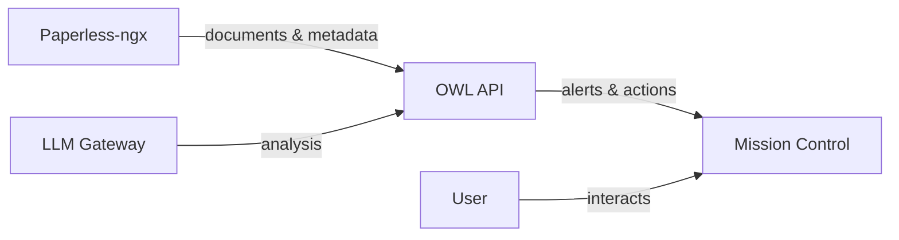
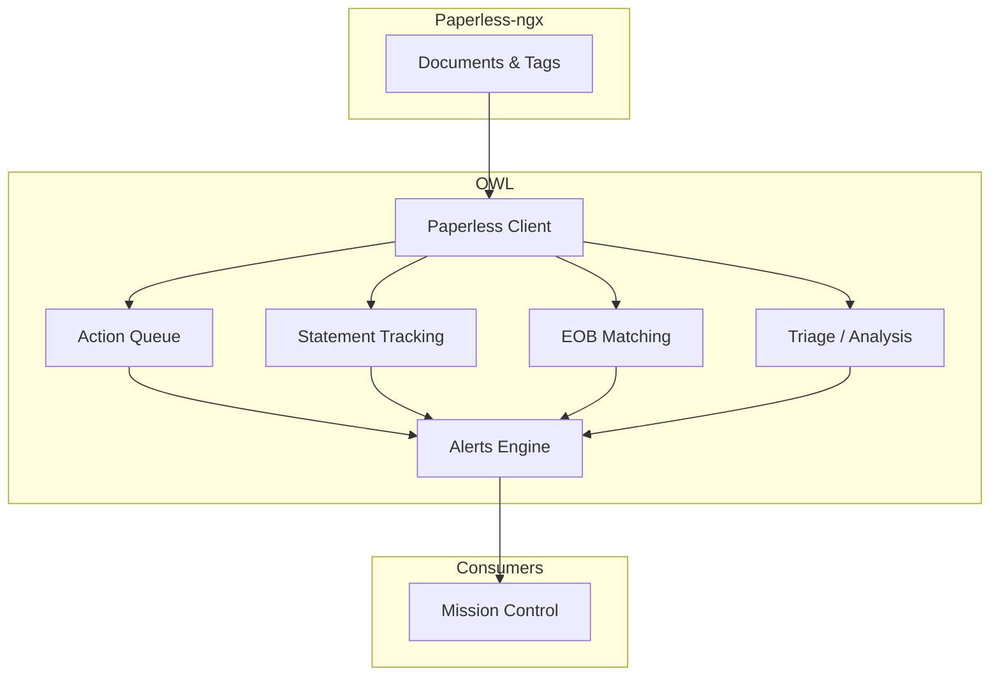
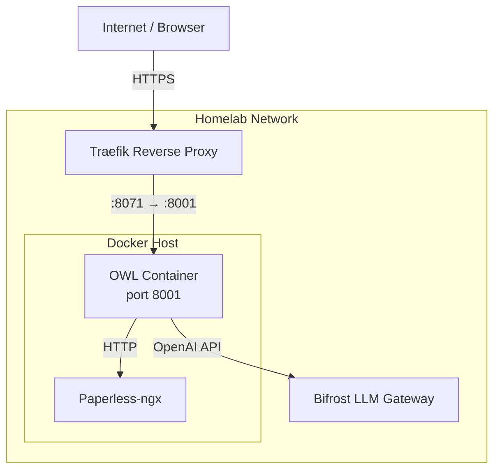

# Architecture Overview

OWL is a **headless API** — it has no user interface of its own. [Mission Control](https://service-004.example.invalid) consumes OWL's endpoints to present document intelligence to the user. Paperless-ngx remains the document source-of-truth; OWL reads from it but never modifies documents directly.



## Module Architecture

OWL is organized into independent, single-responsibility modules. Each module owns its own database, models, and router — there is no shared mutable state between modules.

| Module | Responsibility |
|--------|---------------|
| **Action Queue** | Inbox-zero workflow — classify documents, recommend next actions |
| **Statement Tracking** | Detect missing recurring statements (bills, pay stubs) |
| **EOB Matching** | Match medical Explanation of Benefits to provider bills |
| **Triage / Analysis** | LLM-powered document classification and correction suggestions |
| **Alerts** | Unified alerting engine consumed by all modules |

### Module Organization

```
src/doc_intelligence_hub/
├── api/
│   ├── app.py              # FastAPI app factory
│   └── routers/            # One router per module
│       ├── action_queue.py
│       ├── statements.py
│       ├── eob.py
│       ├── alerts.py
│       └── admin.py
├── modules/                # Business logic per module
│   ├── action_queue/
│   ├── statements/
│   ├── eob_matching/
│   ├── analysis/
│   └── triage/
└── core/                   # Shared utilities & alerts engine
```

:::tip Cross-references
For usage instructions, see the [User Guide](../guide/). For deep-dive design docs per module, see the [Module Reference](../modules/).
:::

## Data Flow

Documents flow through OWL in a single direction — from ingestion to actionable alerts:



Each module independently queries Paperless via the shared client, processes documents through its own logic (potentially calling the LLM), and emits alerts. Mission Control polls the alerts endpoint to surface them to the user.

## Technology Stack

| Layer | Technology |
|-------|-----------|
| Language | Python 3.12 |
| Web Framework | FastAPI (async) |
| ORM / Database | SQLAlchemy + SQLite (one DB per module) |
| LLM | OpenAI-compatible chat completions via Bifrost gateway |
| Containerization | Docker (single image) |
| Reverse Proxy | Traefik (TLS termination, routing) |
| Configuration | YAML config + environment variables |

## Deployment Topology



| Detail | Value |
|--------|-------|
| Image | `service-007.example.invalid/doc-intelligence-hub` |
| Internal port | `8001` |
| External port | `8071` (via Traefik) |
| Data volume | `/app/data` (SQLite databases) |

## API Layer

The FastAPI application is constructed via an app factory in `api/app.py`. On startup it:

1. Loads `hub_settings` from YAML + env vars and attaches it to `app.state`
2. Initializes a shared **Paperless client** (token-based HTTP client)
3. Registers module routers under versioned prefixes

All routers share the Paperless client instance but maintain their own database connections and session factories.

:::info Router structure
Each router is self-contained — it defines its own Pydantic models, dependencies, and SQLAlchemy sessions. This keeps modules independently deployable in the future.
:::

## Storage

Each module maintains its own SQLite database under `/app/data`:

```
/app/data/
├── action_queue.db
├── statements.db
├── eob_matching.db
└── alerts.db
```

:::warning No shared database state
Modules do not read from each other's databases. Cross-module communication happens exclusively through the Alerts engine API. This isolation simplifies testing and prevents cascading failures.
:::

- SQLAlchemy handles migrations and schema management per module
- SQLite is chosen for simplicity — the workload is single-user, low-write
- The `/app/data` directory is a Docker volume for persistence across container restarts

## LLM Integration

OWL uses an OpenAI-compatible chat completions API for document analysis, classification, and extraction tasks.

### Bifrost Gateway Pattern

Rather than calling LLM providers directly, OWL routes all requests through **Bifrost** — a local gateway that handles:

- Model routing and selection
- Rate limiting and retry logic
- Provider failover (local → cloud)
- Usage tracking

### Configuration

| Env Var | Purpose |
|---------|---------|
| `LLM_BASE_URL` | Bifrost endpoint (e.g., `http://bifrost:8000/v1`) |
| `LLM_API_KEY` | API key for the gateway |
| `LLM_MODEL` | Default model identifier |

Modules can override the model per-request when a task requires specific capabilities (e.g., larger context window for full-document analysis).

## Security Model

:::info Internal-only service
OWL runs on an isolated homelab network behind Traefik. It is **not exposed to the public internet**.
:::

- **No authentication layer** — the service trusts all callers on the internal network
- **Paperless access** — token-based authentication to Paperless-ngx API
- **LLM access** — API key for Bifrost gateway
- **Network isolation** — Docker network restricts inter-container communication to declared links
- **TLS** — Traefik terminates HTTPS at the edge; internal traffic is plaintext HTTP

This model is appropriate for a single-user homelab. If OWL were ever exposed publicly, an auth layer (e.g., OAuth2 or API keys) would need to be added at the FastAPI level.
