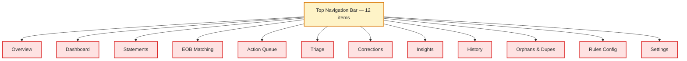
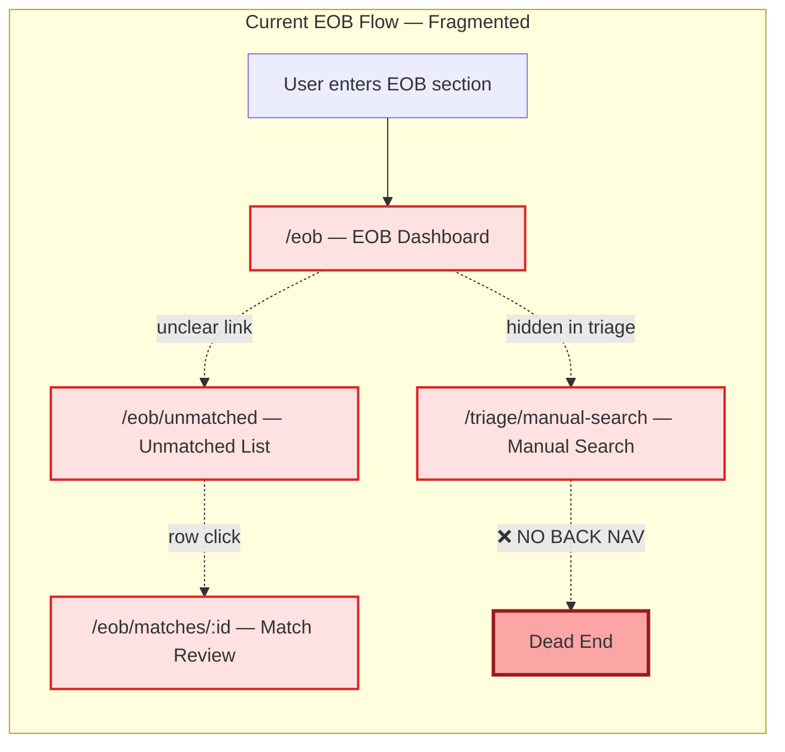
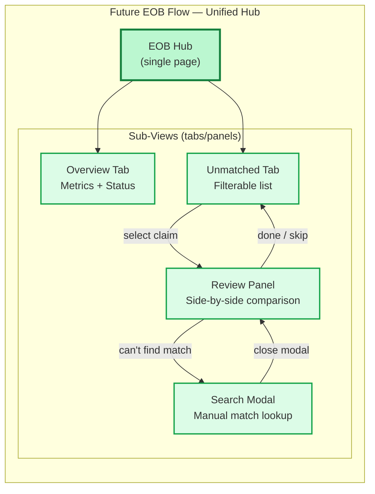
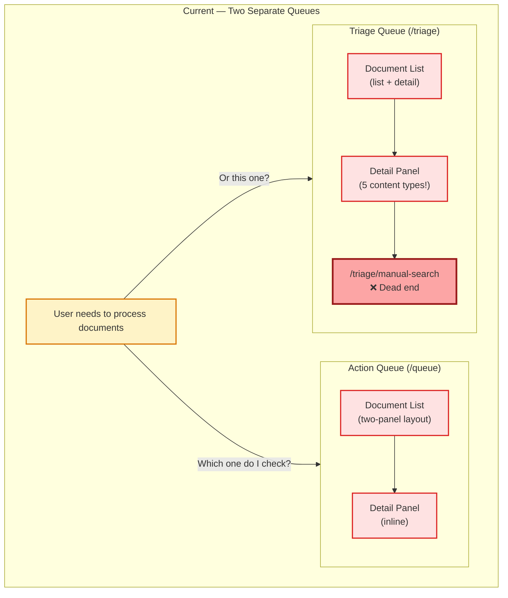
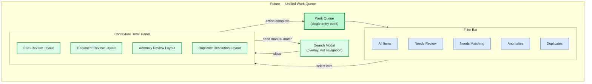
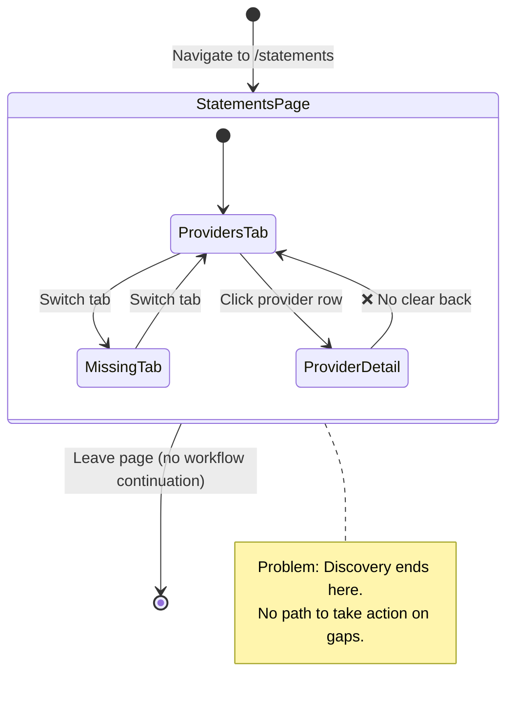
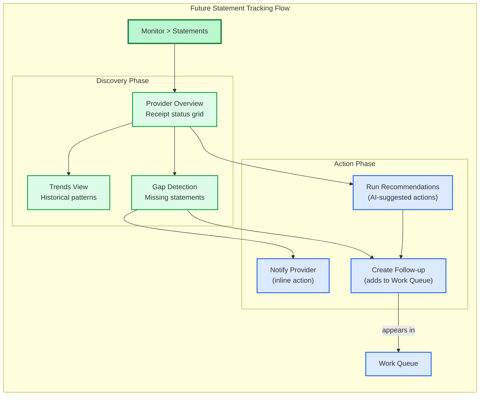

# OWL UI Flow Diagrams — Current State vs Future State

This document presents visual diagrams of the OWL (Document Intelligence Hub) navigation hierarchy and user flows, comparing the **current state** (with identified problems) against a **proposed future state** (with improvements).

**Legend:**
- 🔴 Current problems — highlighted in red/orange
- 🟢 Future improvements — highlighted in green/blue

---

## 1. High-Level Navigation Hierarchy

### Current State: Flat 12-Item Navigation

The current navigation presents all 12 sections as equal top-level items in a horizontal bar. This overflows on screens narrower than 1400px and provides no visual grouping to help users find related features.

**Problems:**
- Two "dashboard" pages (Overview and Dashboard) with unclear differentiation
- EOB Matching, Action Queue, and Triage are conceptually related but separated
- Admin features (Corrections, History, Rules, Settings) mixed with primary workflows
- No hierarchy — everything competes for attention equally

---

### Future State: Consolidated 5-Group Navigation

The proposed navigation groups related features into 5 top-level sections with contextual sub-navigation within each section. This reduces cognitive load and fits comfortably on all screen sizes.

```mermaid
graph TD
    NAV[Top Navigation — 5 items]
    NAV --> DASH[Dashboard]
    NAV --> DOCS[Documents]
    NAV --> MED[Medical Claims]
    NAV --> MON[Monitor]
    NAV --> ADMIN[Admin]

    DASH --> DASH1[Unified Overview]
    DASH --> DASH2[Key Metrics]
    DASH --> DASH3[Alerts & Notifications]

    DOCS --> DOCS1[Work Queue]
    DOCS --> DOCS2[Triage]
    DOCS --> DOCS3[Orphans & Duplicates]

    MED --> MED1[EOB Hub]
    MED --> MED2[Unmatched Claims]
    MED --> MED3[Match Review]

    MON --> MON1[Statements]
    MON --> MON2[Insights & Trends]
    MON --> MON3[Processing History]

    ADMIN --> ADMIN1[Rules Configuration]
    ADMIN --> ADMIN2[Corrections]
    ADMIN --> ADMIN3[Settings]

    classDef solution fill:#dcfce7,stroke:#16a34a,stroke-width:2px
    classDef solutionNav fill:#dbeafe,stroke:#2563eb,stroke-width:2px
    classDef solutionSub fill:#f0fdf4,stroke:#22c55e
    class NAV solutionNav
    class DASH,DOCS,MED,MON,ADMIN solution
    class DASH1,DASH2,DASH3,DOCS1,DOCS2,DOCS3,MED1,MED2,MED3,MON1,MON2,MON3,ADMIN1,ADMIN2,ADMIN3 solutionSub
```

**Improvements:**
- 5 top-level items — fits any screen width without overflow
- Logical grouping by user intent (what am I trying to do?)
- Sub-navigation appears contextually within each section
- Clear separation of primary workflows vs administrative features

---

## 2. EOB Matching Flow

### Current State: Fragmented Across 4 Pages

The EOB matching workflow is split across 4 disconnected pages with no clear primary flow. Users must remember which page to visit for each task, and the Manual Match Search page is a dead-end with no back navigation.

**Problems:**
- No clear entry point or flow direction
- Manual Match Search lives under `/triage` despite being an EOB feature
- No breadcrumbs or back navigation between pages
- Users lose context when moving between views

---

### Future State: Unified EOB Hub with Sub-Views

The proposed design creates a single EOB Hub page with panel-based sub-views. Users stay in one context and can navigate between views without losing their place.

**Improvements:**
- Single page context — no disorienting full-page navigations
- Clear linear flow: Overview → List → Review → (optionally) Search
- Manual Search is a modal overlay, not a separate dead-end page
- Consistent back navigation (close panel returns to list)
- Breadcrumb trail always visible: Medical Claims > EOB Hub > [current view]

---

## 3. Document Triage Flow

### Current State: Two Overlapping Queues

Action Queue and Triage Queue serve similar purposes (review documents and take action) but exist as separate pages with different UIs and no shared context. Users must check both to ensure nothing is missed.

**Problems:**
- Users don't know which queue to check — overlapping purposes
- Triage detail panel renders 5 different content types without clear context switching
- Action Queue and Triage Queue have different UI patterns for similar tasks
- Manual Search is accessible only from Triage, not from Action Queue

---

### Future State: Unified Work Queue with Filters

A single unified Work Queue replaces both pages. Users filter by document type or action needed, and the detail panel adapts its layout based on the selected item's type.

**Improvements:**
- One place to check for all pending work
- Filters replace separate pages — faster to switch context
- Detail panel type is driven by the selected item, not the page URL
- Keyboard shortcuts work uniformly across all item types
- Clear badge counts on each filter tab show pending work

---

## 4. Statement Tracking Flow

### Current State: Linear but Disconnected

Statement tracking works as a standalone page with tabs (Providers, Missing), but there's no connection to the actions a user would take after identifying gaps (e.g., notifying a provider, creating a follow-up task).

**Problems:**
- Statement discovery is isolated — user identifies a gap but has no in-app path to act on it
- No connection to notifications, follow-ups, or queue items
- Provider detail page lacks consistent back navigation
- No timeline or trend view for tracking statement receipt patterns

---

### Future State: Statement Tracking with Action Integration

The future flow connects statement discovery to actionable outcomes. Users can see trends, identify gaps, and take action (notify provider, create task) without leaving the workflow.

**Improvements:**
- Discovery flows naturally into action — no dead ends
- Trend view helps users anticipate gaps before they become problems
- Actions create items in the unified Work Queue (cross-feature integration)
- AI-powered recommendations surface actionable insights
- Breadcrumb navigation: Monitor > Statements > [Provider] maintains context

---

## Summary: Navigation Reduction

| Aspect | Current | Future |
|--------|---------|--------|
| Top-level nav items | 12 | 5 |
| Minimum screen width | ~1400px | ~900px |
| Pages for EOB workflow | 4 (scattered) | 1 (with sub-views) |
| Document queues | 2 (overlapping) | 1 (unified + filters) |
| Dead-end pages | 2+ | 0 |
| Back navigation coverage | ~40% of pages | 100% (breadcrumbs) |

---

## Implementation Priority

```mermaid
graph LR
    subgraph p1["Phase 1: Quick Wins"]
        A["Merge Overview + Dashboard"]
        B["Add breadcrumbs globally"]
        C["Fix Manual Search back nav"]
    end
    
    subgraph p2["Phase 2: Core Restructure"]
        D["Unify Action Queue + Triage"]
        E["Create EOB Hub"]
        F["Implement 5-group nav"]
    end
    
    subgraph p3["Phase 3: Enhancements"]
        G["Statement action integration"]
        H["AI recommendations"]
        I["Cross-feature Work Queue"]
    end

    p1 --> p2 --> p3

    classDef phase1 fill:#fef9c3,stroke:#ca8a04
    classDef phase2 fill:#dbeafe,stroke:#2563eb
    classDef phase3 fill:#f3e8ff,stroke:#9333ea
    class A,B,C phase1
    class D,E,F phase2
    class G,H,I phase3
```

Each phase can be shipped independently, with Phase 1 providing immediate UX relief while larger restructuring is planned.
