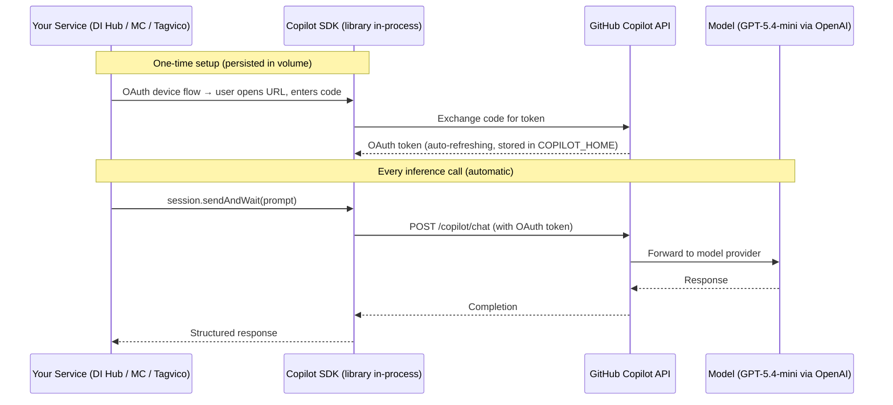
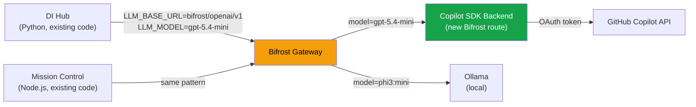
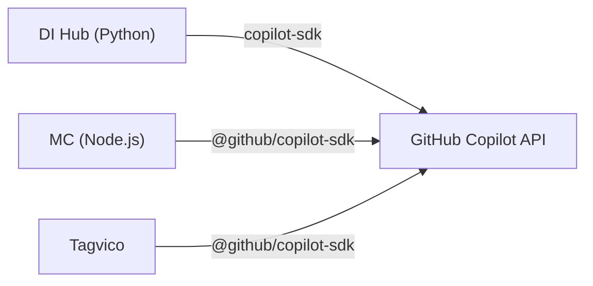

# GitHub Copilot SDK as Server-Side AI Provider

## TL;DR

The official `@github/copilot-sdk` (Node.js) and `copilot-sdk` (Python) packages
let any server-side application call cloud LLMs (GPT-5.4-mini and above) **billed
through an existing GitHub Copilot subscription** — no separate API keys, no
pay-per-token costs. With unlimited GitHub Copilot Enterprise access, this is
effectively free GPT-5.4-mini inference for all homelab services.

**The best integration path:** Add a Copilot SDK backend to Bifrost so all
existing services (DI Hub, MC, etc.) get cloud model access with **zero code
changes** — just an env var swap.

---

## How It Works



### Key Facts

| Aspect | Detail |
|---|---|
| **What is it?** | GitHub Copilot (developer subscription) — NOT M365 Copilot |
| **Package** | `@github/copilot-sdk` (npm) / `copilot-sdk` (pip) — GA June 2026 |
| **Runs where** | Server-side, in your container process. No browser/IDE required. |
| **Auth** | OAuth device flow (one-time) or `COPILOT_GITHUB_TOKEN` env var |
| **Token persistence** | Stored in `COPILOT_HOME` directory (volume mount) — auto-refreshes |
| **Models available** | Whatever your Copilot plan includes — discovered via `listModels()` |
| **Billing** | Against enterprise premium request pool |
| **With your plan** | Unlimited Copilot Enterprise = effectively free inference |
| **Offline?** | No — requires internet to reach GitHub API |
| **Privacy** | Prompt content sent to GitHub/OpenAI infrastructure |

---

## Integration Architecture: Three Options

### Option A: Bifrost Backend (Recommended — Zero Code Changes)



**How it works:**
- Add a new route/backend to Bifrost that uses the Copilot SDK internally
- Bifrost exposes it as an OpenAI-compatible endpoint (it already does this)
- DI Hub changes ONE env var: `LLM_MODEL=gpt-5.4-mini` (Bifrost routes to Copilot)
- MC changes ONE env var if using Bifrost for its AI features
- **No code changes in DI Hub or MC.** They still call the same OpenAI-compatible API.

**Why this is the best option:**
- DI Hub's `llm.py` already calls `client.chat.completions.create()` via Bifrost
- Bifrost already abstracts model routing — this is just another backend
- All services get cloud models immediately without touching their code
- Bifrost can do smart routing: try Ollama first, fallback to Copilot on failure
- Single auth point (Bifrost holds the Copilot token, not each service)

### Option B: Direct SDK Integration (Per-Service)



Each service integrates the SDK directly. This is what Tagvico does today.

**Pros:** No Bifrost dependency, per-service model selection
**Cons:** Auth setup per service, SDK installed in each image, more moving parts

### Option C: Hybrid (Bifrost + Direct for Specific Features)

- **Bifrost route** for standard chat completions (DI Hub extraction, action classification)
- **Direct SDK** in MC for agentic features (multi-turn chat, tool use in AI assistant)
- **Direct SDK** in Tagvico (already built-in)

**This is the pragmatic end state.** Start with Option A (Bifrost), add Option B
for MC's AI assistant later if agentic features need it.

---

## Option A Deep Dive: Bifrost Copilot Backend

### What Bifrost Already Does

Bifrost is an OpenAI-compatible gateway that routes requests based on model name:

```
Client → POST /openai/v1/chat/completions {model: "phi3:mini"}
Bifrost → Routes to Ollama at localhost:11434
```

### What We Add

A new backend that translates OpenAI-compatible requests into Copilot SDK calls:

```
Client → POST /openai/v1/chat/completions {model: "gpt-5.4-mini"}
Bifrost → Copilot SDK backend → GitHub Copilot API → Response
```

### Implementation Sketch (Bifrost is Node.js/TypeScript)

```typescript
// bifrost/backends/copilot.ts
import { CopilotClient } from '@github/copilot-sdk';

let client: CopilotClient | null = null;

async function getClient(): Promise<CopilotClient> {
  if (!client) {
    client = new CopilotClient({
      mode: 'empty',
      baseDirectory: process.env.COPILOT_HOME || '/data/copilot',
      workingDirectory: '/tmp/bifrost-copilot',
      logLevel: 'error'
    });
    await client.start();
  }
  return client;
}

// OpenAI-compatible handler
export async function handleChatCompletion(req: ChatCompletionRequest) {
  const copilot = await getClient();
  const session = await copilot.createSession({
    model: req.model,
    availableTools: [],
    excludedTools: ['builtin:*', 'mcp:*', 'custom:*']
  });

  const prompt = req.messages.map(m => `${m.role}: ${m.content}`).join('\n');
  const response = await session.sendAndWait({ prompt });
  await session.disconnect();

  // Return OpenAI-compatible response format
  return {
    id: `chatcmpl-${Date.now()}`,
    object: 'chat.completion',
    model: req.model,
    choices: [{
      index: 0,
      message: { role: 'assistant', content: response?.data?.content || '' },
      finish_reason: 'stop'
    }],
    usage: { prompt_tokens: 0, completion_tokens: 0, total_tokens: 0 }
  };
}
```

### Bifrost Routing Rules

```yaml
# bifrost config
routes:
  - pattern: "phi3:*"
    backend: ollama
    endpoint: http://ollama:11434

  - pattern: "gpt-5.4-*"
    backend: copilot
    # No endpoint needed — uses SDK

  - pattern: "gpt-5.6-*"
    backend: copilot

  # Fallback chain
  - pattern: "*"
    backend: ollama
    fallback: copilot  # If Ollama fails, try Copilot
```

### DI Hub Usage (Zero Changes Required)

```dotenv
# Just change the model name — Bifrost handles routing
LLM_BASE_URL=https://service-001.example.invalid/openai/v1
LLM_API_KEY=bifrost
LLM_MODEL=gpt-5.4-mini   # ← Was phi3:mini, now routes to Copilot via Bifrost
```

DI Hub's `llm.py` calls `client.chat.completions.create(model="gpt-5.4-mini")`
→ Bifrost receives it → routes to Copilot backend → returns OpenAI-compatible
response. **DI Hub never knows it's talking to GitHub Copilot.**

---

## Smart Routing Strategies

### Strategy 1: Model-Based Routing (Simple)

| Model Request | Routes To | Use Case |
|---|---|---|
| `phi3:mini` | Ollama (local) | Quick, private, simple docs |
| `gpt-5.4-mini` | Copilot SDK | Higher quality, complex docs |
| `gpt-5.4-nano` | Copilot SDK | Cheap bulk processing |

Services choose quality by picking a model name. No logic changes.

### Strategy 2: Fallback Chain (Resilient)

```
Request → Try Ollama → If timeout/error → Fallback to Copilot → Return response
```

This gives you local-first privacy with cloud resilience. If the GPU is busy or
Ollama is down, Bifrost automatically routes to Copilot.

### Strategy 3: Privacy-Aware Routing (Best)

```
Request with header X-Privacy: strict → Force Ollama only (medical/financial)
Request with header X-Privacy: standard → Ollama with Copilot fallback
Request without header → Default route (model-based)
```

DI Hub could set this per-module:
- EOB matching (medical data): `X-Privacy: strict` → always Ollama
- Action queue (general triage): `X-Privacy: standard` → Ollama + fallback
- Statement tracker: `X-Privacy: standard` → fast cloud is fine

---

## Mission Control Integration

MC already uses Vercel AI SDK with configurable providers. Two paths:

### Path 1: Via Bifrost (same as DI Hub)

If MC's AI calls go through Bifrost, it gets Copilot for free too.

### Path 2: Direct `@github/copilot-sdk` for Agentic Features

MC's AI assistant needs multi-turn, streaming, and potentially tool use. The
Copilot SDK supports all of this natively:

```typescript
// src/lib/ai/copilot-provider.ts
import { CopilotClient } from '@github/copilot-sdk';

const client = new CopilotClient({
  baseDirectory: process.env.COPILOT_HOME || '/data/copilot'
});

export async function createAssistantSession(model: string) {
  await client.start();
  return client.createSession({
    model,
    availableTools: [],  // Or define MC-specific tools
    onPermissionRequest: (req) => ({ kind: 'reject' })
  });
}
```

This replaces the need for separate OpenAI/Azure API keys for MC's AI features.

---

## Tagvico Integration

Tagvico already supports `AI_PROVIDER=copilot` natively. For our deployment:

```dotenv
# Primary: Ollama (free, local, handles routine filing)
AI_PROVIDER=ollama
OLLAMA_HOST=http://ollama:11434
OLLAMA_MODEL=phi3:mini

# Secondary: Copilot (set in Settings UI for quality comparison)
# Or switch globally:
# AI_PROVIDER=copilot
# COPILOT_HOME=/app/data/copilot
# COPILOT_MODEL=gpt-5.4-mini
```

---

## Privacy Boundaries

| Data Type | Acceptable for Cloud? | Route |
|---|---|---|
| Document titles, tags, correspondents | ✅ Yes | Copilot |
| General document classification | ✅ Yes | Copilot |
| Medical EOB content (PHI) | ⚠️ Caution | Ollama (local) |
| Financial account numbers | ⚠️ Caution | Ollama (local) |
| Statement frequency patterns | ✅ Yes (metadata only) | Either |
| Interactive AI assistant queries | ✅ Yes | Copilot |

**Rule:** If the prompt contains actual medical/financial document text with
PII/PHI, route to Ollama. If it's metadata, classification prompts, or
interactive queries, Copilot is fine.

---

## Setup Requirements

### One-Time Per Service (or Per Bifrost Instance)

| Step | How | Frequency |
|---|---|---|
| Install SDK | Bundled in image (Bifrost, Tagvico) or `pip install copilot-sdk` | Once per image build |
| Device auth | Open URL in browser, enter 8-char code | Once (token refreshes) |
| Volume mount | `COPILOT_HOME=/app/data/copilot` on persistent volume | Once per docker-compose |

### If Routing Through Bifrost (Recommended)

Only Bifrost needs the Copilot SDK and auth token. All other services are unchanged.

```yaml
# docker-compose addition for Bifrost
services:
  bifrost:
    # ... existing config ...
    environment:
      COPILOT_HOME: /data/copilot
    volumes:
      - bifrost_copilot_data:/data/copilot  # Persist OAuth token
```

---

## Cost Analysis

With unlimited GitHub Copilot Enterprise:

| Scenario | Monthly Volume | Cost | Quality |
|---|---|---|---|
| Tagvico filing (all via Ollama) | ~200 docs | $0 | Adequate (phi3:mini) |
| Tagvico filing (all via Copilot) | ~200 docs | $0 (enterprise pool) | Excellent (gpt-5.4-mini) |
| DI Hub action classification | ~50 docs/month | $0 | Excellent |
| MC AI assistant | ~100 queries/month | $0 | Excellent |
| **Total incremental cost** | | **$0** | |

vs. OpenAI Direct at $0.75/1M input tokens + $4.50/1M output tokens:
- Same volume would cost ~$2-5/month (negligible either way)
- But requires managing API keys, billing, usage monitoring

**The Copilot SDK path is strictly better:** same quality, zero cost, simpler auth.

---

## Phased Rollout

### Phase 1: Tagvico Direct (Week 1)
- Configure `AI_PROVIDER=copilot` in Tagvico deployment
- Complete device auth
- Benchmark: process 20 documents via Copilot vs Ollama, compare quality
- **Zero infrastructure changes**

### Phase 2: Bifrost Copilot Backend (Week 2-3)
- Add Copilot SDK backend to Bifrost
- Implement OpenAI-compatible translation layer
- Add model-based routing rules
- Test: DI Hub calls `gpt-5.4-mini` through Bifrost → gets Copilot response
- **DI Hub gets cloud models with zero code changes**

### Phase 3: Smart Routing (Week 3-4)
- Add fallback chain (Ollama → Copilot on failure)
- Add privacy-aware routing header
- DI Hub modules set appropriate privacy level per-call
- **Best of both worlds: local privacy + cloud quality + resilience**

### Phase 4: MC Direct SDK (Future, Optional)
- If MC needs multi-turn/agentic features beyond chat completion
- Add `@github/copilot-sdk` to MC for AI assistant
- **Only if Bifrost path is insufficient for MC's needs**

---

## Comparison: All Provider Options

| Provider | Cost | Quality | Privacy | Latency | Offline | Setup |
|---|---|---|---|---|---|---|
| Ollama (phi3:mini) | Free | ★★☆ | ✅ Local | 10-30s | ✅ | Existing |
| Copilot SDK (gpt-5.4-mini) | Free* | ★★★★ | ❌ Cloud | 2-5s | ❌ | Device auth once |
| OpenAI Direct | ~$3/mo | ★★★★ | ❌ Cloud | 2-5s | ❌ | API key + billing |
| OpenRouter | ~$3/mo | ★★★★ | ❌ Cloud | 3-7s | ❌ | API key + billing |

*Free with existing unlimited Copilot Enterprise subscription.

**Clear winner for cloud path: Copilot SDK.** Same models as OpenAI Direct,
zero incremental cost, simpler auth, no billing management.

---

## Risks

| Risk | Mitigation |
|---|---|
| GitHub Copilot API rate limits | Monitor `totalNanoAiu` usage; fall back to Ollama under pressure |
| OAuth token expiry edge cases | Persistent volume + auto-refresh; monitor health check |
| SDK breaking changes on update | Pin SDK version; test before upgrading Bifrost image |
| Enterprise policy changes | Copilot is enterprise-approved; no personal key concerns |
| Model availability changes | `listModels()` discovers available models dynamically |
