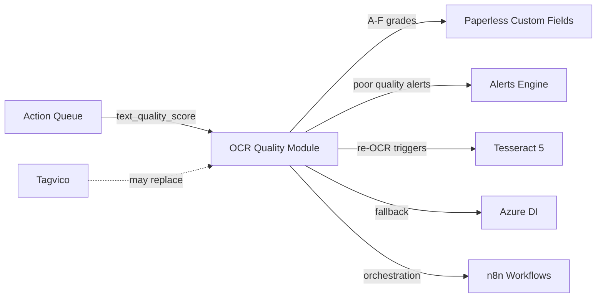

# OCR Quality Pipeline — Implementation Plan

## Purpose

This document bridges the gap between OWL's **6 existing OCR quality design documents** and actual implementation. The design is comprehensive; what's missing is a phased implementation plan that connects the design to the codebase and clarifies what to build first.

:::info Current State
- **Design**: 6 detailed documents covering scoring, Ollama validation, remediation, n8n orchestration, and baseline inventory
- **Code**: A basic `text_quality_score` heuristic exists in the Action Queue pipeline (`_compute_text_quality`), but there is no dedicated OCR quality module
- **Decision Gate**: The [feature roadmap](./../../feature-roadmap.md#ocr-quality-system) notes this should only proceed if OCR quality is actively blocking other modules, and that Tagvico's OCR rescue feature may eliminate the need entirely
:::

---

## Existing Design Documents

| Document | Location | Covers |
|----------|----------|--------|
| OCR Quality Design (umbrella) | `docs/modules/ocr-quality/ocr-quality-design.md` | End-to-end architecture, document lifecycle, gating rules |
| Baseline Inventory | `docs/modules/ocr-quality/ocr-baseline-inventory.md` | Script to score all existing Paperless documents |
| Quality Scoring | `docs/modules/ocr-quality/ocr-quality-scoring.md` | A–F grading system, heuristic metrics, thresholds |
| Ollama Integration | `docs/modules/ocr-quality/ocr-ollama-integration.md` | LLM-based validation for borderline scores |
| Remediation Engine | `docs/modules/ocr-quality/ocr-remediation-engine.md` | Tiered re-OCR: Tesseract 5 → Azure Document Intelligence |
| n8n Workflow | `docs/modules/ocr-quality/ocr-n8n-workflow.md` | Orchestration via n8n webhooks, scheduling, alerting |

---

## What Already Exists in Code

### Action Queue Text Quality Heuristic

```
modules/action_queue/pipeline.py :: _compute_text_quality()
modules/action_queue/database.py :: content_length, word_count, text_quality_score columns
```

This provides a 0–100 heuristic score based on:
- Content length (penalizes very short docs)
- Non-alpha character ratio (detects garbled OCR)
- Average word length (detects broken words)

**This is explicitly annotated as "free data for future OCR quality pipeline"** — it was designed to seed the OCR module with data without requiring a separate pass over documents.

---

## Phased Implementation Plan

### Phase 0: Validate the Need (Before Writing Code)

Before investing 60+ hours, answer:

1. **Is Tagvico's OCR rescue feature (#815) shipping?** If yes, it may handle remediation and this pipeline becomes scoring-only.
2. **Are any downstream modules failing due to OCR quality?** Check Action Queue rejection rates for `unreadable` / `low_confidence` dispositions.
3. **What does the existing `text_quality_score` data show?** Query the action queue DB to understand the distribution. If 95%+ of documents score >70, the pipeline has low ROI.

```sql
-- Run against action_queue.db to assess need
SELECT
    CASE
        WHEN text_quality_score >= 80 THEN 'A-B (good)'
        WHEN text_quality_score >= 60 THEN 'C (acceptable)'
        WHEN text_quality_score >= 40 THEN 'D (poor)'
        ELSE 'F (failing)'
    END AS grade_bucket,
    COUNT(*) AS doc_count,
    ROUND(100.0 * COUNT(*) / SUM(COUNT(*)) OVER (), 1) AS pct
FROM actions
WHERE text_quality_score IS NOT NULL
GROUP BY grade_bucket
ORDER BY MIN(text_quality_score) DESC;
```

**Decision gate:** Only proceed to Phase 1 if >10% of documents score below 60.

### Phase 1: Scoring Module (Standalone, No Remediation)

**Goal:** Dedicated OCR quality scoring as a first-class module, consuming the design in `ocr-quality-scoring.md`.

**What to build:**
1. `modules/ocr_quality/` directory with its own SQLAlchemy models and DB
2. A–F grading function implementing the full scoring rubric (not just the 3-metric heuristic from Action Queue)
3. API router: `GET /api/ocr/scores`, `POST /api/ocr/scan` (score a batch of documents)
4. Integration with Action Queue: replace inline `_compute_text_quality` with a call to the OCR module
5. Paperless custom field writeback: populate an "OCR Quality" custom field so scores are visible in Paperless UI

**What NOT to build yet:** Remediation, Ollama validation, n8n orchestration, dashboard UI.

**Effort: M (1–2 weeks)**  
**Depends on:** Phase 0 validation

### Phase 2: Baseline Inventory Run

**Goal:** Score every existing document in Paperless, implementing `ocr-baseline-inventory.md`.

**What to build:**
1. CLI command: `doc-hub ocr-scan --all` (batch score with progress reporting)
2. Rate limiting (respect Paperless API limits)
3. Results summary: grade distribution, worst offenders list

**Effort: S (2–3 days)**  
**Depends on:** Phase 1

### Phase 3: Ollama Validation (Optional)

**Goal:** Use LLM to validate borderline scores (C/D grades), implementing `ocr-ollama-integration.md`.

**What to build:**
1. Prompt template: send document text to LLM, ask "is this coherent?"
2. Upgrade/downgrade scores based on LLM assessment
3. Cost tracking (token usage per validation)

**Effort: M (1 week)**  
**Depends on:** Phase 1; only if borderline-grade documents are a significant population

### Phase 4: Remediation Engine

**Goal:** Re-OCR poor-quality documents, implementing `ocr-remediation-engine.md`.

**What to build:**
1. Tesseract 5 tier: re-OCR locally, compare before/after scores, gate on improvement
2. Azure DI tier: cloud fallback for documents Tesseract can't improve, with budget controls
3. Before/after comparison with rollback capability
4. Never replace text unless new score > old score (the critical gating rule from the design)

**Effort: XL (3–4 weeks)**  
**Depends on:** Phase 2 baseline data showing remediation would help

### Phase 5: Orchestration & Dashboard

**Goal:** n8n integration + UI, implementing `ocr-n8n-workflow.md`.

**What to build:**
1. n8n webhook triggers for scheduled scans
2. Dashboard page showing grade distribution, remediation history, cost tracking
3. Home Assistant alerts for quality degradation

**Effort: M (1–2 weeks)**  
**Depends on:** Phase 4

---

## Relationship to Other Systems



---

## Relationship to Plugin Architecture

If the [Plugin Module Architecture](./plugin-module-architecture.md) is implemented first, the OCR Quality module would be an ideal second adopter (after Action Queue) of the `DocumentModule` protocol. Its self-contained nature (own DB, own router, no cross-module dependencies) makes it a clean fit.

If the plugin architecture is NOT implemented, the OCR module follows the same manual wiring pattern as existing modules — add to `app.py`, add to TopNav, etc.

---

## References

- [OCR Quality Design Documents](./../../modules/ocr-quality/) — Full design specifications
- [Feature Roadmap — OCR Quality System](./../../feature-roadmap.md#ocr-quality-system) — Roadmap entry with issue links
- [Audit Findings — ARCH-03](./../../design/active/audit-findings.md#priority-2-critical-architecture-gaps) — Original audit finding
- [Audit Findings — Priority 5](./../../design/active/audit-findings.md#priority-5-observations--future-considerations) — Observation on design docs accelerating implementation
- [Action Queue Pipeline — `_compute_text_quality`](https://github.com/rsocko/ideation/blob/main/experiments/document-intelligence/src/doc_intelligence_hub/modules/action_queue/pipeline.py) — Existing text quality heuristic
