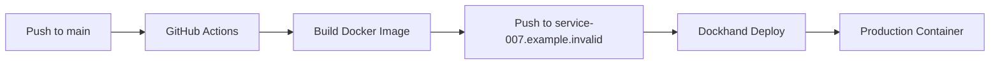

# Development Guide

This guide covers everything you need to contribute to the Document Intelligence Hub (OWL) — from setting up your local environment to deploying changes.

## Dev Environment Setup

### Prerequisites

- **Python 3.12+** (3.11 minimum, 3.12 recommended)
- **Node.js 20+** (for frontend development)
- **Docker & Docker Compose** (for integration testing and local deployment)

### Installation

```bash
# Clone the repository
git clone https://github.com/rsocko/ideation.git
cd ideation/experiments/document-intelligence

# Create a virtual environment
python -m venv .venv
source .venv/bin/activate  # Linux/macOS
# .venv\Scripts\activate   # Windows

# Install the package in editable mode with dev dependencies
pip install -e ".[dev]"
```

:::tip
If you have [uv](https://github.com/astral-sh/uv) installed, you can speed up dependency resolution:
```bash
uv venv .venv
source .venv/bin/activate
uv pip install -e ".[dev]"
```
:::

### Environment Variables

Copy the example env file and configure for local development:

```bash
cp config/.env.example .env
```

Key variables:
- `PAPERLESS_URL` — URL to your Paperless-ngx instance
- `PAPERLESS_API_TOKEN` — API token for Paperless authentication
- `LLM_BASE_URL` — LLM gateway endpoint (default: Bifrost)
- `LLM_API_KEY` — API key for the LLM gateway
- `LLM_MODEL` — Model to use (default: `azure/gpt-4o-mini`)

## Project Structure

```
experiments/document-intelligence/
├── src/doc_intelligence_hub/
│   ├── api/                    # FastAPI application & routers
│   │   ├── app.py             # App factory, lifespan, middleware
│   │   ├── routers/           # One file per API domain
│   │   └── static/            # Built frontend assets
│   ├── core/                   # Shared utilities
│   │   ├── alerts.py          # Alert system & database
│   │   ├── llm.py             # LLM client (OpenAI-compatible)
│   │   ├── logging_config.py  # Structured logging setup
│   │   ├── paperless/         # Paperless-ngx API client
│   │   ├── extractors/        # Document content extractors
│   │   ├── retention.py       # Data retention policies
│   │   └── scheduler.py       # APScheduler-based job scheduler
│   └── modules/                # Business logic per domain
│       ├── statements/        # Statement tracking & recommendations
│       ├── eob_matching/      # EOB classification & bill matching
│       ├── action_queue/      # Document triage pipeline
│       ├── analysis/          # Rule-based analysis engine
│       └── triage/            # Human review queue
├── config/                     # YAML configuration files
├── tests/                      # Pytest test suite
├── frontend/                   # React/Vite frontend
├── docker-compose.yml          # Production compose stack
├── Dockerfile                  # Multi-stage production image
└── pyproject.toml              # Package metadata & dependencies
```

## Running Locally

### API Server

The fastest way to start the hub locally:

```bash
# Using the CLI entry point
doc-hub-serve

# Or with uvicorn directly (enables auto-reload)
uvicorn doc_intelligence_hub.api.app:create_app --factory --reload --port 8001
```

The API will be available at `http://localhost:8001` with interactive docs at `/docs`.

:::tip
Use `--reload` during development so the server restarts automatically when you edit source files.
:::

### CLI Commands

The project provides several CLI entry points defined in `pyproject.toml`:

| Command | Description |
|---------|-------------|
| `doc-hub-serve` | Start the unified API server |
| `doc-hub` | Statement tracker CLI |
| `eob-match` | EOB matching pipeline CLI |
| `paq` | Action Queue pipeline CLI |

## Adding a New Module

Follow this pattern to add a new business logic module:

### 1. Create the module directory

```
src/doc_intelligence_hub/modules/your_module/
├── __init__.py
├── service.py      # Business logic
├── models.py       # Pydantic models
├── database.py     # SQLite/SQLAlchemy if needed
└── cli.py          # Optional CLI entry point
```

### 2. Create a router

```python
# src/doc_intelligence_hub/api/routers/your_module.py
from fastapi import APIRouter

router = APIRouter(prefix="/api/your-module", tags=["your-module"])

@router.get("/status")
async def get_status():
    return {"status": "ok", "module": "your-module"}
```

### 3. Register in app.py

```python
# In src/doc_intelligence_hub/api/app.py
from doc_intelligence_hub.api.routers import your_module

# Inside create_app():
app.include_router(your_module.router)
```

### 4. Add tests

```
tests/your_module/
├── __init__.py
├── test_service.py
└── test_router.py
```

:::warning
Always register your router in `app.py` — routers that aren't registered won't be included in the OpenAPI schema or accessible at runtime.
:::

## Code Style

The project uses **Ruff** for both linting and formatting:

```bash
# Check for lint errors
ruff check src/ tests/

# Auto-fix what can be fixed
ruff check --fix src/ tests/

# Format code
ruff format src/ tests/
```

### Key conventions

- **Type hints** throughout — all function signatures should be annotated
- **Line length**: 100 characters max
- **Import sorting**: handled by Ruff's isort rules
- **Lint rules enforced**: pycodestyle (E/W), pyflakes (F), isort (I), bugbear (B)
- **Pydantic models** for all API request/response schemas

:::info
`E501` (line-too-long) is ignored — Ruff's formatter handles line wrapping automatically.
:::

## CI/CD

The deployment pipeline:



1. **GitHub Actions** triggers on push to `main`
2. **Multi-stage Docker build** — frontend assets compiled, Python wheel built, slim runtime image
3. **Image pushed** to `service-007.example.invalid/doc-intelligence-hub`
4. **Dockhand** detects the new image and deploys to the homelab

### Docker Image Details

The Dockerfile uses a 3-stage build:
1. **frontend-build** — Node 20, builds React/Vite app
2. **builder** — Python 3.12, builds the wheel
3. **runtime** — Python 3.12-slim, installs wheel + supercronic for scheduled jobs

## Docker Development

Run the full stack locally with Docker Compose:

```bash
# Build and start all services
docker compose up -d --build

# Start just the hub service
docker compose up -d --build hub

# Run scheduled jobs (eob-matching, action-queue)
docker compose --profile jobs up eob-matching
docker compose --profile jobs up action-queue

# Start the EOB scheduler (daily cron)
docker compose --profile scheduled up -d eob-scheduler

# View logs
docker compose logs -f hub
```

:::warning
Make sure you have a `.env` file with `PAPERLESS_API_TOKEN` set — the hub won't be able to connect to Paperless without it.
:::

### Services

| Service | Description | Port |
|---------|-------------|------|
| `hub` | Main API server | 8071 (→ 8001 internal) |
| `eob-matching` | EOB classification job (on-demand) | — |
| `action-queue` | Triage pipeline job (on-demand) | — |
| `eob-scheduler` | Cron-based EOB trigger | — |

## Contributing

### Workflow

1. **Branch** from `main` with a descriptive name (e.g., `feat/new-extractor`, `fix/eob-timeout`)
2. **Develop** with tests — new business logic requires test coverage
3. **Lint** before pushing: `ruff check src/ tests/`
4. **Open a PR** with a clear description of what changed and why
5. **Merge** after review — CI must pass

### PR Checklist

- [ ] Tests pass (`pytest`)
- [ ] Linting passes (`ruff check`)
- [ ] New endpoints documented in router docstrings
- [ ] Config changes reflected in example files
- [ ] Breaking API changes noted in PR description
