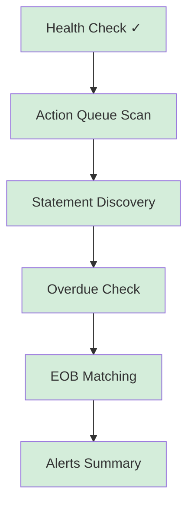

# First Run Walkthrough

You've got OWL installed — now let's verify everything works and run your first document intelligence tasks.

## Step 1: Verify Connectivity

First, confirm OWL is running and can reach its dependencies:

```bash
# Basic health check
***REMOVED*** http://localhost:8071/health
```

Expected response:
```json
{
  "status": "healthy",
  "version": "0.2.0"
}
```

Next, check that OWL can reach both Paperless and your LLM:

```bash
# Check upstream service connectivity
***REMOVED*** http://localhost:8071/api/queue/check
```

Expected response:
```json
{
  "paperless": { "status": "connected", "url": "http://paperless:8000" },
  "llm": { "status": "connected", "model": "azure/gpt-4o-mini" }
}
```

:::danger Connection Failures
If either service shows `"status": "disconnected"`:
- **Paperless**: Verify `PAPERLESS_URL` is reachable from inside the container and your API token is valid
- **LLM**: Verify `LLM_BASE_URL` and `LLM_API_KEY` are correct. Try `***REMOVED*** $LLM_BASE_URL/models` from the host to test.
:::

## Step 2: Run Your First Action Queue Scan

The Action Queue (PAQ) is OWL's document triage pipeline. It scans Paperless for documents needing attention and uses the LLM to classify and enrich them.

Start with a **dry run** to see what OWL would do without writing anything:

```bash
***REMOVED*** -X POST http://localhost:8071/api/queue/run \
  -H "Content-Type: application/json" \
  -d '{"dry_run": true}'
```

Expected response:
```json
{
  "status": "completed",
  "documents_scanned": 15,
  "actions_proposed": 7,
  "dry_run": true,
  "actions": [
    {
      "document_id": 142,
      "title": "Electricity Bill - June 2025",
      "proposed_tags": ["bill", "utilities"],
      "proposed_correspondent": "Power Company"
    }
  ]
}
```

:::tip
The dry run shows you exactly what OWL wants to do. Review the output before running a live pass. When you're satisfied:
```bash
***REMOVED*** -X POST http://localhost:8071/api/queue/run \
  -H "Content-Type: application/json" \
  -d '{"dry_run": false}'
```
:::

:::warning
The Action Queue requires LLM access for document classification. If your LLM is not configured, this endpoint will return an error explaining what's missing.
:::

## Step 3: Run Statement Discovery

Statement Discovery scans your documents to find recurring bills and statements, building a timeline of what you owe and when.

```bash
***REMOVED*** -X POST http://localhost:8071/api/statements/discovery/run
```

This endpoint uses **Server-Sent Events (SSE)** to stream progress in real-time:

```text
data: {"event": "discovery_start", "total_documents": 230}

data: {"event": "statement_found", "vendor": "Electric Company", "amount": 142.50, "date": "2025-06-15"}

data: {"event": "statement_found", "vendor": "Internet Provider", "amount": 79.99, "date": "2025-06-01"}

data: {"event": "progress", "processed": 50, "total": 230}

data: {"event": "discovery_complete", "statements_found": 12, "vendors_identified": 5}
```

:::info SSE Streaming
The response streams as events — your terminal will show them as they arrive. Use `***REMOVED*** -N` (no-buffer) if events seem delayed:
```bash
***REMOVED*** -N -X POST http://localhost:8071/api/statements/discovery/run
```
:::

Discovery builds a persistent database of your statements in the `/app/data` volume, so subsequent runs are incremental and fast.

## Step 4: Check for Overdue Statements

Once Discovery has found your recurring statements, check if any are overdue:

```bash
***REMOVED*** -X POST http://localhost:8071/api/statements/recommendations/run
```

Expected response:
```json
{
  "status": "completed",
  "recommendations": [
    {
      "vendor": "Electric Company",
      "last_seen": "2025-05-15",
      "expected_by": "2025-06-15",
      "days_overdue": 11,
      "recommendation": "Statement appears overdue — check for missing scan"
    }
  ],
  "total_tracked": 5,
  "overdue_count": 1
}
```

This helps you catch statements that should have arrived but haven't been scanned into Paperless yet.

## Step 5: Run EOB Matching

If you have medical documents (Explanation of Benefits, medical bills), OWL can match EOBs to their corresponding bills:

```bash
***REMOVED*** -X POST http://localhost:8071/api/eob/run
```

Expected response:
```json
{
  "status": "completed",
  "eobs_processed": 3,
  "matches_found": 2,
  "matches": [
    {
      "eob_document_id": 89,
      "bill_document_id": 76,
      "provider": "City Hospital",
      "service_date": "2025-04-12",
      "confidence": 0.94
    }
  ]
}
```

:::info No Medical Documents?
If you don't have EOBs or medical bills in Paperless, this endpoint will return an empty result set — that's expected. Skip this step if it doesn't apply to your document library.
:::

## Step 6: Check Alerts

OWL aggregates insights and alerts from all its modules. Check the summary:

```bash
***REMOVED*** http://localhost:8071/api/insights/alerts/summary
```

Expected response:
```json
{
  "total_alerts": 3,
  "by_severity": {
    "warning": 2,
    "info": 1
  },
  "alerts": [
    {
      "type": "overdue_statement",
      "severity": "warning",
      "message": "Electric Company statement overdue by 11 days",
      "created_at": "2025-06-26T10:00:00Z"
    },
    {
      "type": "unmatched_eob",
      "severity": "warning",
      "message": "EOB from City Hospital has no matching bill",
      "created_at": "2025-06-25T14:30:00Z"
    }
  ]
}
```

## What You've Accomplished



You've verified OWL's connectivity, scanned your documents, discovered recurring statements, checked for overdue items, attempted EOB matching, and reviewed your alert summary.

## Next Steps

- **[User Guide](/docs/user-guide)** — Deep dive into each module and its configuration options
- **[Configuration Reference](/docs/configuration)** — Full reference for `config.docker.yaml` and all environment variables
- **Set up scheduled runs** — Use the `eob-scheduler` service or cron to automate OWL's pipelines:
  ```bash
  docker compose --profile scheduled up -d
  ```
- **Enable the Action Queue job** — Run PAQ on a schedule:
  ```bash
  docker compose --profile jobs run action-queue
  ```

:::tip Automation
Once you're comfortable with OWL's output, automate everything. Set `WRITE_TO_PAPERLESS=true` and let the scheduled jobs handle daily document triage, statement tracking, and EOB matching without manual intervention.
:::
