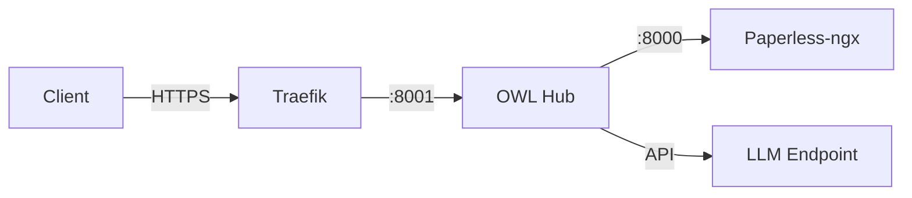

# Installation & Setup

Get OWL (the Document Intelligence Hub) running alongside your Paperless-ngx instance in under 5 minutes.

## Prerequisites

Before you begin, make sure you have:

- **Docker** (v20.10+) and **Docker Compose** (v2.x)
- A running **Paperless-ngx** instance with API access
- An **LLM endpoint** (OpenAI-compatible API — Azure OpenAI, local Ollama, or any proxy like Bifrost)
- A **Paperless API token** with full read/write permissions

:::warning Paperless Token Permissions
OWL needs a token with access to documents, tags, custom fields, and correspondents. A limited-scope token will cause silent failures when writing enrichment data back to Paperless.
:::

## Quick Install

```bash
# Clone the repository
git clone https://github.com/rsocko/owl.git
cd owl

# Create your environment file
cp .env.example .env

# Edit .env with your values (see Environment Variables below)
nano .env

# Start OWL
docker compose up -d
```

:::tip
If you're pulling the pre-built image from the registry, omit `--build`. If you want to build locally (for development or custom changes), add `--build`:
```bash
docker compose up -d --build
```
:::

## Environment Variables

| Variable | Required | Default | Description |
|----------|----------|---------|-------------|
| `PAPERLESS_URL` | ✅ | `http://paperless:8000` | URL to your Paperless-ngx instance |
| `PAPERLESS_API_TOKEN` | ✅ | — | API token for Paperless-ngx |
| `LLM_BASE_URL` | ✅* | `https://service-001.example.invalid/openai/v1` | OpenAI-compatible LLM endpoint |
| `LLM_API_KEY` | ✅* | — | API key for the LLM endpoint |
| `LLM_MODEL` | ✅* | `azure/gpt-4o-mini` | Model identifier to use |
| `WRITE_TO_PAPERLESS` | ❌ | `true` | Whether OWL writes enrichment data back to Paperless |
| `LOG_FORMAT` | ❌ | `json` | Log output format (`json` or `text`) |
| `STATEMENT_TRACKER_CONFIG` | ❌ | `/app/config/config.docker.yaml` | Path to statement tracker YAML config |

*\* Required for full functionality. Without LLM access, features like Action Queue classification, Statement Discovery, and EOB matching will not work.*

:::info LLM Without Full Functionality
OWL's health check and basic connectivity will work without an LLM configured, but all intelligent document processing requires a working LLM endpoint.
:::

## Verify Installation

Once the container is running, verify it's healthy:

```bash
curl http://localhost:8071/health
```

Expected response:

```json
{
  "status": "healthy",
  "version": "0.2.0"
}
```

You can also check Docker's built-in health status:

```bash
docker inspect --format='{{.State.Health.Status}}' doc-intelligence-hub
```

This should return `healthy` after the 30-second start period.

## Network Configuration

OWL needs to communicate with your Paperless-ngx instance. There are two common setups:

### Same Docker Network (Recommended)

If Paperless runs in Docker on the same host, add OWL to the same network:

```yaml
networks:
  doc-intelligence:
    name: doc-intelligence
    external: false
  # Add your Paperless network here
  paperless_default:
    external: true
```

Then set `PAPERLESS_URL=http://paperless:8000` (using the container name).

### External URL

If Paperless is on a different host or exposed via a reverse proxy:

```bash
PAPERLESS_URL=https://paperless.yourdomain.com
```

:::warning Network Isolation
If OWL can't reach Paperless, you'll see connection errors in logs but the container will still start. Always verify connectivity after setup — see [First Run Walkthrough](./first-run).
:::

## Production Setup

For production deployments, put OWL behind a reverse proxy with HTTPS.

### Traefik with Let's Encrypt

```yaml
services:
  hub:
    labels:
      - "traefik.enable=true"
      - "traefik.http.routers.owl.rule=Host(`service-005.example.invalid`)"
      - "traefik.http.routers.owl.entrypoints=websecure"
      - "traefik.http.routers.owl.tls.certresolver=letsencrypt"
      - "traefik.http.services.owl.loadbalancer.server.port=8001"
```

This gives you:
- HTTPS via automatic Let's Encrypt certificates
- Hostname-based routing at `service-005.example.invalid`
- Container-internal port `8001` exposed through Traefik



:::tip
Use `LOG_FORMAT=json` in production for structured logging that works well with log aggregators like Loki or Elasticsearch.
:::

## Data Persistence

OWL stores its operational data in a Docker volume:

```yaml
volumes:
  hub-data:
    name: doc-intelligence-data
```

This volume is mounted at `/app/data` inside the container and holds statement tracking databases, discovery caches, and run history. Back it up alongside your Paperless data.

---

**Next:** [First Run Walkthrough →](./first-run)
