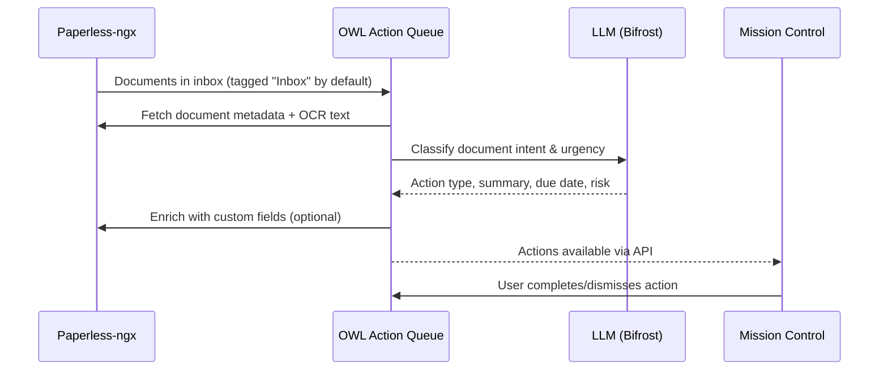
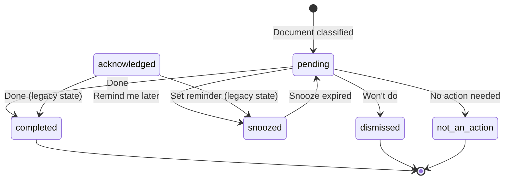

# Action Queue — Inbox Zero for Documents

The Action Queue is OWL's primary workflow module. It scans your Paperless-ngx inbox, classifies each document using an LLM, assigns urgency scores, and surfaces recommended actions — turning a pile of unprocessed documents into a prioritized task list.

:::info Interactive Mockup
Preview the Needs Review UI: [Unified Review Dashboard](../../mockups/triage-correction/triage-unified.html) — The human-review workflow with keyboard shortcuts and bulk operations.
:::

## How It Works



### Action Types

Documents are classified into one of these action categories:

| Action | Description | Example |
|--------|-------------|---------|
| `PAY` | Payment required | Invoice, utility bill |
| `RESPOND` | Reply or action needed | Letter requiring response |
| `FILE` | Just file, no action | Informational notice |
| `REVIEW` | Read and decide | Policy change, terms update |
| `SIGN` | Signature required | Contract, form |
| `WAIT` | Pending external action | Application in progress |
| `SHARE` | Forward to someone | Document for spouse/accountant |
| `SCHEDULE` | Calendar event needed | Appointment reminder |
| `ARCHIVE` | Safe to archive immediately | Duplicate, outdated |
| `TASK` | General to-do (catch-all) | Create account, register, cancel service |

## Action Lifecycle

Actions follow a clear lifecycle from detection to resolution:



| Status | Meaning | Remains in queue? |
|--------|---------|-------------------|
| `pending` | Not yet handled — needs attention | ✅ Yes (active) |
| `acknowledged` | Legacy state created by the removed Acknowledge action | ❌ No |
| `completed` | **Done** — user completed the real-world task | ❌ No |
| `snoozed` | **Remind me later** — returns tomorrow, next week, or on a selected date | ❌ No (resurfaces when the reminder expires) |
| `dismissed` | **Won't do** — this was a real task, intentionally declined | ❌ No |
| `not_an_action` | **No action needed** — OWL detected a task incorrectly | ❌ No (records classifier feedback) |

### Severity Tiers

Actions are bucketed into 3 display severity tiers (mapped from urgency):

| Severity | Urgency Source | Display Treatment |
|----------|---------------|-------------------|
| `critical` | CRITICAL | Red badge, top of queue, notification |
| `focus` | HIGH, MEDIUM | Amber badge, prominent placement |
| `safe` | LOW | Normal display, no special treatment |

### Recommended CTAs (Call-to-Action)

Each action includes an AI-recommended primary action button with optional deep links:

| CTA ID | Label Example | When Used |
|--------|---------------|-----------|
| `pay-online` | "Pay Online" | Bills with a payment URL |
| `call-provider` | "Call Billing" | Documents with a phone number |
| `email-provider` | "Draft Response" | Letters requiring a reply |
| `schedule-event` | "Add to Calendar" | Appointments, renewals |
| `sign-document` | "Sign Document" | Contracts, forms |
| `share-document` | "Share with Accountant" | Tax forms, shared docs |
| `review-document` | "Open & Review" | Policies, contracts |
| `open-document` | "View Document" | General viewing |
| `archive` | "Archive" | Already processed |
| `create-task` | "Create Task" | General to-do items |

CTAs can include a `url` (deep link to pay/sign/view) and/or `phone` number extracted from the document.

## User Flow

1. **Documents arrive** — Scanned mail, email attachments, or manual uploads land in Paperless with an `inbox` tag.
2. **OWL classifies** — On schedule or manual trigger, OWL fetches unprocessed documents and runs LLM classification.
3. **Actions appear** — Each document gets an action type, urgency score (1–10), and human-readable summary.
4. **User acts** — In Mission Control, review the queue sorted by urgency. Mark items done, set a reminder, decline the task, or tell OWL that no action was needed.
5. **Enrichment** — Classifications and status changes update Paperless custom fields for downstream filtering. Resolved documents have their configured intake tags removed by default.

## API Reference

### Check System Health

```bash
curl http://service-005.example.invalid/api/queue/check
```

Returns connectivity status for Paperless and the LLM backend:

```json
{
  "status": "ok",
  "module": "action-queue",
  "read_only": false,
  "paperless": { "status": "ok" },
  "ollama": { "status": "ok", "model": "azure/gpt-4o-mini" }
}
```

### Run the Classification Pipeline

```bash
curl -X POST http://service-005.example.invalid/api/queue/run \
  -H "Content-Type: application/json" \
  -d '{"dry_run": false, "limit": 50}'
```

| Parameter | Type | Default | Description |
|-----------|------|---------|-------------|
| `limit` | int | null | Max documents to process (1–500) |
| `dry_run` | bool | `true` | Preview without writing changes |
| `force` | bool | `false` | Reprocess already-classified docs |

:::warning
`dry_run` defaults to `true`. You must explicitly set `"dry_run": false` to persist classifications and enrich Paperless.
:::

### List Actions

```bash
curl http://service-005.example.invalid/api/queue/actions
```

Returns all pending actions sorted by urgency descending.

### Update an Action

```bash
curl -X PATCH http://service-005.example.invalid/api/queue/actions/42 \
  -H "Content-Type: application/json" \
  -d '{"status": "completed", "dry_run": false}'
```

Valid statuses: `completed`, `dismissed`, `pending`, `acknowledged`, `snoozed`, `not_an_action`.

When setting status to `snoozed`, include `"snoozed_until": "2026-08-01T09:00:00Z"`.

### Set a Reminder

```bash
curl -X PATCH http://service-005.example.invalid/api/queue/actions/42 \
  -H "Content-Type: application/json" \
  -d '{"status": "snoozed", "snoozed_until": "2026-08-20T09:00:00", "dry_run": false}'
```

Removes the action from the active queue until the specified date and time. Once
the reminder expires, OWL automatically returns it to Pending within one minute.
Queue reads also perform this promotion so reminders catch up after service downtime.

### Snooze an Action

```bash
curl -X POST http://service-005.example.invalid/api/queue/actions/42/snooze \
  -H "Content-Type: application/json" \
  -d '{"until": "2026-08-01T09:00:00Z"}'
```

Defers the action until the specified time. Use `GET /api/queue/actions/expired-snoozes` to find actions ready to resurface.

### Submit Feedback (False Positive / Misclassification)

```bash
curl -X POST http://service-005.example.invalid/api/queue/actions/42/feedback \
  -H "Content-Type: application/json" \
  -d '{"feedback_type": "not_an_action", "reason": "This is just an ad mailer"}'
```

| feedback_type | Meaning |
|---------------|---------|
| `not_an_action` | Document doesn't require any action (false positive) |
| `misclassified` | Wrong action type — provide `corrected_action_type` |
| `wrong_urgency` | Urgency level is incorrect |
| `wrong_amount` | Extracted amount is wrong |

Feedback trains the classifier over time and is stored for analysis.

### Pipeline Progress (SSE)

```bash
curl http://service-005.example.invalid/api/queue/progress
```

Server-sent events stream for real-time pipeline progress during a run.

## Configuration

### LLM Settings

OWL uses an OpenAI-compatible API via the Bifrost gateway:

```bash
LLM_BASE_URL=https://service-001.example.invalid/openai/v1
LLM_API_KEY=bifrost
LLM_MODEL=azure/gpt-4o-mini
```

:::tip
If the LLM is unavailable, OWL falls back to a **rule-based classifier** that uses document metadata (correspondent, tags, document type) to infer actions. Classification quality is lower, but the queue still functions.
:::

### Scheduling

Use the admin API to configure automatic runs:

```bash
curl -X PUT http://service-005.example.invalid/api/admin/schedules/action_queue \
  -H "Content-Type: application/json" \
  -d '{"enabled": true, "cron": "0 6 * * *"}'
```

### Write-Back Control

Set `WRITE_TO_PAPERLESS=true` to allow OWL to enrich documents with custom fields. When `false`, OWL operates read-only and actions exist only in OWL's database.

The default document source and resolution behavior are durable settings under
**Settings → Action Queue — Document Source**. The default source is the
Paperless `Inbox` tag; ad-hoc Custom Run filters do not change that default.

When **Remove intake tags when resolved** is enabled (the default), OWL removes
the configured monitored tags after an action is completed, dismissed, or
classified as `not_an_action`. OWL uses the `Action Status` custom field for
workflow state and does not add a separate `Todo` tag.

## Limitations

:::warning Current Limitations
- **Bulk operations** are defined in the API schema but not yet implemented in the UI
- **Learning from feedback** — user corrections (via `/feedback` endpoint) are stored but not yet used for model fine-tuning; feedback data can be exported for offline analysis
- **CTA deep links** — AI extracts URLs/phone numbers when available, but not all documents have parseable payment links
:::
