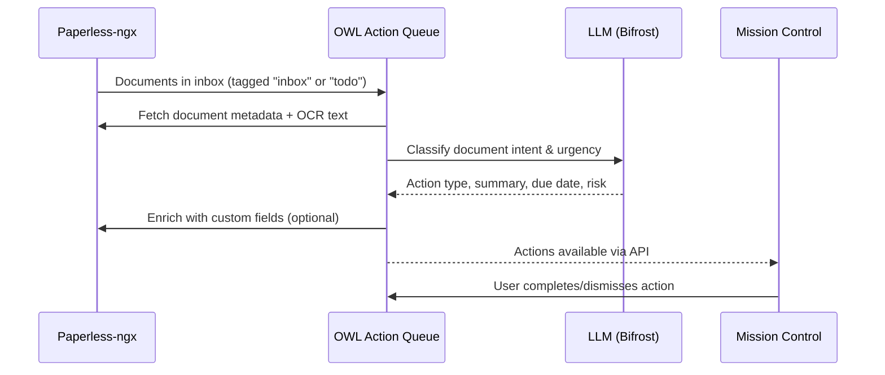

# Action Queue — Inbox Zero for Documents

The Action Queue is OWL's primary workflow module. It scans your Paperless-ngx inbox, classifies each document using an LLM, assigns urgency scores, and surfaces recommended actions — turning a pile of unprocessed documents into a prioritized task list.

## How It Works



### Action Types

Documents are classified into one of these action categories:

| Action | Description | Example |
|--------|-------------|---------|
| `PAY` | Payment required | Invoice, utility bill |
| `RESPOND` | Reply or action needed | Letter requiring response |
| `FILE` | Just file, no action | Informational notice |
| `REVIEW` | Read and decide | Policy change, terms update |
| `SIGN` | Signature required | Contract, form |
| `WAIT` | Pending external action | Application in progress |
| `SHARE` | Forward to someone | Document for spouse/accountant |
| `SCHEDULE` | Calendar event needed | Appointment reminder |
| `ARCHIVE` | Safe to archive immediately | Duplicate, outdated |

## User Flow

1. **Documents arrive** — Scanned mail, email attachments, or manual uploads land in Paperless with an `inbox` tag.
2. **OWL classifies** — On schedule or manual trigger, OWL fetches unprocessed documents and runs LLM classification.
3. **Actions appear** — Each document gets an action type, urgency score (1–10), and human-readable summary.
4. **User reviews** — In Mission Control, review the queue sorted by urgency. Complete, dismiss, or defer each item.
5. **Enrichment** — Completed actions update Paperless custom fields (action type, status) for downstream filtering.

## API Reference

### Check System Health

```bash
***REMOVED*** http://service-005.example.invalid/api/queue/check
```

Returns connectivity status for Paperless and the LLM backend:

```json
{
  "status": "ok",
  "module": "action-queue",
  "read_only": false,
  "paperless": { "status": "ok" },
  "ollama": { "status": "ok", "model": "azure/gpt-4o-mini" }
}
```

### Run the Classification Pipeline

```bash
***REMOVED*** -X POST http://service-005.example.invalid/api/queue/run \
  -H "Content-Type: application/json" \
  -d '{"dry_run": false, "limit": 50}'
```

| Parameter | Type | Default | Description |
|-----------|------|---------|-------------|
| `limit` | int | null | Max documents to process (1–500) |
| `dry_run` | bool | `true` | Preview without writing changes |
| `force` | bool | `false` | Reprocess already-classified docs |

:::warning
`dry_run` defaults to `true`. You must explicitly set `"dry_run": false` to persist classifications and enrich Paperless.
:::

### List Actions

```bash
***REMOVED*** http://service-005.example.invalid/api/queue/actions
```

Returns all pending actions sorted by urgency descending.

### Update an Action

```bash
***REMOVED*** -X PATCH http://service-005.example.invalid/api/queue/actions/42 \
  -H "Content-Type: application/json" \
  -d '{"status": "completed", "dry_run": false}'
```

Valid statuses: `completed`, `dismissed`, `pending`.

### Pipeline Progress (SSE)

```bash
***REMOVED*** http://service-005.example.invalid/api/queue/progress
```

Server-sent events stream for real-time pipeline progress during a run.

## Configuration

### LLM Settings

OWL uses an OpenAI-compatible API via the Bifrost gateway:

```bash
LLM_BASE_URL=https://service-001.example.invalid/openai/v1
LLM_API_KEY=bifrost
LLM_MODEL=azure/gpt-4o-mini
```

:::tip
If the LLM is unavailable, OWL falls back to a **rule-based classifier** that uses document metadata (correspondent, tags, document type) to infer actions. Classification quality is lower, but the queue still functions.
:::

### Scheduling

Use the admin API to configure automatic runs:

```bash
***REMOVED*** -X PUT http://service-005.example.invalid/api/admin/schedules/action_queue \
  -H "Content-Type: application/json" \
  -d '{"enabled": true, "cron": "0 6 * * *"}'
```

### Write-Back Control

Set `WRITE_TO_PAPERLESS=true` to allow OWL to enrich documents with custom fields. When `false`, OWL operates read-only and actions exist only in OWL's database.

## Limitations

:::warning Current Limitations
- **Bulk operations** are defined in the API schema but not yet implemented in the UI
- **Deferred actions** (snooze until date) are tracked but have no automatic re-surfacing yet
- **Learning from feedback** — user corrections are stored but not yet used for model fine-tuning
:::
