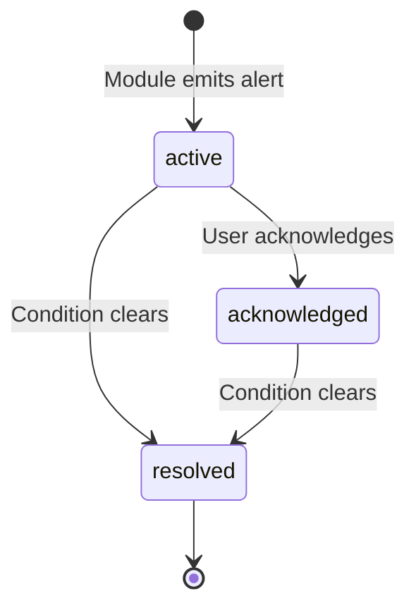

# Unified Alerts — Cross-Module Alert Inbox

The Alerts system provides a single feed of actionable notifications across all OWL modules. Alerts are consumed by Mission Control to surface urgent items in the household dashboard.

:::info Interactive Mockup
Preview the insights & alerts UI: [Insights Tab](../../mockups/triage-correction/insights-tab.html) — Alert feed with severity filters, acknowledgment flow, and trend charts.
:::

## Alert Types

| Alert Type | Source Module | Trigger |
|------------|--------------|---------|
| `overdue_statement` | Statement Tracking | Expected statement not received within grace period |
| `eob_orphan` | EOB Matching | EOB or bill unmatched for extended period |
| `eob_mismatch` | EOB Matching | Match score anomaly or amount discrepancy |
| `high_urgency_action` | Action Queue | Document classified with urgency ≥ 8/10 |

## Alert Severity Levels

| Severity | Meaning | Example |
|----------|---------|---------|
| `critical` | Immediate action required | Payment past due, legal deadline |
| `high` | Action needed soon | Statement 2+ weeks overdue |
| `medium` | Should review | Moderate urgency document, orphaned EOB |
| `low` | Informational | Provider pattern changed |
| `info` | Status update | Discovery completed, new provider detected |

## API Reference

### List Alerts

```bash
curl "http://service-005.example.invalid/api/insights/alerts?module=statements&severity=high"
```

| Parameter | Type | Description |
|-----------|------|-------------|
| `module` | string | Filter: `statements`, `eob`, `action_queue` |
| `severity` | string | Filter: `critical`, `high`, `medium`, `low`, `info` |
| `acknowledged` | bool | Filter by acknowledgment status |

Response:

```json
{
  "alerts": [
    {
      "id": "alert-uuid-456",
      "alert_type": "overdue_statement",
      "severity": "high",
      "module": "statements",
      "title": "Chase Visa statement overdue",
      "description": "Monthly statement expected by Jul 15 not yet received (11 days overdue)",
      "action_url": "/statements/providers/chase-visa",
      "metadata": {
        "provider_key": "chase-visa",
        "expected_date": "2026-07-15",
        "days_overdue": 11
      },
      "created_at": "2026-07-26T06:00:00Z",
      "acknowledged_at": null,
      "resolved_at": null
    }
  ]
}
```

### Alert Summary

```bash
curl http://service-005.example.invalid/api/insights/alerts/summary
```

Returns counts grouped by severity and module — useful for dashboard badges:

```json
{
  "total": 5,
  "by_severity": { "critical": 0, "high": 2, "medium": 3, "low": 0, "info": 0 },
  "by_module": { "statements": 2, "eob": 2, "action_queue": 1 }
}
```

### Acknowledge an Alert

```bash
curl -X PATCH http://service-005.example.invalid/api/insights/alerts/alert-uuid-456/acknowledge
```

Acknowledging an alert marks it as seen without resolving the underlying issue. Acknowledged alerts remain visible but are de-prioritized in Mission Control.

### Resolve an Alert

Alerts are automatically resolved when their underlying condition clears (e.g., the missing statement arrives). Manual resolution is not currently exposed via API — acknowledge and wait for auto-resolution.

## Workflow



## Integration with Mission Control

Mission Control polls the alerts summary endpoint to display badge counts on the Document Intelligence card. Clicking through opens the full alert list with filtering and acknowledge actions.

:::note
Alerts are designed to be consumed by Mission Control's notification system. OWL itself does not send push notifications or emails — it provides the data layer that MC renders.
:::

## Limitations

:::warning Current Gaps
- **Statement module** does not yet auto-emit alerts. The recommendation engine detects overdue statements but you must manually trigger recommendations; results are not automatically written to the alerts table.
- **EOB module** does not yet auto-emit orphan/mismatch alerts. The detection logic exists but the bridge to the unified alerts system is not wired.
- **Action Queue** is the only module currently writing to the alerts table (high-urgency actions).
- **Auto-resolution** is designed but not yet implemented — alerts must be acknowledged manually.
:::

## Alert Retention

Old alerts are cleaned up automatically. By default, resolved alerts older than 90 days are purged. This is handled by `cleanup_old_alerts()` which runs on server startup.
