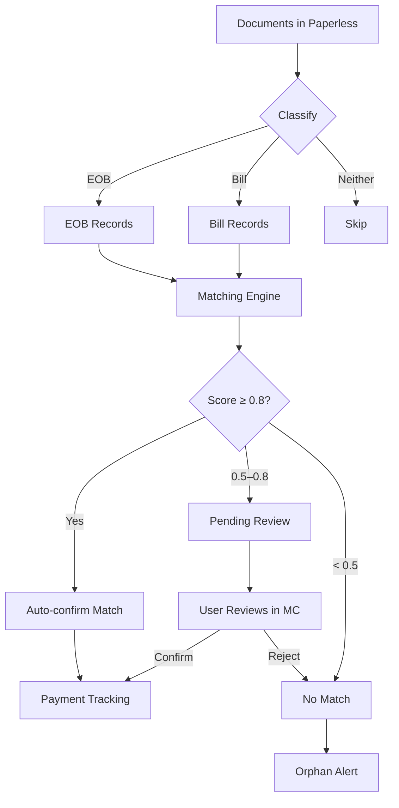
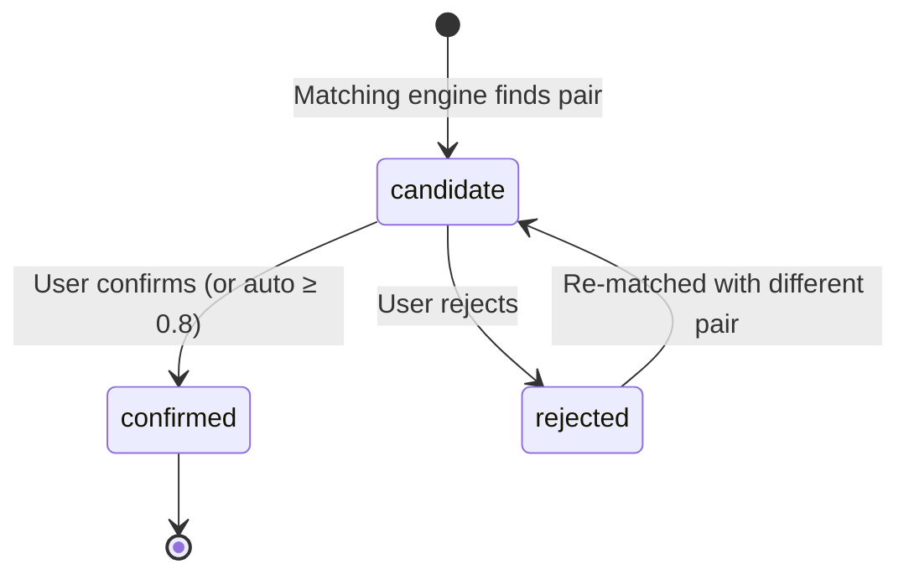

# EOB Matching — Insurance & Medical Bill Reconciliation

The EOB Matching module automatically pairs insurance Explanations of Benefit (EOBs) with their corresponding medical bills using a multi-factor weighted scoring algorithm. It tracks payment status and surfaces orphaned documents that need attention.

## How It Works



### Scoring Factors

Matches are scored using five weighted factors:

| Factor | Weight | What It Compares |
|--------|--------|-----------------|
| **Date proximity** | 30% | Service dates between EOB and bill |
| **Provider name** | 25% | Healthcare provider / facility name |
| **Patient name** | 20% | Patient listed on both documents |
| **Amount** | 15% | Billed amount vs EOB allowed/paid amounts |
| **Procedures** | 10% | CPT codes or procedure descriptions |

A composite score of **0.0–1.0** is computed. Scores above 0.8 auto-confirm; scores between 0.5–0.8 require human review.

## User Flow

### 1. Run the Matching Pipeline

```bash
***REMOVED*** -X POST http://service-005.example.invalid/api/eob/run \
  -H "Content-Type: application/json" \
  -d '{"limit": 50, "verbose": true}'
```

| Parameter | Type | Default | Description |
|-----------|------|---------|-------------|
| `limit` | int | 20 | Max documents to process |
| `tags` | list | null | Filter by Paperless tags |
| `correspondent` | string | null | Filter by correspondent |
| `created_after` | string | null | Only docs after this date (YYYY-MM-DD) |
| `since_last_run` | bool | false | Only process new docs since last run |
| `verbose` | bool | false | Include extraction details in response |
| `write_to_paperless` | bool | null | Override hub write setting |

### 2. Review Matches

```bash
***REMOVED*** http://service-005.example.invalid/api/eob/matches?status=pending_review
```

Response:

```json
{
  "matches": [
    {
      "id": "match-uuid-123",
      "eob_document_id": 201,
      "bill_document_id": 189,
      "score": 0.72,
      "status": "candidate",
      "score_breakdown": {
        "date": 0.9,
        "provider": 0.8,
        "patient": 0.7,
        "amount": 0.5,
        "procedures": 0.4
      },
      "eob_summary": "BCBS EOB - Dr. Smith - 2026-05-15",
      "bill_summary": "Smith Family Practice - $250 - 2026-05-14"
    }
  ]
}
```

### 3. Confirm or Reject

```bash
# Confirm a match
***REMOVED*** -X POST http://service-005.example.invalid/api/eob/matches/match-uuid-123/confirm \
  -H "Content-Type: application/json" \
  -d '{"notes": "Verified amounts match after insurance adjustment"}'

# Reject a match
***REMOVED*** -X POST http://service-005.example.invalid/api/eob/matches/match-uuid-123/reject \
  -H "Content-Type: application/json" \
  -d '{"reason": "Different patient - spouse vs primary"}'
```

### 4. Track Payments

Once matched, track payment status:

```bash
***REMOVED*** -X POST http://service-005.example.invalid/api/eob/matches/match-uuid-123/payment \
  -H "Content-Type: application/json" \
  -d '{"status": "paid", "amount_paid": 45.00, "paid_date": "2026-06-01"}'
```

### Match States



| State | Meaning |
|-------|---------|
| `candidate` | Potential match, needs review |
| `confirmed` | Verified correct match |
| `rejected` | Incorrect pairing |

### Payment States

| State | Meaning |
|-------|---------|
| `unpaid` | Bill confirmed but not yet paid |
| `partial` | Partial payment recorded |
| `paid` | Fully paid |
| `overpaid` | Paid more than owed (flag for refund) |

### 5. Handle Orphans

Documents classified as EOB or Bill that have no match after a configurable period are surfaced as orphans:

```bash
***REMOVED*** http://service-005.example.invalid/api/eob/documents?status=unmatched
```

### 6. Manual Match

For difficult cases, manually pair documents:

```bash
***REMOVED*** -X POST http://service-005.example.invalid/api/eob/matches/manual \
  -H "Content-Type: application/json" \
  -d '{"eob_doc_id": 201, "bill_doc_id": 189, "notes": "Manual match - different provider name on EOB"}'
```

## API Reference

| Endpoint | Method | Description |
|----------|--------|-------------|
| `/api/eob/run` | POST | Run matching pipeline |
| `/api/eob/matches` | GET | List matches (filter by status) |
| `/api/eob/matches/{id}` | GET | Get match details |
| `/api/eob/matches/{id}/confirm` | POST | Confirm a match |
| `/api/eob/matches/{id}/reject` | POST | Reject a match |
| `/api/eob/matches/{id}/payment` | POST | Record payment |
| `/api/eob/matches/manual` | POST | Create manual match |
| `/api/eob/documents` | GET | List classified documents |
| `/api/eob/stats` | GET | Match statistics |

## Configuration

### Scoring Weights

Adjust matching weights via the admin API:

```bash
***REMOVED*** -X PUT http://service-005.example.invalid/api/admin/weights/eob \
  -H "Content-Type: application/json" \
  -d '{
    "date": 0.30,
    "provider": 0.25,
    "patient": 0.20,
    "amount": 0.15,
    "procedures": 0.10
  }'
```

### Auto-Confirm Threshold

```bash
***REMOVED*** -X PUT http://service-005.example.invalid/api/admin/config/eob \
  -H "Content-Type: application/json" \
  -d '{"auto_confirm_threshold": 0.85}'
```

## Limitations

:::warning Current Limitations
- **Paperless live integration not yet wired** — the classification and extraction logic works against document content, but the full pipeline has not been tested end-to-end against a live Paperless instance with real medical documents.
- **Persistence layer exists but is untested with real data** — the SQLite schema and matching logic are implemented, but production-quality data (real EOBs and bills) has not been run through the system.
- **LLM extraction required** — unlike the Action Queue which has a rule-based fallback, EOB matching relies entirely on LLM-based field extraction and will not function without an available LLM endpoint.
:::
