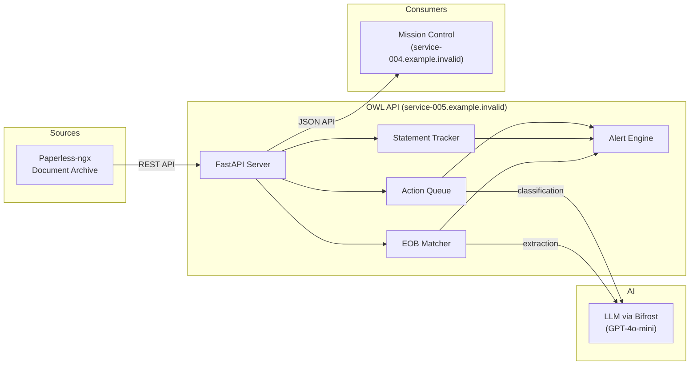

# OWL 🦉 — Organize. Watch. Learn.

OWL is a document intelligence application that turns your [Paperless-ngx](https://docs.paperless-ngx.com/) archive into an actionable system. It provides a built-in dashboard for triage, tracking, and matching workflows, and also feeds alerts into [Mission Control](https://service-004.example.invalid) for cross-service visibility. It classifies incoming documents, detects missing recurring statements, matches medical EOBs to bills, and surfaces alerts.

## Core Capabilities

| Module | What It Does |
|--------|-------------|
| [Action Queue](./action-queue-guide.md) | Inbox-zero workflow — classifies documents and recommends next actions |
| [Statement Tracking](./statement-tracking-guide.md) | Detects missing recurring statements (bank, utilities, insurance) |
| [EOB Matching](./eob-matching-guide.md) | Matches insurance Explanations of Benefit to medical bills |
| [Alerts](./alerts-guide.md) | Unified alert inbox across all modules |
| OCR Quality | Scores and remediates poor OCR (planned) |

## Architecture



## Quick Start

### Prerequisites

- Docker & Docker Compose
- A running Paperless-ngx instance with API access
- LLM access (Bifrost gateway or direct OpenAI-compatible endpoint)

### Environment Variables

```bash
# Required
PAPERLESS_URL=http://paperless:8000
PAPERLESS_API_TOKEN=your-paperless-token

# LLM (via Bifrost or direct)
LLM_BASE_URL=https://service-001.example.invalid/openai/v1
LLM_API_KEY=bifrost
LLM_MODEL=azure/gpt-4o-mini

# Optional
WRITE_TO_PAPERLESS=true        # Allow OWL to write tags/fields back
LOG_FORMAT=json                 # Structured logging for production
```

### Docker Compose

```bash
cd owl
docker compose up -d --build
```

The hub starts on port **8071** by default. Verify it's running:

```bash
curl http://localhost:8071/health
```

:::tip
OWL is designed as a headless API. For the full user experience, access it through Mission Control's Document Intelligence panel at `service-004.example.invalid`.
:::

## API Base URL

All endpoints are served under `http://service-005.example.invalid` (or `localhost:8071` in development).

| Prefix | Module |
|--------|--------|
| `/api/queue/*` | Action Queue |
| `/api/statements/*` | Statement Tracking |
| `/api/eob/*` | EOB Matching |
| `/api/insights/alerts/*` | Unified Alerts |
| `/api/admin/*` | Admin & Configuration |

## What's Next

- **New to OWL?** Start with the [Action Queue Guide](./action-queue-guide.md) — it's the most impactful module for daily use.
- **Tracking bills?** See [Statement Tracking](./statement-tracking-guide.md) for missing statement detection.
- **Medical documents?** The [EOB Matching Guide](./eob-matching-guide.md) covers insurance/bill reconciliation.
- **Configuration?** See the [Configuration Reference](./configuration.md) for all environment variables and YAML options.
