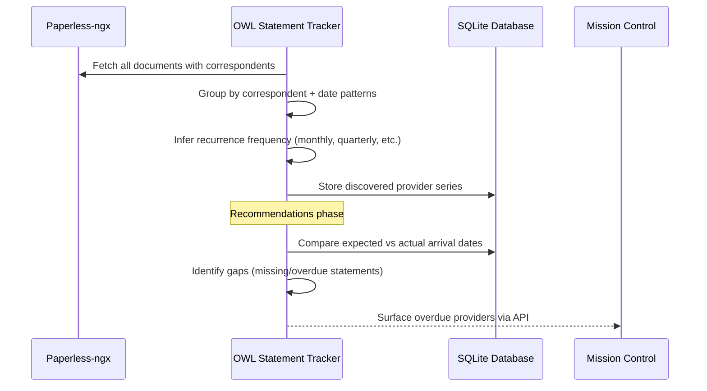

# Statement Tracking — Never Miss a Recurring Statement

The Statement Tracker analyzes your Paperless-ngx archive to identify recurring document providers (banks, credit cards, utilities, insurance) and alerts you when expected statements are overdue or missing.

:::info Interactive Mockup
Preview the statement series detail view: [Statement Series Detail](../../mockups/triage-correction/statement-series-detail.html) — Provider timeline, gap visualization, and override controls.
:::

## How It Works



### What It Detects

| Frequency | Examples |
|-----------|----------|
| Monthly | Bank statements, credit card statements, utility bills |
| Quarterly | Investment reports, insurance summaries |
| Annually | Tax documents, policy renewals |
| Semi-annual | Property tax, HOA assessments |

## User Flow

### 1. Run Discovery

Discovery scans your Paperless archive and identifies providers that send recurring documents:

```bash
curl -X POST http://service-005.example.invalid/api/statements/discovery/run
```

This returns a Server-Sent Events (SSE) stream with progress updates. Discovery groups documents by correspondent and normalized statement title, assigns a human-readable `statement_name`, and then infers the sending frequency. The statement name is distinct from the shared correspondent (for example, "Chase Sapphire Statement" versus "Chase") and can be corrected with the series rename action for Paperless write-back.

:::info
Discovery requires **sufficient document history** to detect patterns. A provider needs at least 3 documents with recognizable date spacing to be identified. For monthly statements, that means ~3 months of history minimum.
:::

### 2. Review Discovered Providers

```bash
curl http://service-005.example.invalid/api/statements/providers
```

Response:

```json
{
  "providers": [
    {
      "provider_key": "chase-visa",
      "provider_name": "Chase",
      "statement_name": "Chase Visa Statement",
      "frequency": "monthly",
      "last_document_date": "2026-06-15",
      "document_count": 14,
      "confidence": 0.92
    }
  ],
  "analyzed_documents": 847,
  "run_at": "2026-07-20T06:00:00Z"
}
```

### 3. Run Recommendations

Check which providers are overdue:

```bash
curl -X POST http://service-005.example.invalid/api/statements/recommendations/run
```

This compares expected arrival dates against actual documents and identifies gaps.

### 4. View Overdue Statements

Recommendations surface in the unified alerts system and through the statements API. Mission Control displays these as actionable items with links to the provider's portal (if configured).

### 5. Override Detection with Hints

If auto-detection gets a provider wrong, you can supply manual hints:

```bash
curl -X PUT http://service-005.example.invalid/api/statements/providers/chase-visa/override \
  -H "Content-Type: application/json" \
  -d '{
    "frequency": "monthly",
    "expected_day": 15,
    "grace_period_days": 10
  }'
```

## API Reference

| Endpoint | Method | Description |
|----------|--------|-------------|
| `/api/statements/providers` | GET | List all discovered providers |
| `/api/statements/discovery/run` | POST | Trigger a new discovery scan (SSE) |
| `/api/statements/recommendations/run` | POST | Check for missing/overdue statements (SSE) |
| `/api/statements/providers/{key}/override` | PUT | Set manual frequency/grace overrides |
| `/api/statements/series/{id}/rename` | POST | Rename a detected series |
| `/api/statements/series/{id}/merge` | POST | Merge two series that represent the same provider |
| `/api/statements/series/{id}/split` | POST | Split a series that was incorrectly grouped |

## Configuration

### YAML Config File

Statement tracking uses a YAML configuration file (set via `STATEMENT_TRACKER_CONFIG`):

```yaml
source:
  paperless_url: http://paperless:8000
  api_token_env: PAPERLESS_API_TOKEN

runtime:
  database_path: /app/data/statements.db

detection:
  min_documents: 3
  confidence_threshold: 0.7

grace_periods:
  monthly: 10    # days past expected date before alerting
  quarterly: 15
  annual: 30
```

### Provider Hints

For providers that are hard to detect automatically, add hints in the config:

```yaml
provider_hints:
  - correspondent: "State Farm"
    frequency: semi_annual
    expected_months: [1, 7]
  - correspondent: "County Tax Office"
    frequency: annual
    expected_month: 11
```

## Limitations

:::warning Current Limitations
- **No automatic alert emission** — the statement module detects gaps but doesn't yet auto-create entries in the unified alerts system. You need to run recommendations manually or on a schedule.
- **SSE-only responses** — discovery and recommendations return Server-Sent Events streams; polling-based clients need to consume the full stream.
:::
