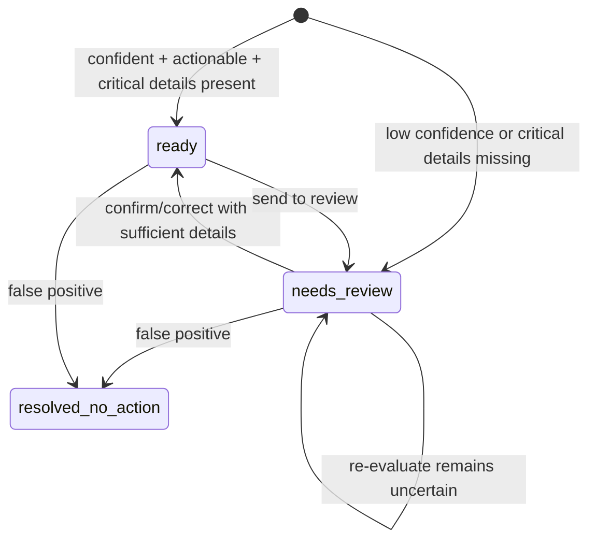
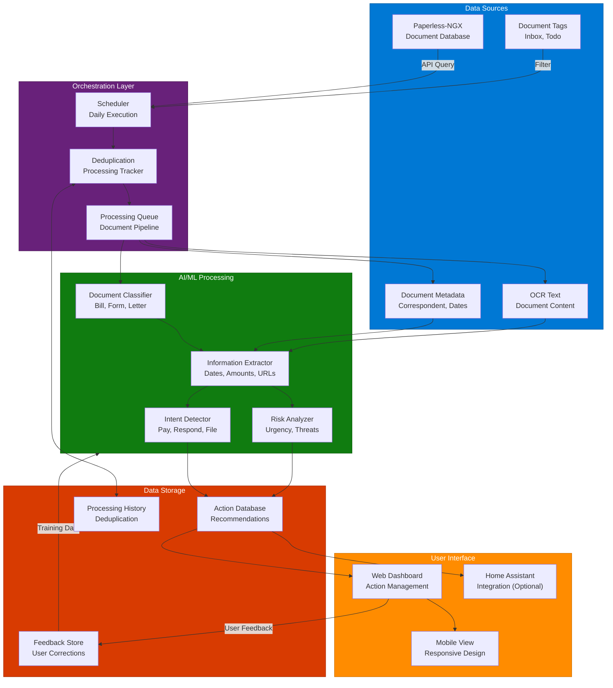
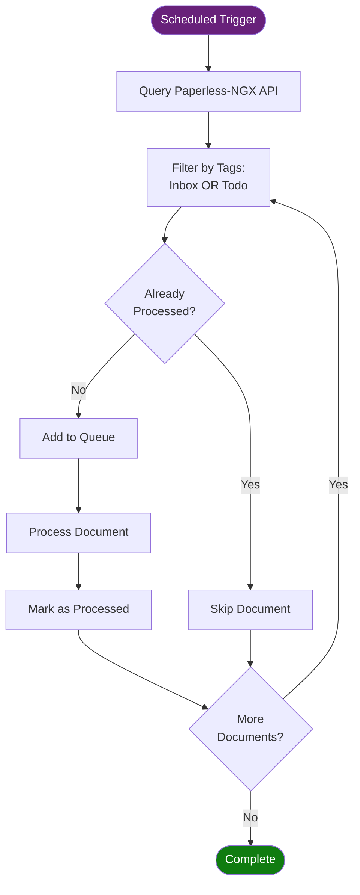
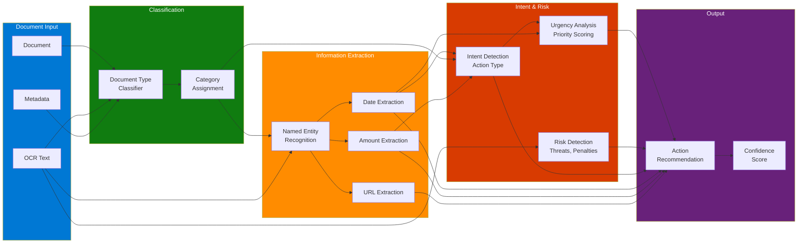
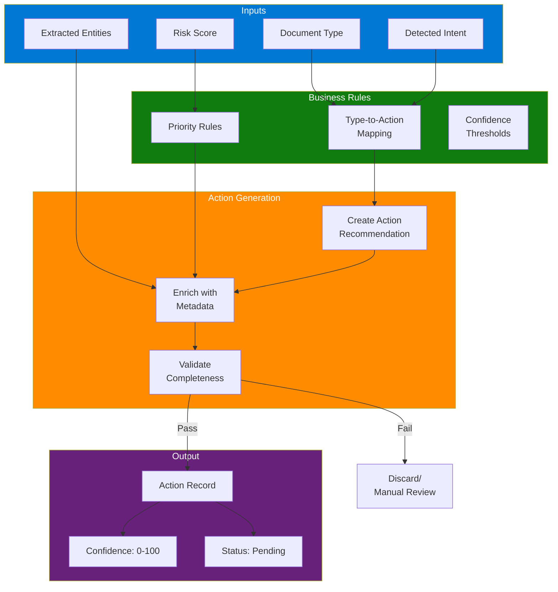
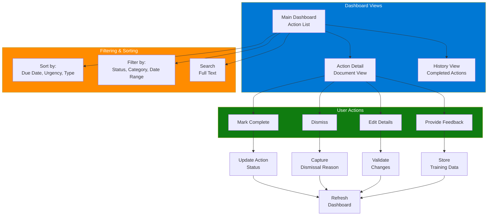
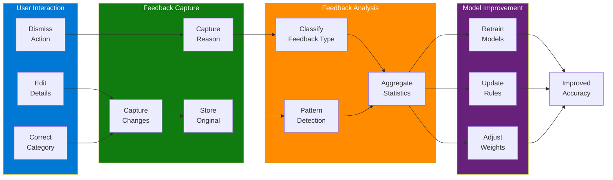
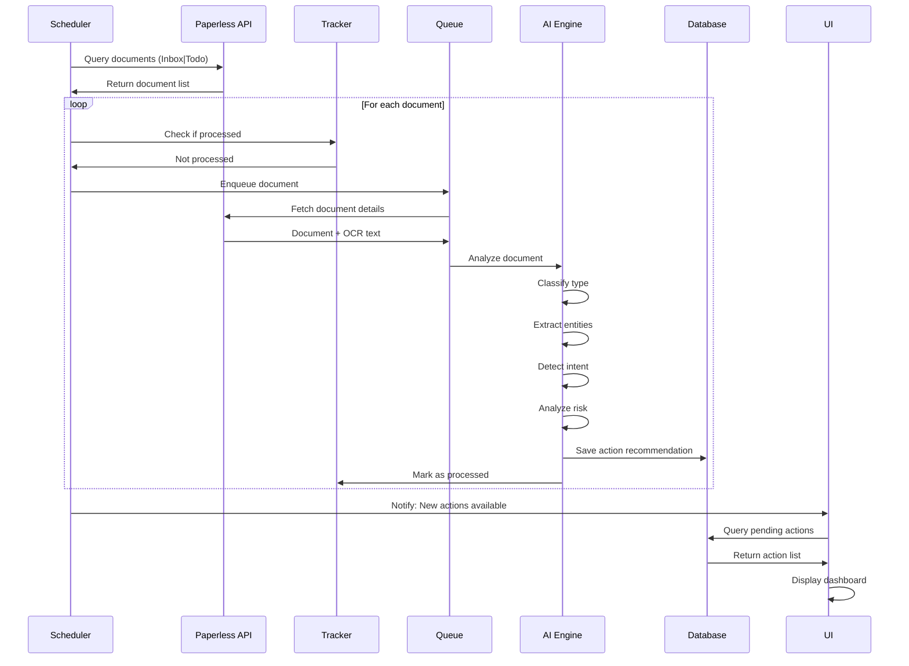
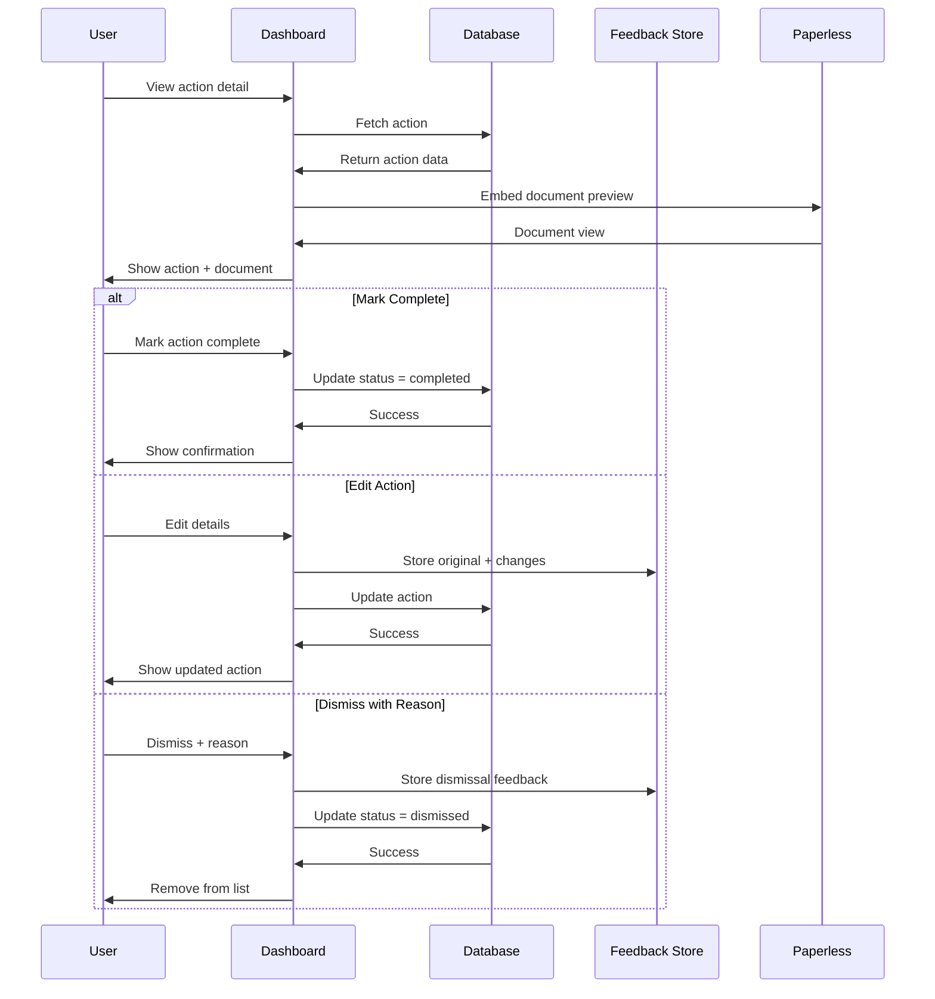

# Current Product Contract

## North star and ownership

OWL should help a person act on documents without asking them to interpret an
uncertain classifier guess first. Product surfaces have distinct ownership:

| Surface | Owns |
|---------|------|
| **Needs Review** | What OWL should believe. It receives uncertain or critically incomplete action classifications and supports confirm, correct, no action, and re-evaluate. |
| **Action Queue** | Trusted, actionable real-world work. It is optimized for daily completion rather than pipeline diagnosis or historical reporting. |
| **Admin / Action Queue Operations** | Pipeline health, custom-field checks, custom and dry runs, backfills, metadata refresh, and troubleshooting. |
| **Mission Control** | Cross-system prioritization of trusted OWL actions. It does not become the source of truth for document analysis, Paperless metadata, OWL lifecycle, or classifier corrections. |

## Readiness routing

`action_ready` is the trust boundary. `review_state` explains the state:



The configured Action Queue confidence threshold remains the confidence policy;
readiness does not introduce a second magic threshold. A title is critical for
all action types. PAY also requires an amount. Confident actionable items bypass
review, confident no-action assessments file automatically, and uncertain
interpretations remain absent from the default Action Queue and Mission Control
feeds until resolved. Needs Review URLs use
`#/triage?type=action_classification&item={review_item_id}` and must select the
specific review item.

## Daily Action Queue

The primary viewport contains a compact last-run/pipeline status, Refresh, Run
now, persistent quick type filters, search, and a persistent **Grouped | Table**
view toggle. It does not contain KPI cards, historical-resolution progress,
health checks, backfill, dry-run, custom-run, or custom-field controls.

Pending actions are grouped in this fixed order: **Overdue**, **Today**,
**Next 7 days**, **Later**, **No due date**. Each group initially displays 15
items and supports collapse and Show more. Within a group the deterministic
order is:

1. Exact due date, earliest first.
2. Action type: PAY, RESPOND, SIGN, SCHEDULE, TASK, REVIEW, SHARE, FILE, ARCHIVE.
3. Newest discovery first, then descending action ID.

The deadline bucket and exact date always outrank action type. Quick filters are
Pay, Respond, Sign, Schedule, and File / Archive; their selection persists
locally between visits.

Grouped is the default for active Pending, Acknowledged, and Remind later work
unless the user has saved a Table preference. The compact table restores
sortable columns for selection, action and correspondent, type, due date,
amount, document metadata, status, lifecycle chronology, and one valid
contextual action. Grouping is unavailable for terminal history and the mixed
All view because a current deadline does not describe resolution history.

Done, Won't do, and No action needed views always use the table without
overwriting the saved active-work preference. Their deterministic initial sort
is newest lifecycle change first. The chronology timestamp is `completed_at`
for completed work, then `updated_at` for other lifecycle transitions, with
`created_at` only as the legacy fallback.

## Obligation-backed linked documents

An actionable invoice represents a real-world obligation, not merely one
Paperless document. One primary PAY action may therefore own a chronological
document set containing the original invoice, duplicates, reminders, revisions,
and payment receipts. Follow-up invoice actions are suppressed from the daily
queue when invoice reference, correspondent, and amount evidence clears the
matching threshold. A recurring account identifier alone is insufficient:
account-based grouping requires explicit reminder/revision language and a close
amount so ordinary monthly bills remain separate obligations.

Grouped Action Queue cards expose an inline **View N docs** control. The expanded
timeline labels each document's role, date, and amount. Hover or keyboard focus
shows a first-page thumbnail and key metadata; activation opens the full document
viewer. The timeline is evidence for one action, not a second task list.

Receipts are still non-actionable documents themselves. A uniquely strongest
receipt match attaches to the obligation when invoice/account identity,
correspondent, and amount—including a small convenience-fee tolerance—provide
sufficient confidence. OWL then displays **Payment evidence found** with a
one-click completion suggestion. It does not close the action automatically.
Completion clears the suggestion and settles the obligation; reopening restores
the suggestion while preserving the receipt and the normal Action Queue undo
path. Ambiguous receipt candidates remain unmatched rather than guessing.

## Contextual action and completion

The document flyout keeps the PDF preview and exposes the normalized
`recommended_cta` plus safe extracted links or phone details. Opening an
external CTA never completes an action. After returning, the user can Mark
done or Remind later. **Something's wrong** is the exceptional path:

- Wrong action type records `misclassified` feedback, updates the current type
  and CTA, and continues in place when critical details remain sufficient.
- Relevant title, summary, deadline, amount, urgency, and correspondent details
  can be corrected in place.
- A correction that remains critically incomplete routes to Needs Review.
- **No action needed** means false positive only. It records `not_an_action`,
  resolves the item, and removes it from actionable feeds.

Original and rejected guesses remain in OWL feedback/audit history. They are
never rendered as current authoritative metadata.

FILE and ARCHIVE mean filing the document, not deleting it and not invoking a
separate Paperless archival feature. **File in Paperless** is a source action:
it removes only configured intake/monitor tags, writes the resolved Action
Status, completes the OWL action, and refreshes the UI. Paperless mutation
happens before local completion; a Paperless failure is shown and leaves the
local action open rather than reporting false success.

Lifecycle actions are status-aware in cards, rows, bulk controls, and the
drawer. Active work may be completed, reminded, or declined; FILE and ARCHIVE
must use the atomic Paperless filing action. Resolved history offers Re-open
instead of Done. Bulk controls appear only when the operation is valid for the
entire selected set.

## Paperless metadata policy

OWL projects canonical metadata through the shared metadata registry. Durable
facts that remain true regardless of action disposition may remain, including
Document Amount, canonical invoice/reference/provider facts, and a safely
masked Account Identifier. Raw account numbers are removed before persistence;
only a short masked value such as `ending 6789` may be projected.

Rejected or corrected action-specific and legacy inferred fields are cleared or
replaced. `not_an_action` clears action-specific inference while retaining
neutral durable facts. OWL does not create ad-hoc Paperless custom fields for
URLs, phone numbers, or email addresses.

## Mission Control compatibility

The connector contract is additive and documented in
[Mission Control Integration](../../guide/mission-control-integration.md).
Existing flat-array, lifecycle, snooze, and feedback behavior remains. The
default list excludes not-ready actions; diagnostic consumers may explicitly
request them. Corrected fields and `recommended_cta` are serialized from the
current action immediately.

SQLite startup migration adds readiness fields to existing databases. Existing
actions default to ready so legacy trusted tasks do not disappear. New pipeline
results are gated before they enter trusted feeds.

## Non-goals

- Mission Control does not own OWL classification, Paperless metadata, or
  correction history.
- Opening a URL or phone CTA does not imply completion.
- Action Queue is not a pipeline operations dashboard or historical analytics
  dashboard.
- No-action is not a synonym for a different action type or "won't do."
- Filing does not delete a document or remove unrelated Paperless tags.
- OWL does not persist full sensitive account numbers or create contact/link
  custom fields.

:::warning Historical architecture
The sections below preserve the original architecture vision for context. Where
they conflict with the current product contract above, the current contract is
authoritative. The implementation now uses FastAPI, React, SQLAlchemy/SQLite,
an LLM through Bifrost with a rule-based fallback, and shared Paperless
integration rather than the originally proposed multi-model pipeline.
:::

# Design Document: Paperless-NGX Action Queue Agent

## System Architecture

### High-Level Overview

The Paperless-NGX Action Queue Agent is a multi-component system that bridges document management with intelligent action recommendations. The system operates as a pipeline: discover → analyze → extract → recommend → present → learn.



## Component Architecture

### 1. Document Discovery & Orchestration

**Purpose:** Identify documents requiring analysis and coordinate the processing pipeline.



**Key Components:**
- **Scheduler Service:** Cron-based or timer-based execution (default: daily at 2 AM)
- **Paperless API Client:** REST API wrapper for querying documents
- **Processing Tracker:** Database tracking which documents have been analyzed
- **Override Mechanism:** Force re-analysis flag for specific documents

**Deduplication Strategy:**
```json
{
  "processing_history": {
    "document_id": 12345,
    "document_hash": "sha256_of_content",
    "last_analyzed": "2026-02-14T02:00:00Z",
    "analysis_version": "1.0",
    "action_ids": [101, 102]
  }
}
```

### 2. AI/ML Analysis Pipeline

**Purpose:** Extract actionable intelligence from document content using multiple ML models.



**ML Model Components:**

1. **Document Type Classifier:**
   - Input: Document text + metadata
   - Output: Document type (bill, form, letter, statement, receipt, contract, notice)
   - Suggested Model: Fine-tuned BERT or lightweight classifier (DistilBERT)

2. **Named Entity Recognition (NER):**
   - Entities: Dates, Monetary amounts, Organizations, Account numbers, Addresses
   - Suggested Model: spaCy with custom entity types or fine-tuned RoBERTa

3. **Intent Detector:**
   - Maps document type + content to action categories
   - Rule-based with ML fallback
   - Examples:
     - Bill + Due Date → PAY
     - Form + Deadline → RESPOND
     - Statement + No Action → FILE

4. **Risk Analyzer:**
   - Scans for: "overdue", "collection", "penalty", "legal action", "final notice"
   - Sentiment analysis for urgency
   - Calculates risk score (0-100)

### 3. Action Recommendation Engine

**Purpose:** Transform extracted information into actionable recommendations.



**Action Data Model:**
```json
{
  "action_id": 101,
  "document_id": 12345,
  "document_url": "http://paperless/documents/12345",
  "action_type": "PAY",
  "title": "Pay Electric Bill",
  "description": "Electric utility bill from PowerCo",
  "due_date": "2026-03-01",
  "amount": "$142.35",
  "correspondent": "PowerCo Electric",
  "urgency": "HIGH",
  "risk_score": 25,
  "priority_score": 85,
  "extracted_data": {
    "account_identifier": "ending 3456",
    "payment_url": "https://powerco.com/pay",
    "due_date_original": "March 1, 2026",
    "statement_date": "February 1, 2026"
  },
  "confidence": 92,
  "status": "pending",
  "created_at": "2026-02-14T02:15:00Z",
  "user_feedback": null,
  "completed_at": null
}
```

### 4. User Interface & Interaction

**Purpose:** Present actions to user and capture feedback for continuous improvement.



**Dashboard Features:**

1. **Action Card Layout:**
```
┌─────────────────────────────────────────┐
│ 🔴 HIGH PRIORITY                        │
│ Pay Electric Bill                      │
│ PowerCo Electric                        │
│ Due: March 1, 2026 (15 days)          │
│ Amount: $142.35                         │
│                                         │
│ [View Document] [Mark Paid] [Dismiss]  │
└─────────────────────────────────────────┘
```

2. **Priority Indicators:**
   - 🔴 RED: Overdue or due within 3 days
   - 🟠 ORANGE: Due within 7 days
   - 🟡 YELLOW: Due within 14 days
   - 🟢 GREEN: Due within 30 days
   - ⚪ GRAY: No due date

3. **Action Buttons:**
   - **Quick Actions:** Common operations (Mark Paid, File, Schedule)
   - **View Document:** Open in Paperless-NGX (embedded iframe or new tab)
   - **Edit:** Modify extracted information
   - **Dismiss:** Remove with optional reason
   - **More:** Additional context menu

### 5. Feedback & Learning Loop

**Purpose:** Improve AI accuracy through user corrections and feedback.



**Feedback Types:**

1. **Dismissal Reasons:**
   - Wrong document type identified
   - Already completed elsewhere
   - Not applicable to me
   - Duplicate action
   - Other (free text)

2. **Edit Corrections:**
   - Due date correction
   - Amount correction
   - Action type change
   - Correspondent correction
   - URL/link correction

3. **Learning Strategy:**
   - Store all corrections as training data
   - Weekly batch retraining of models
   - A/B testing of model improvements
   - Track accuracy metrics over time

## Data Flow Sequence

### Document Processing Flow



### User Action Flow



## Technical Specifications

### API Integration: Paperless-NGX

**Endpoint Usage:**

```
# List documents with specific tags
GET /api/documents/?tags__name__in=Inbox,Todo

# Get document details
GET /api/documents/{id}/

# Download document preview
GET /api/documents/{id}/preview/

# Download document OCR text
GET /api/documents/{id}/download/

# Update document tags (optional)
PATCH /api/documents/{id}/
```

**Authentication:**
- API Token authentication
- Token stored securely in environment variables

### AI/ML Processing Details

**Model Selection Criteria:**
1. **Size:** Must run efficiently on homelab hardware
2. **Latency:** Process document in < 5 seconds
3. **Accuracy:** > 85% accuracy for critical extractions
4. **Privacy:** Must be self-hosted (no cloud APIs for sensitive documents)

**Recommended Models:**

| Task | Recommended Model | Size | Rationale |
|------|------------------|------|-----------|
| Document Classification | DistilBERT fine-tuned | 250MB | Fast, accurate, easy to train |
| NER | spaCy en_core_web_trf | 400MB | Excellent entity recognition |
| Date Parsing | dateparser library | N/A | Rule-based, reliable |
| Amount Extraction | Regex + validation | N/A | Precise for currency |
| Intent Detection | Rule-based + XGBoost | 50MB | Interpretable, accurate |
| Risk Analysis | VADER + keywords | 5MB | Lightweight, effective |

**Small Language Model Option:**
- **Phi-3 Mini (3.8B)** or **Mistral 7B** for unified processing
- Runs on GPU or capable CPU
- Single model for classification, extraction, and intent
- Trade-off: Higher resource usage, potentially better accuracy

### Database Schema

**Actions Table:**
```sql
CREATE TABLE actions (
    action_id INTEGER PRIMARY KEY,
    document_id INTEGER NOT NULL,
    document_url TEXT NOT NULL,
    action_type TEXT NOT NULL,
    title TEXT NOT NULL,
    description TEXT,
    due_date DATE,
    amount DECIMAL(10,2),
    correspondent TEXT,
    urgency TEXT,
    risk_score INTEGER,
    priority_score INTEGER,
    extracted_data JSON,
    confidence INTEGER,
    status TEXT NOT NULL DEFAULT 'pending',
    created_at TIMESTAMP DEFAULT CURRENT_TIMESTAMP,
    completed_at TIMESTAMP,
    dismissed_at TIMESTAMP,
    INDEX idx_status (status),
    INDEX idx_due_date (due_date),
    INDEX idx_urgency (urgency)
);
```

**Feedback Table:**
```sql
CREATE TABLE feedback (
    feedback_id INTEGER PRIMARY KEY,
    action_id INTEGER NOT NULL,
    feedback_type TEXT NOT NULL,
    original_data JSON,
    corrected_data JSON,
    reason TEXT,
    created_at TIMESTAMP DEFAULT CURRENT_TIMESTAMP,
    FOREIGN KEY (action_id) REFERENCES actions(action_id)
);
```

**Processing History Table:**
```sql
CREATE TABLE processing_history (
    document_id INTEGER PRIMARY KEY,
    document_hash TEXT NOT NULL,
    last_analyzed TIMESTAMP NOT NULL,
    analysis_version TEXT NOT NULL,
    action_ids JSON
);
```

## Deployment Architecture

```mermaid
graph TB
    subgraph homelab["Homelab Infrastructure"]
        subgraph containers["Docker Containers"]
            scheduler[Scheduler<br/>Container]
            api[API Service<br/>Container]
            ml[ML Processing<br/>Container]
            web[Web Dashboard<br/>Container]
        end
        
        subgraph storage["Data Storage"]
            postgres[(PostgreSQL<br/>Database)]
            models[Model<br/>Storage]
        end
        
        subgraph services["External Services"]
            paperless[Paperless-NGX]
            hass[Home Assistant<br/>(Optional)]
        end
    end
    
    scheduler --> api
    api --> ml
    ml --> postgres
    api --> postgres
    web --> api
    ml --> models
    
    api <--> paperless
    web <--> hass
    
    style homelab fill:#f0f0f0,stroke:#333
    style containers fill:#0078d4,stroke:#005a9e,color:#fff
    style storage fill:#107c10,stroke:#0e5e0d,color:#fff
    style services fill:#ff8c00,stroke:#cc6f00,color:#fff
```

## Performance Considerations

**Processing Throughput:**
- Target: 50-100 documents per day
- Processing time: 3-5 seconds per document
- Total daily execution: 5-10 minutes

**Resource Requirements:**
- CPU: 2-4 cores
- RAM: 4-8 GB (with ML models loaded)
- Storage: 10 GB (models + database)
- GPU: Optional, improves ML inference speed

**Optimization Strategies:**
- Batch processing for efficiency
- Model caching in memory
- Parallel document processing
- Incremental updates only

## Error Handling & Reliability

**Error Categories:**

1. **API Failures:** Retry with exponential backoff
2. **ML Failures:** Log and skip with manual review flag
3. **Database Failures:** Transaction rollback and retry
4. **Timeout Errors:** Queue for later retry

**Monitoring:**
- Processing success/failure rates
- Average processing time per document
- Model confidence scores
- User feedback frequency
- System resource utilization

**Alerting:**
- Critical: Multiple processing failures
- Warning: Low confidence scores
- Info: Processing complete, actions ready

## Security & Privacy

**Data Protection:**
- All document data stays within homelab
- Encrypted database storage
- Secure API authentication
- No external cloud services for document processing

**Access Control:**
- Dashboard requires authentication
- API token rotation
- Audit logs for all actions

**Compliance:**
- GDPR-compliant data retention
- User can delete all their data
- Transparent AI decision-making

## Testing Strategy

**Unit Tests:**
- Test each ML model independently
- Test API integration functions
- Test data extraction logic

**Integration Tests:**
- End-to-end document processing
- Dashboard interaction flows
- Feedback loop verification

**Validation:**
- Manual review of first 100 actions
- Accuracy benchmarking against human labels
- User acceptance testing

## Success Metrics

**Primary KPIs:**
- Action recommendation accuracy: > 85%
- User action completion rate: > 70%
- Time saved vs. manual review: > 60%

**Secondary KPIs:**
- Processing time per document: < 5 seconds
- System uptime: > 99%
- User satisfaction score: > 4/5

## Future Enhancements

1. **Multi-modal Analysis:** Process document images directly with vision models
2. **Predictive Actions:** Learn user patterns to pre-populate action details
3. **Smart Routing:** Automatically forward actions to other systems
4. **Voice Interface:** Integration with voice assistants
5. **Mobile App:** Native mobile experience
6. **Collaborative Actions:** Share actions with family members
7. **Payment Integration:** Direct bill payment from dashboard

## References

- [Paperless-NGX API Documentation](https://docs.paperless-ngx.com/api/)
- [spaCy NER Documentation](https://spacy.io/usage/linguistic-features#named-entities)
- [Hugging Face Transformers](https://huggingface.co/docs/transformers/)
- [Home Assistant Integration](https://www.home-assistant.io/integrations/)
