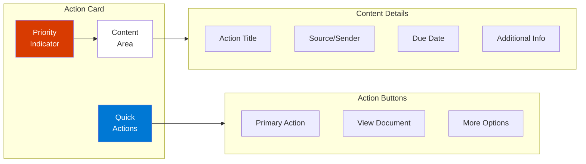
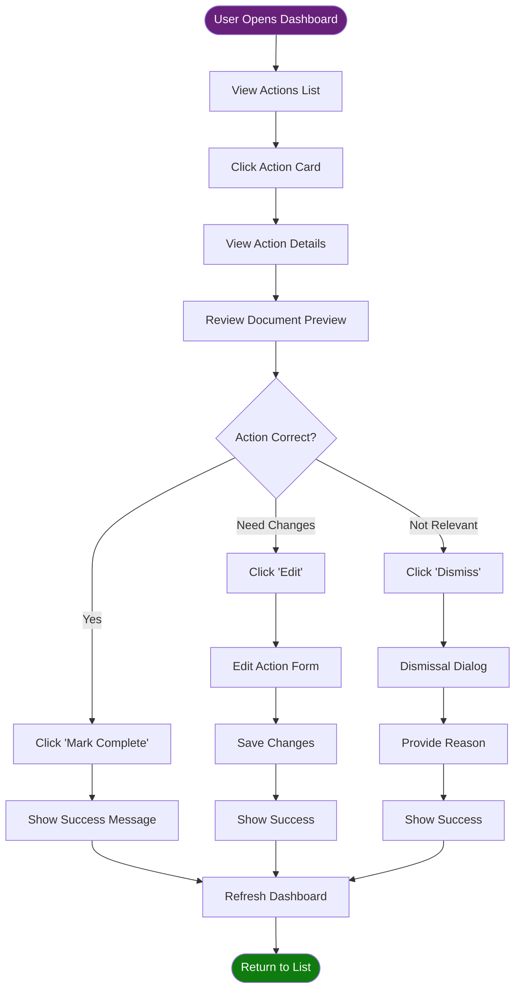
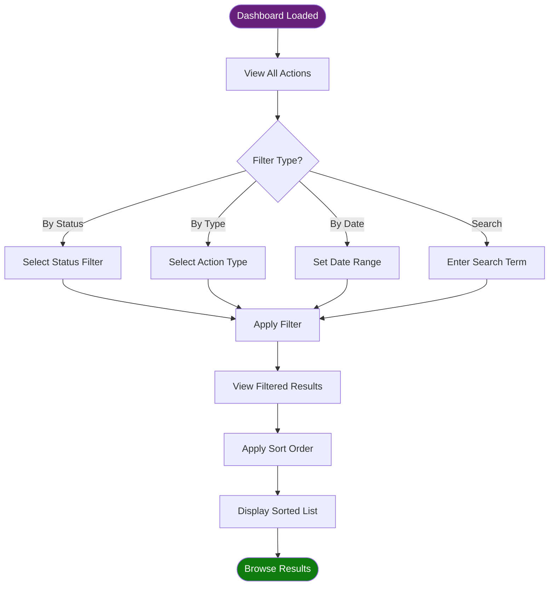
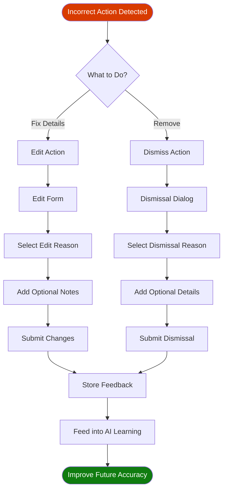

# UI Design Document: Paperless Action Queue Dashboard

## Overview

This document defines the user interface design for the Document Action Queue Dashboard. The UI prioritizes clarity, speed, and ease of use for managing document-based actions.

## Design Principles

1. **Action-Oriented:** Every screen should make it obvious what to do next
2. **Information Hierarchy:** Most urgent/important items are most prominent
3. **Mobile-First:** Design works on phone, tablet, and desktop
4. **Minimal Clicks:** Common actions require 1-2 clicks maximum
5. **Visual Feedback:** Immediate confirmation of all user actions
6. **Contextual Help:** Tooltips and guidance where needed

## Dashboard Layout

### Main Dashboard View

```mermaid
graph TD
    subgraph header["Header Bar"]
        logo[📋 Action Queue]
        stats[Stats: 12 Pending | 3 Urgent]
        user[User Menu]
    end
    
    subgraph filters["Filter & Sort Bar"]
        status[Status Filter]
        type[Type Filter]
        sort[Sort Options]
        search[Search Box]
    end
    
    subgraph content["Content Area"]
        urgent[Urgent Actions Section]
        today[Due Today Section]
        week[Due This Week Section]
        later[Later Section]
    end
    
    subgraph sidebar["Side Panel (Optional)"]
        preview[Document Preview]
        details[Action Details]
    end
    
    header --> filters
    filters --> content
    content --> sidebar
    
    style header fill:#0078d4,color:#fff
    style filters fill:#f0f0f0
    style content fill:#ffffff
    style sidebar fill:#f8f8f8
```

### Wireframe: Desktop View

```
┌─────────────────────────────────────────────────────────────────┐
│  📋 Action Queue        🔴 3 Urgent | 🟠 5 Due Soon | 12 Total  │
├─────────────────────────────────────────────────────────────────┤
│  [All] [Pending] [Completed]  [▼ Due Date]  [🔍 Search...]     │
├──────────────────────────────────────┬──────────────────────────┤
│  ⚠️ URGENT - DUE IN 2 DAYS          │                          │
│  ┌────────────────────────────────┐  │   Document Preview       │
│  │ 🔴 Pay Electric Bill           │  │   ┌──────────────────┐  │
│  │ PowerCo Electric               │  │   │                  │  │
│  │ Due: Feb 16, 2026              │  │   │  [PDF Preview]   │  │
│  │ Amount: $142.35                │  │   │                  │  │
│  │                                │  │   │                  │  │
│  │ [✓ Mark Paid] [📄 View] [✕]   │  │   │                  │  │
│  └────────────────────────────────┘  │   └──────────────────┘  │
│                                      │                          │
│  ┌────────────────────────────────┐  │   Action Details         │
│  │ 🔴 Respond to IRS Notice      │  │   ────────────────────   │
│  │ IRS                            │  │   Type: PAY              │
│  │ Due: Feb 17, 2026              │  │   Confidence: 95%        │
│  │ URGENT: Tax matter             │  │   Risk Score: 85         │
│  │                                │  │   [Edit Details]         │
│  │ [✓ Done] [📄 View] [✕]        │  │                          │
│  └────────────────────────────────┘  │                          │
│                                      │                          │
│  📅 DUE THIS WEEK                   │                          │
│  ┌────────────────────────────────┐  │                          │
│  │ 🟠 File Insurance Claim        │  │                          │
│  │ State Farm                     │  │                          │
│  │ Due: Feb 20, 2026              │  │                          │
│  │                                │  │                          │
│  │ [✓ Done] [📄 View] [✕]        │  │                          │
│  └────────────────────────────────┘  │                          │
└──────────────────────────────────────┴──────────────────────────┘
```

### Wireframe: Mobile View

```
┌─────────────────────────┐
│ ≡  Action Queue      🔔 │
│ 🔴 3 Urgent | 12 Total  │
├─────────────────────────┤
│ [Pending ▼] [Sort ▼]   │
├─────────────────────────┤
│ ⚠️ URGENT               │
├─────────────────────────┤
│ 🔴 Pay Electric Bill    │
│ PowerCo Electric        │
│ Due: Feb 16, 2026       │
│ $142.35                 │
│                         │
│ [Mark Paid] [View] [✕]  │
├─────────────────────────┤
│ 🔴 Respond to IRS       │
│ IRS                     │
│ Due: Feb 17, 2026       │
│ ⚠️ URGENT               │
│                         │
│ [Done] [View] [✕]       │
├─────────────────────────┤
│ 📅 DUE THIS WEEK        │
├─────────────────────────┤
│ 🟠 File Insurance Claim │
│ State Farm              │
│ Due: Feb 20, 2026       │
│                         │
│ [Done] [View] [✕]       │
└─────────────────────────┘
```

## Component Specifications

### Action Card Component

The core UI element representing a single action.



**States:**
- **Default:** White background, border based on urgency
- **Hover:** Slight elevation, shadow
- **Selected:** Blue left border, light blue background
- **Completed:** Gray overlay, strikethrough text
- **Dismissed:** Faded opacity

**Priority Indicators:**
- 🔴 **Critical:** Red circle - Overdue or due within 3 days
- 🟠 **High:** Orange circle - Due within 7 days
- 🟡 **Medium:** Yellow circle - Due within 14 days
- 🟢 **Low:** Green circle - Due within 30 days
- ⚪ **None:** Gray circle - No due date

### Detailed Action View

When user clicks on an action card or "View" button:

```
┌────────────────────────────────────────────────────────┐
│  ← Back to Dashboard                            [✕]    │
├────────────────────────────────────────────────────────┤
│                                                        │
│  Pay Electric Bill - Account #123456                  │
│  PowerCo Electric                                     │
│                                                        │
│  ┌──────────────────────────────────────────────────┐ │
│  │ Priority: 🔴 URGENT     Due: Feb 16, 2026       │ │
│  │ Amount: $142.35         Status: Pending          │ │
│  │ Confidence: 95%         Risk Score: 25           │ │
│  └──────────────────────────────────────────────────┘ │
│                                                        │
│  📄 Document Preview                                  │
│  ┌──────────────────────────────────────────────────┐ │
│  │                                                  │ │
│  │         [Embedded PDF or Image Preview]         │ │
│  │                                                  │ │
│  └──────────────────────────────────────────────────┘ │
│                                                        │
│  📋 Extracted Information                             │
│  • Account Number: 123456                            │
│  • Statement Date: Jan 15, 2026                      │
│  • Payment URL: https://powerco.com/pay              │
│  • Previous Balance: $135.20                         │
│                                                        │
│  💬 AI Analysis                                       │
│  This appears to be a monthly utility bill requiring  │
│  payment by the due date to avoid late fees.          │
│                                                        │
│  ═══════════════════════════════════════════════════  │
│                                                        │
│  [✓ Mark as Paid] [📅 Set Reminder] [✏️ Edit]        │
│  [🔗 Open Payment Link] [❌ Dismiss]                  │
│                                                        │
└────────────────────────────────────────────────────────┘
```

### Edit Action Dialog

```
┌─────────────────────────────────────┐
│  Edit Action Details                │
├─────────────────────────────────────┤
│                                     │
│  Action Type:                       │
│  [▼ PAY          ]                  │
│                                     │
│  Title:                             │
│  [Pay Electric Bill - #123456    ]  │
│                                     │
│  Due Date:                          │
│  [📅 Feb 16, 2026 ]                 │
│                                     │
│  Amount:                            │
│  [$142.35          ]                │
│                                     │
│  Notes:                             │
│  [Add notes...                   ]  │
│  [                                ] │
│                                     │
│  Why are you editing this?          │
│  ○ Incorrect due date               │
│  ○ Wrong amount                     │
│  ○ Wrong action type                │
│  ○ Other: [_________________]       │
│                                     │
│     [Cancel]    [Save Changes]      │
│                                     │
└─────────────────────────────────────┘
```

### Dismiss Action Dialog

```
┌─────────────────────────────────────┐
│  Dismiss Action                     │
├─────────────────────────────────────┤
│                                     │
│  Why are you dismissing this        │
│  action?                            │
│                                     │
│  ○ Already completed elsewhere      │
│  ○ Not relevant to me              │
│  ○ Duplicate action                 │
│  ○ Incorrect document type          │
│  ○ Wrong information extracted      │
│  ○ Other                            │
│                                     │
│  Additional details (optional):     │
│  [                                ] │
│  [                                ] │
│                                     │
│  This feedback helps improve the    │
│  AI accuracy.                       │
│                                     │
│     [Cancel]    [Dismiss Action]    │
│                                     │
└─────────────────────────────────────┘
```

## User Flows

### Flow 1: Reviewing and Completing an Action



### Flow 2: Filtering and Searching Actions



### Flow 3: Providing Feedback



## Visual Design System

### Color Palette

**Primary Colors:**
- **Primary Blue:** #0078d4 (Actions, links)
- **Success Green:** #107c10 (Completed actions)
- **Warning Orange:** #ff8c00 (Due soon)
- **Danger Red:** #d83b01 (Urgent, overdue)
- **Neutral Gray:** #605e5c (Text, borders)

**Status Colors:**
- **Pending:** Blue (#0078d4)
- **Completed:** Green (#107c10)
- **Dismissed:** Gray (#a19f9d)
- **Overdue:** Red (#d83b01)

**Background Colors:**
- **Page Background:** #faf9f8
- **Card Background:** #ffffff
- **Sidebar Background:** #f3f2f1
- **Hover State:** #f8f8f8

### Typography

**Font Family:** System fonts for performance
```css
font-family: -apple-system, BlinkMacSystemFont, 'Segoe UI', Roboto, 
             'Helvetica Neue', Arial, sans-serif;
```

**Font Sizes:**
- **H1 (Page Title):** 28px, Bold
- **H2 (Section Header):** 20px, Semi-bold
- **H3 (Card Title):** 16px, Semi-bold
- **Body Text:** 14px, Regular
- **Small Text:** 12px, Regular
- **Caption:** 11px, Regular

### Spacing

**Padding:**
- **Cards:** 16px
- **Sections:** 24px
- **Buttons:** 12px horizontal, 8px vertical

**Margins:**
- **Between Cards:** 12px
- **Between Sections:** 32px
- **Page Margins:** 24px (desktop), 16px (mobile)

### Icons

**Icon Set:** Use Font Awesome or Material Design Icons

**Action Icons:**
- ✓ **Complete:** Check circle
- 📄 **View Document:** File icon
- ✏️ **Edit:** Pencil icon
- ❌ **Dismiss:** X circle
- 🔗 **Link:** External link icon
- 📅 **Calendar:** Calendar icon
- 🔔 **Notification:** Bell icon
- ⚙️ **Settings:** Gear icon

### Responsive Breakpoints

```css
/* Mobile */
@media (max-width: 767px) {
  /* Single column, stacked layout */
}

/* Tablet */
@media (min-width: 768px) and (max-width: 1023px) {
  /* Two column layout */
}

/* Desktop */
@media (min-width: 1024px) {
  /* Full layout with sidebar */
}
```

## Interactions & Animations

### Hover States

**Action Cards:**
- Subtle elevation (box-shadow)
- Slight scale (1.02x)
- Transition: 200ms ease

**Buttons:**
- Background color darkens
- Cursor changes to pointer
- Transition: 150ms ease

### Loading States

**Initial Load:**
```
┌─────────────────────────┐
│                         │
│    🔄 Loading actions...│
│                         │
│    ▓▓▓▓▓░░░░░░░ 40%    │
│                         │
└─────────────────────────┘
```

**Skeleton Loading:**
Show placeholder cards with pulsing animation while loading.

### Success Feedback

**Action Completed:**
- Green checkmark animation
- Toast notification: "✓ Action marked as completed"
- Card fades out after 500ms

**Changes Saved:**
- Brief flash of green border
- Toast notification: "✓ Changes saved"

### Error States

**Network Error:**
```
┌─────────────────────────┐
│  ⚠️ Connection Error    │
│                         │
│  Could not load actions.│
│                         │
│  [Retry]                │
└─────────────────────────┘
```

**Validation Error:**
- Red border on invalid field
- Error message below field
- Disable submit until fixed

## Accessibility

### WCAG 2.1 AA Compliance

**Keyboard Navigation:**
- Tab through all interactive elements
- Enter/Space to activate buttons
- Escape to close dialogs
- Arrow keys for lists (optional)

**Screen Reader Support:**
- Semantic HTML (header, nav, main, article)
- ARIA labels for icon buttons
- ARIA live regions for dynamic content
- Skip navigation links

**Color Contrast:**
- Text: Minimum 4.5:1 ratio
- Large text: Minimum 3:1 ratio
- Interactive elements: Minimum 3:1 ratio

**Focus Indicators:**
- Visible focus ring on all interactive elements
- High contrast (blue #0078d4 outline)
- Never remove focus styles

## Home Assistant Integration UI

### Lovelace Dashboard Card

```yaml
type: custom:vertical-stack
cards:
  - type: markdown
    content: |
      ## 📋 Document Actions
      {{ states('sensor.paperless_pending_actions') }} pending actions
  
  - type: conditional
    conditions:
      - entity: sensor.paperless_pending_actions
        state_not: "0"
    card:
      type: entities
      entities:
        - entity: sensor.paperless_pending_actions
          secondary_info: last-changed
  
  - type: button
    name: Open Action Queue
    tap_action:
      action: url
      url_path: /api/hassio_ingress/paperless_actions
    icon: mdi:file-document-multiple
```

### Mobile App Notification

```yaml
# Example automation for urgent actions
automation:
  - alias: "Notify on Urgent Document Action"
    trigger:
      - platform: state
        entity_id: sensor.paperless_urgent_actions
    condition:
      - condition: numeric_state
        entity_id: sensor.paperless_urgent_actions
        above: 0
    action:
      - service: notify.mobile_app
        data:
          title: "⚠️ Urgent Document Action"
          message: >
            You have {{ states('sensor.paperless_urgent_actions') }} 
            urgent document(s) requiring attention.
          data:
            url: /lovelace/paperless
            actions:
              - action: "VIEW_ACTIONS"
                title: "View Actions"
```

## Empty States

### No Pending Actions

```
┌─────────────────────────────────┐
│                                 │
│         ✓                       │
│    All caught up!               │
│                                 │
│  No pending document actions.   │
│                                 │
│  [View Completed Actions]       │
│                                 │
└─────────────────────────────────┘
```

### No Results from Filter

```
┌─────────────────────────────────┐
│                                 │
│         🔍                      │
│    No matching actions          │
│                                 │
│  Try adjusting your filters.    │
│                                 │
│  [Clear Filters]                │
│                                 │
└─────────────────────────────────┘
```

## Settings Panel

```
┌────────────────────────────────────┐
│  ⚙️ Settings                       │
├────────────────────────────────────┤
│                                    │
│  Notification Preferences          │
│  ☑ Email on urgent actions         │
│  ☑ Push notifications              │
│  ☐ Daily digest                    │
│                                    │
│  Display Options                   │
│  Compact view: [○————] Normal      │
│  Cards per page: [▼ 20]           │
│                                    │
│  AI Confidence Threshold           │
│  Only show actions with confidence │
│  above: [▼ 80%]                    │
│                                    │
│  Document Tags to Monitor          │
│  ☑ Inbox                           │
│  ☑ Todo                            │
│  ☐ Action Required                 │
│  ☐ Review                          │
│                                    │
│  [Save Settings]                   │
│                                    │
└────────────────────────────────────┘
```

## Performance Targets

**Loading Times:**
- Initial page load: < 2 seconds
- Action list refresh: < 500ms
- Document preview: < 1 second
- Search results: < 300ms

**Interactions:**
- Button click response: < 100ms
- Page transitions: < 200ms
- Modal open/close: < 150ms

**Optimization:**
- Lazy load document previews
- Virtual scrolling for long lists
- Debounce search input (300ms)
- Cache API responses (5 minutes)

## Technical Implementation Notes

### Streamlit Implementation

```python
import streamlit as st
import requests
from datetime import datetime

st.set_page_config(
    page_title="Document Action Queue",
    page_icon="📋",
    layout="wide"
)

# Header
col1, col2, col3 = st.columns([2, 1, 1])
with col1:
    st.title("📋 Document Action Queue")
with col2:
    urgent_count = get_urgent_count()
    st.metric("Urgent Actions", urgent_count, delta_color="inverse")
with col3:
    total_count = get_total_count()
    st.metric("Total Pending", total_count)

# Filters
filter_col1, filter_col2, filter_col3 = st.columns(3)
with filter_col1:
    status = st.selectbox("Status", ["All", "Pending", "Completed"])
with filter_col2:
    action_type = st.selectbox("Type", ["All", "PAY", "RESPOND", "FILE"])
with filter_col3:
    sort_by = st.selectbox("Sort By", ["Due Date", "Urgency", "Created"])

# Action cards
actions = fetch_actions(status, action_type, sort_by)

for action in actions:
    with st.expander(f"{action['urgency_icon']} {action['title']}", 
                     expanded=action['urgency']=='HIGH'):
        col1, col2 = st.columns([2, 1])
        
        with col1:
            st.write(f"**Correspondent:** {action['correspondent']}")
            st.write(f"**Due Date:** {action['due_date']}")
            if action['amount']:
                st.write(f"**Amount:** {action['amount']}")
        
        with col2:
            st.write(f"**Urgency:** {action['urgency']}")
            st.write(f"**Confidence:** {action['confidence']}%")
        
        # Action buttons
        btn_col1, btn_col2, btn_col3, btn_col4 = st.columns(4)
        with btn_col1:
            if st.button("✓ Complete", key=f"complete_{action['id']}"):
                mark_complete(action['id'])
                st.rerun()
        with btn_col2:
            if st.button("📄 View Doc", key=f"view_{action['id']}"):
                st.session_state.selected_action = action['id']
        with btn_col3:
            if st.button("✏️ Edit", key=f"edit_{action['id']}"):
                st.session_state.editing = action['id']
        with btn_col4:
            if st.button("❌ Dismiss", key=f"dismiss_{action['id']}"):
                st.session_state.dismissing = action['id']
```

### Vue.js Implementation

```vue
<template>
  <div class="action-queue">
    <header class="header">
      <h1>📋 Document Action Queue</h1>
      <div class="stats">
        <stat-card label="Urgent" :value="urgentCount" color="red" />
        <stat-card label="Total" :value="totalCount" color="blue" />
      </div>
    </header>
    
    <filter-bar
      v-model:status="filters.status"
      v-model:type="filters.type"
      v-model:sort="filters.sort"
      @change="loadActions"
    />
    
    <div class="actions-grid">
      <action-card
        v-for="action in filteredActions"
        :key="action.id"
        :action="action"
        @complete="handleComplete"
        @view="handleView"
        @edit="handleEdit"
        @dismiss="handleDismiss"
      />
    </div>
    
    <action-detail-modal
      v-if="selectedAction"
      :action="selectedAction"
      @close="selectedAction = null"
    />
  </div>
</template>

<script setup>
import { ref, computed, onMounted } from 'vue'
import { useActionStore } from '@/stores/actions'

const actionStore = useActionStore()
const filters = ref({ status: 'pending', type: 'all', sort: 'due_date' })
const selectedAction = ref(null)

const urgentCount = computed(() => 
  actionStore.actions.filter(a => a.urgency === 'HIGH').length
)

const totalCount = computed(() => actionStore.actions.length)

const filteredActions = computed(() => {
  return actionStore.getFilteredActions(filters.value)
})

onMounted(() => {
  actionStore.loadActions()
})
</script>
```

## Future UI Enhancements

1. **Dark Mode:** Full dark theme support
2. **Drag & Drop:** Reorder actions by priority
3. **Batch Actions:** Select multiple, perform bulk operations
4. **Calendar View:** Visualize due dates on calendar
5. **Timeline View:** Chronological action history
6. **Tags:** User-defined tags for organization
7. **Notes:** Add personal notes to actions
8. **Attachments:** Upload additional files
9. **Sharing:** Share actions with family members
10. **Mobile App:** Native iOS/Android app

## Usability Testing Plan

**Test Scenarios:**
1. First-time user completes their first action
2. User with 20+ actions filters and sorts to find specific one
3. User dismisses an incorrectly identified action
4. User edits action details and provides feedback
5. Mobile user manages actions on phone
6. Screen reader user navigates dashboard

**Success Criteria:**
- 90% task completion rate
- < 3 clicks to complete common actions
- < 10 seconds to find specific action
- Positive user feedback (4+ out of 5)

## Conclusion

This UI design prioritizes speed, clarity, and user control. The interface is designed to be implemented incrementally, starting with core functionality and expanding based on user feedback. The modular component approach allows for easy customization and extension.
