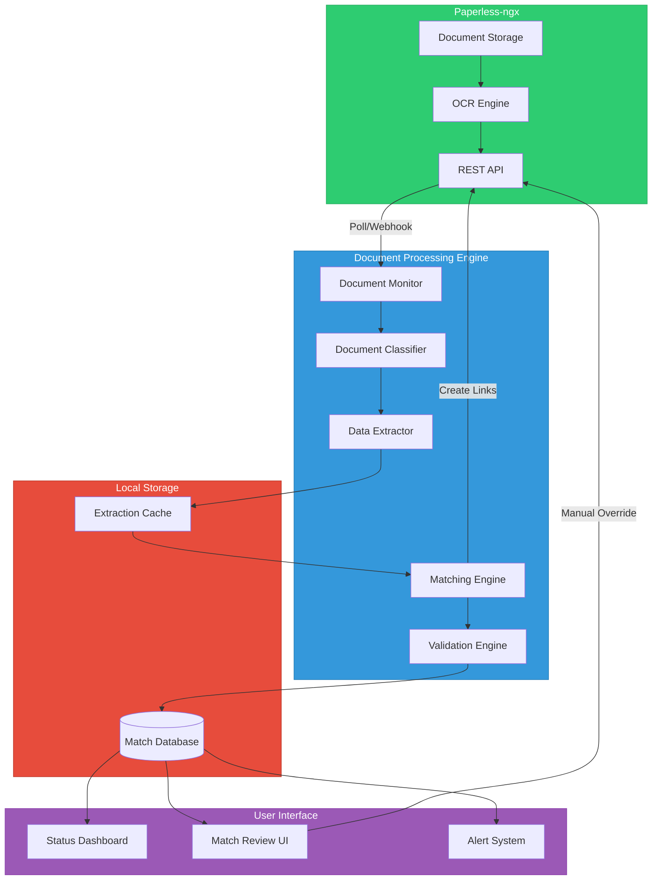
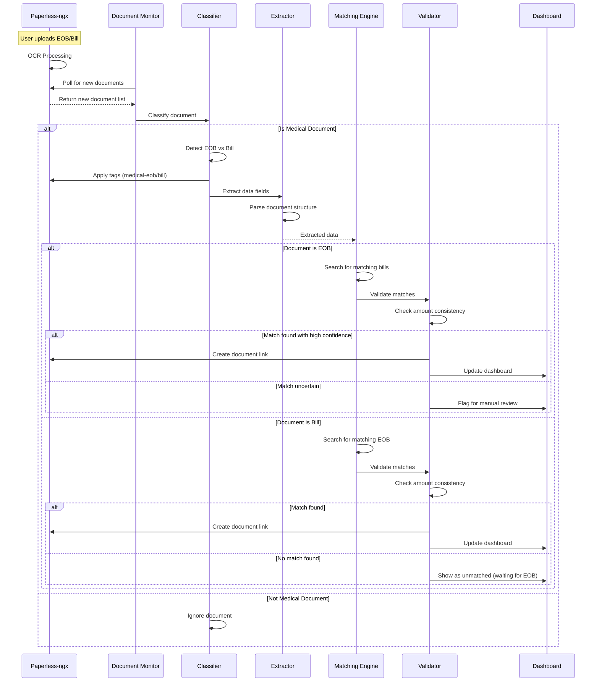
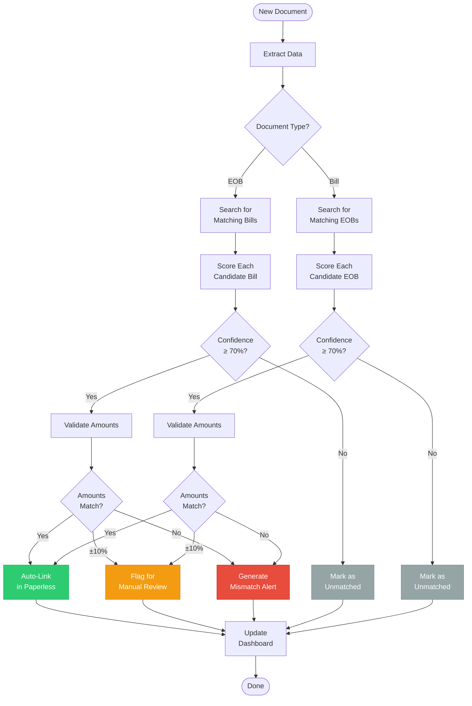

# Design Document: Medical EOB & Bill Matching System

## Table of Contents

1. [System Architecture](#1-system-architecture)
2. [Data Flow](#2-data-flow)
3. [Document Classification](#3-document-classification)
4. [Data Extraction](#4-data-extraction)
5. [Matching Algorithm](#5-matching-algorithm)
6. [Paperless-ngx Integration](#6-paperless-ngx-integration)
7. [Database Schema](#7-database-schema)
8. [Dashboard & UI](#8-dashboard--ui)
9. [Security & Privacy](#9-security--privacy)
10. [Implementation Approaches](#10-implementation-approaches)
11. [Algorithms & Pseudocode](#11-algorithms--pseudocode)
12. [Error Handling](#12-error-handling)
13. [Testing Strategy](#13-testing-strategy)
14. [Performance Considerations](#14-performance-considerations)

---

## 1. System Architecture

### High-Level Architecture



### Component Responsibilities

#### 1. Document Monitor
- Polls Paperless-ngx API for new/updated documents
- Filters for medical-related documents (by tags, correspondent, or content)
- Triggers classification pipeline for unprocessed documents

#### 2. Document Classifier
- Determines if document is EOB, Bill, or Other
- Uses pattern matching and/or ML models
- Applies appropriate Paperless tags (`medical-eob`, `medical-bill`)

#### 3. Data Extractor
- Parses documents to extract structured data
- Handles various document formats and layouts
- Caches extraction results for performance

#### 4. Matching Engine
- Compares EOBs against Bills using multiple factors
- Calculates confidence scores for potential matches
- Handles one-to-many relationships (1 EOB → N Bills)

#### 5. Validation Engine
- Verifies dollar amounts match within tolerance
- Flags mismatches and anomalies
- Generates alerts for user review

#### 6. Dashboard & UI
- Displays matched pairs with status
- Shows unmatched documents requiring attention
- Provides manual review and override interface

---

## 2. Data Flow

### Document Processing Flow



### Matching Flow (Detailed)



---

## 3. Document Classification

### Classification Strategies

#### Option A: Rule-Based Pattern Matching

**EOB Detection Patterns:**
```
- Header text contains: "Explanation of Benefits", "EOB", "This is not a bill"
- From known insurance companies: UnitedHealthcare, Aetna, Blue Cross, Kaiser, etc.
- Contains phrases: "Amount your plan pays", "You may owe", "Patient responsibility"
- Has table with columns: "Service Date", "Provider", "Billed", "Allowed", "Paid"
- Footer disclaimers about not being a bill
```

**Bill Detection Patterns:**
```
- Header text contains: "Invoice", "Statement", "Amount Due", "Bill"
- Contains: "Please remit payment", "Due date", "Payment instructions"
- Has fields: "Account number", "Invoice number", "Balance due"
- From known provider systems: Epic, Cerner, Meditech, etc.
- Medical procedure codes (CPT codes) present
```

**Classification Logic:**
```python
def classify_document(text, metadata):
    eob_score = 0
    bill_score = 0
    
    # EOB indicators
    if "explanation of benefits" in text.lower():
        eob_score += 50
    if "this is not a bill" in text.lower():
        eob_score += 40
    if any(insurer in text for insurer in INSURANCE_COMPANIES):
        eob_score += 30
    if "amount your plan pays" in text.lower():
        eob_score += 20
    
    # Bill indicators
    if any(word in text.lower() for word in ["invoice", "amount due", "balance"]):
        bill_score += 40
    if "please remit payment" in text.lower():
        bill_score += 30
    if re.search(r"due date:?\s*\d{1,2}/\d{1,2}/\d{4}", text, re.I):
        bill_score += 25
    if re.search(r"account\s+number:?\s*\w+", text, re.I):
        bill_score += 20
    
    # Decision
    if eob_score > bill_score and eob_score >= 60:
        return "EOB"
    elif bill_score > eob_score and bill_score >= 60:
        return "BILL"
    else:
        return "UNKNOWN"
```

#### Option B: Machine Learning Classification

**Training Data:**
- Collect 50-100 labeled examples of EOBs and Bills
- Extract text features (TF-IDF or word embeddings)
- Train binary or multi-class classifier

**Model Options:**
- **Naive Bayes** - Simple, fast, good baseline
- **Random Forest** - Better accuracy, handles feature interactions
- **Neural Network (DistilBERT)** - Best accuracy, higher complexity

**Feature Engineering:**
```python
features = {
    "has_eob_header": bool,
    "has_bill_header": bool,
    "insurance_company_mentioned": bool,
    "provider_name_present": bool,
    "payment_instructions_present": bool,
    "amounts_table_structure": bool,
    "due_date_present": bool,
    "account_number_present": bool,
    "word_count": int,
    "has_not_a_bill_disclaimer": bool,
    "avg_sentence_length": float,
    "medical_terminology_density": float
}
```

---

## 4. Data Extraction

### Key Fields to Extract

#### From EOB Documents:
```javascript
{
  "document_id": "paperless-123",
  "document_type": "EOB",
  "insurance_company": "UnitedHealthcare",
  "policy_number": "ABC123456789",
  "patient_name": "John Doe",
  "claim_number": "2024010123456",
  "date_of_service": "2024-01-15",
  "provider_name": "City Medical Center",
  "provider_npi": "1234567890",
  "services": [
    {
      "description": "Office Visit - Established Patient",
      "cpt_code": "99213",
      "billed_amount": 250.00,
      "allowed_amount": 180.00,
      "plan_pays": 144.00,
      "patient_responsibility": 36.00
    }
  ],
  "total_billed": 250.00,
  "total_allowed": 180.00,
  "total_plan_pays": 144.00,
  "total_patient_responsibility": 36.00,
  "extracted_at": "2024-01-20T10:30:00Z"
}
```

#### From Bill Documents:
```javascript
{
  "document_id": "paperless-456",
  "document_type": "BILL",
  "provider_name": "City Medical Center",
  "provider_npi": "1234567890",
  "provider_tax_id": "12-3456789",
  "patient_name": "John Doe",
  "patient_account": "MRN987654",
  "invoice_number": "INV-20240115-001",
  "invoice_date": "2024-01-16",
  "date_of_service": "2024-01-15",
  "due_date": "2024-02-15",
  "services": [
    {
      "description": "Office Visit",
      "cpt_code": "99213",
      "amount": 36.00
    }
  ],
  "total_amount": 36.00,
  "amount_paid": 0.00,
  "balance_due": 36.00,
  "payment_status": "PENDING",
  "extracted_at": "2024-01-20T10:35:00Z"
}
```

### Extraction Techniques

#### Technique 1: Regular Expression Patterns

```python
# Date of service extraction
date_patterns = [
    r"date\s+of\s+service:?\s*(\d{1,2}[/-]\d{1,2}[/-]\d{2,4})",
    r"service\s+date:?\s*(\d{1,2}[/-]\d{1,2}[/-]\d{2,4})",
    r"DOS:?\s*(\d{1,2}[/-]\d{1,2}[/-]\d{2,4})"
]

# Dollar amount extraction
amount_patterns = [
    r"total\s+amount\s+due:?\s*\$?([\d,]+\.?\d{0,2})",
    r"balance:?\s*\$?([\d,]+\.?\d{0,2})",
    r"patient\s+responsibility:?\s*\$?([\d,]+\.?\d{0,2})"
]

# Provider name extraction
provider_patterns = [
    r"provider:?\s*([A-Z][a-zA-Z\s,\.]+(?:Hospital|Medical|Clinic|Center))",
    r"billed\s+by:?\s*([A-Z][a-zA-Z\s,\.]+)"
]
```

#### Technique 2: Layout Analysis (Table Detection)

Many EOBs have tabular data. Use libraries like `pdfplumber` or `camelot` to extract tables:

```python
import pdfplumber

def extract_eob_services_table(pdf_path):
    with pdfplumber.open(pdf_path) as pdf:
        for page in pdf.pages:
            tables = page.extract_tables()
            for table in tables:
                # Look for table with expected columns
                if is_eob_services_table(table):
                    return parse_eob_table(table)
    return []

def is_eob_services_table(table):
    # Check if header row contains expected column names
    header = table[0] if table else []
    expected_columns = ["service date", "provider", "billed", "allowed", "paid"]
    return any(col.lower() in [h.lower() for h in header] for col in expected_columns)
```

#### Technique 3: Named Entity Recognition (NER)

For ML approach, use spaCy or custom NER models:

```python
import spacy

nlp = spacy.load("en_core_web_sm")

def extract_entities(text):
    doc = nlp(text)
    
    entities = {
        "dates": [ent.text for ent in doc.ents if ent.label_ == "DATE"],
        "organizations": [ent.text for ent in doc.ents if ent.label_ == "ORG"],
        "money": [ent.text for ent in doc.ents if ent.label_ == "MONEY"],
        "persons": [ent.text for ent in doc.ents if ent.label_ == "PERSON"]
    }
    
    return entities
```

---

## 5. Matching Algorithm

### Multi-Factor Scoring System

The matching algorithm scores potential EOB-Bill pairs based on multiple factors:

#### Scoring Factors:

| Factor | Weight | Description |
|--------|--------|-------------|
| Date of Service | 30% | How close are the service dates? |
| Provider Name | 25% | Do provider names match? |
| Patient Name | 20% | Does patient name match? |
| Amount | 15% | Do amounts align? |
| Procedure Codes | 10% | Do CPT codes overlap? |

#### Date Similarity Scoring

```python
def score_date_similarity(eob_date, bill_date):
    """
    Score based on days difference.
    Same day: 100 points
    ±7 days: 80-100 points (linear decay)
    ±14 days: 60-80 points
    ±30 days: 40-60 points
    >30 days: 0-40 points
    """
    days_diff = abs((eob_date - bill_date).days)
    
    if days_diff == 0:
        return 100
    elif days_diff <= 7:
        return 100 - (days_diff * 2.86)  # Linear decay to 80
    elif days_diff <= 14:
        return 80 - ((days_diff - 7) * 2.86)  # Decay to 60
    elif days_diff <= 30:
        return 60 - ((days_diff - 14) * 1.25)  # Decay to 40
    else:
        return max(0, 40 - ((days_diff - 30) * 0.5))  # Decay to 0
```

#### Provider Name Matching (Fuzzy)

```python
from fuzzywuzzy import fuzz

def score_provider_similarity(eob_provider, bill_provider):
    """
    Use fuzzy string matching to handle variations:
    - "City Medical Center" vs "City Med Ctr"
    - "Dr. John Smith" vs "John Smith MD"
    - "ABC Hospital" vs "ABC Hospital - Outpatient"
    """
    # Normalize: lowercase, remove punctuation, standardize abbreviations
    eob_clean = normalize_provider_name(eob_provider)
    bill_clean = normalize_provider_name(bill_provider)
    
    # Calculate similarity
    ratio = fuzz.ratio(eob_clean, bill_clean)
    token_sort_ratio = fuzz.token_sort_ratio(eob_clean, bill_clean)
    partial_ratio = fuzz.partial_ratio(eob_clean, bill_clean)
    
    # Use best score
    return max(ratio, token_sort_ratio, partial_ratio)

def normalize_provider_name(name):
    replacements = {
        "medical center": "med ctr",
        "hospital": "hosp",
        "clinic": "clnc",
        "doctor": "dr",
        "physician": "phys"
    }
    name = name.lower()
    for old, new in replacements.items():
        name = name.replace(old, new)
    return name.strip()
```

#### Amount Correlation

```python
def score_amount_similarity(eob_patient_responsibility, bill_amount):
    """
    Check if bill amount matches EOB patient responsibility.
    Allow for small differences due to adjustments.
    """
    if eob_patient_responsibility == 0 or bill_amount == 0:
        return 0
    
    diff_percent = abs(eob_patient_responsibility - bill_amount) / eob_patient_responsibility
    
    if diff_percent == 0:
        return 100  # Perfect match
    elif diff_percent <= 0.05:
        return 90  # Within 5%
    elif diff_percent <= 0.10:
        return 75  # Within 10%
    elif diff_percent <= 0.20:
        return 50  # Within 20%
    else:
        return 0  # Too different
```

#### Overall Match Score

```python
def calculate_match_score(eob, bill):
    """
    Combine all factors with weights.
    Returns score 0-100 and confidence level.
    """
    date_score = score_date_similarity(eob.date_of_service, bill.date_of_service)
    provider_score = score_provider_similarity(eob.provider_name, bill.provider_name)
    patient_score = score_patient_similarity(eob.patient_name, bill.patient_name)
    amount_score = score_amount_similarity(eob.total_patient_responsibility, bill.balance_due)
    procedure_score = score_procedure_overlap(eob.services, bill.services)
    
    # Weighted average
    total_score = (
        date_score * 0.30 +
        provider_score * 0.25 +
        patient_score * 0.20 +
        amount_score * 0.15 +
        procedure_score * 0.10
    )
    
    # Determine confidence level
    if total_score >= 85:
        confidence = "HIGH"
    elif total_score >= 70:
        confidence = "MEDIUM"
    else:
        confidence = "LOW"
    
    return {
        "score": total_score,
        "confidence": confidence,
        "breakdown": {
            "date": date_score,
            "provider": provider_score,
            "patient": patient_score,
            "amount": amount_score,
            "procedures": procedure_score
        }
    }
```

### One-to-Many Matching

Some EOBs cover multiple bills (e.g., hospital + physician + anesthesia):

```python
def match_eob_to_bills(eob, candidate_bills):
    """
    Match one EOB to potentially multiple bills.
    """
    matches = []
    
    # Score each candidate
    for bill in candidate_bills:
        score_result = calculate_match_score(eob, bill)
        if score_result["confidence"] in ["HIGH", "MEDIUM"]:
            matches.append({
                "bill": bill,
                "score": score_result["score"],
                "confidence": score_result["confidence"],
                "breakdown": score_result["breakdown"]
            })
    
    # Sort by score descending
    matches.sort(key=lambda x: x["score"], reverse=True)
    
    # Check if total bill amounts match EOB patient responsibility
    if matches:
        total_bill_amount = sum(m["bill"].balance_due for m in matches)
        eob_patient_resp = eob.total_patient_responsibility
        
        if abs(total_bill_amount - eob_patient_resp) / eob_patient_resp <= 0.10:
            # Amount validation passed
            return {
                "matched": True,
                "matches": matches,
                "amount_validation": "PASS"
            }
        else:
            return {
                "matched": True,
                "matches": matches,
                "amount_validation": "MISMATCH",
                "expected": eob_patient_resp,
                "actual": total_bill_amount,
                "difference": total_bill_amount - eob_patient_resp
            }
    
    return {
        "matched": False,
        "matches": [],
        "amount_validation": "N/A"
    }
```

---

## 6. Paperless-ngx Integration

### API Endpoints Used

#### 1. List Documents (Polling)
```http
GET /api/documents/?tags__name=medical-eob&created__gte=2024-01-01
Authorization: Token YOUR_API_TOKEN
```

#### 2. Get Document Details
```http
GET /api/documents/{id}/
Authorization: Token YOUR_API_TOKEN
```

#### 3. Get Document Text (OCR Result)
```http
GET /api/documents/{id}/download/?original=false
Authorization: Token YOUR_API_TOKEN
```

#### 4. Update Document (Add Tags, Custom Fields)
```http
PATCH /api/documents/{id}/
Authorization: Token YOUR_API_TOKEN
Content-Type: application/json

{
  "tags": [1, 2, 5],  // Tag IDs
  "custom_fields": [
    {"field": 1, "value": "MATCHED"},
    {"field": 2, "value": "85.5"}  // Match score
  ]
}
```

#### 5. Create Document Links
```http
POST /api/documents/{id}/links/
Authorization: Token YOUR_API_TOKEN
Content-Type: application/json

{
  "target_document": 456,
  "link_type": "related_to"
}
```

### Custom Fields Configuration

Recommended custom fields to create in Paperless:

| Field Name | Type | Description |
|------------|------|-------------|
| `medical_doc_type` | Select | EOB, Bill, Other |
| `match_status` | Select | Matched, Unmatched, Pending Review |
| `match_confidence` | Number | Match score (0-100) |
| `payment_status` | Select | Paid, Pending, Overdue |
| `amount_due` | Number | Dollar amount due |
| `date_of_service` | Date | Service date |
| `provider_name` | Text | Healthcare provider |
| `patient_name` | Text | Patient name |

### Document Linking Strategy

```python
def link_documents_in_paperless(eob_doc_id, bill_doc_ids):
    """
    Create bidirectional links between EOB and Bills.
    """
    api_base = "https://paperless.example.com/api"
    headers = {"Authorization": f"Token {API_TOKEN}"}
    
    # Link EOB to each Bill
    for bill_id in bill_doc_ids:
        # EOB -> Bill
        requests.post(
            f"{api_base}/documents/{eob_doc_id}/links/",
            headers=headers,
            json={"target_document": bill_id, "link_type": "related_to"}
        )
        
        # Bill -> EOB (bidirectional)
        requests.post(
            f"{api_base}/documents/{bill_id}/links/",
            headers=headers,
            json={"target_document": eob_doc_id, "link_type": "related_to"}
        )
    
    # Add note to EOB
    note = f"Automatically matched to {len(bill_doc_ids)} bill(s)"
    requests.post(
        f"{api_base}/documents/{eob_doc_id}/notes/",
        headers=headers,
        json={"note": note}
    )
```

---

## 7. Database Schema

### Local Match Database (SQLite)

```sql
-- Documents table (cache of Paperless documents)
CREATE TABLE documents (
    id INTEGER PRIMARY KEY,
    paperless_id INTEGER UNIQUE NOT NULL,
    doc_type TEXT NOT NULL CHECK(doc_type IN ('EOB', 'BILL', 'OTHER')),
    created_date DATETIME NOT NULL,
    modified_date DATETIME NOT NULL,
    extracted_data TEXT,  -- JSON blob
    processing_status TEXT DEFAULT 'PENDING',
    last_processed DATETIME,
    FOREIGN KEY (paperless_id) REFERENCES paperless_documents(id)
);

-- Matches table (EOB to Bill relationships)
CREATE TABLE matches (
    id INTEGER PRIMARY KEY AUTOINCREMENT,
    eob_document_id INTEGER NOT NULL,
    bill_document_id INTEGER NOT NULL,
    match_score REAL NOT NULL,
    confidence_level TEXT CHECK(confidence_level IN ('HIGH', 'MEDIUM', 'LOW')),
    date_score REAL,
    provider_score REAL,
    patient_score REAL,
    amount_score REAL,
    procedure_score REAL,
    amount_validation TEXT CHECK(amount_validation IN ('PASS', 'MISMATCH', 'PENDING')),
    expected_amount REAL,
    actual_amount REAL,
    amount_difference REAL,
    matched_date DATETIME DEFAULT CURRENT_TIMESTAMP,
    reviewed BOOLEAN DEFAULT 0,
    reviewed_by TEXT,
    reviewed_date DATETIME,
    manual_override BOOLEAN DEFAULT 0,
    notes TEXT,
    FOREIGN KEY (eob_document_id) REFERENCES documents(id),
    FOREIGN KEY (bill_document_id) REFERENCES documents(id),
    UNIQUE(eob_document_id, bill_document_id)
);

-- Payment tracking
CREATE TABLE payment_tracking (
    id INTEGER PRIMARY KEY AUTOINCREMENT,
    bill_document_id INTEGER UNIQUE NOT NULL,
    amount_due REAL NOT NULL,
    amount_paid REAL DEFAULT 0,
    payment_status TEXT DEFAULT 'PENDING' CHECK(payment_status IN ('PAID', 'PENDING', 'OVERDUE', 'DISPUTED')),
    due_date DATE,
    paid_date DATE,
    payment_method TEXT,
    payment_reference TEXT,
    notes TEXT,
    FOREIGN KEY (bill_document_id) REFERENCES documents(id)
);

-- Extraction cache
CREATE TABLE extraction_cache (
    document_id INTEGER PRIMARY KEY,
    extracted_at DATETIME NOT NULL,
    extraction_method TEXT,
    raw_text TEXT,
    structured_data TEXT,  -- JSON blob
    confidence REAL,
    FOREIGN KEY (document_id) REFERENCES documents(id)
);

-- Processing log
CREATE TABLE processing_log (
    id INTEGER PRIMARY KEY AUTOINCREMENT,
    document_id INTEGER,
    action TEXT NOT NULL,
    status TEXT NOT NULL,
    message TEXT,
    timestamp DATETIME DEFAULT CURRENT_TIMESTAMP,
    FOREIGN KEY (document_id) REFERENCES documents(id)
);

-- Indexes for performance
CREATE INDEX idx_documents_type ON documents(doc_type);
CREATE INDEX idx_documents_status ON documents(processing_status);
CREATE INDEX idx_matches_eob ON matches(eob_document_id);
CREATE INDEX idx_matches_bill ON matches(bill_document_id);
CREATE INDEX idx_matches_confidence ON matches(confidence_level);
CREATE INDEX idx_payment_status ON payment_tracking(payment_status);
CREATE INDEX idx_payment_due_date ON payment_tracking(due_date);
```

---

## 8. Dashboard & UI

### Dashboard Views

#### 1. Overview Dashboard

```
┌─────────────────────────────────────────────────────────────┐
│  Medical Bills Dashboard                      🔄 Last sync: 2m ago │
├─────────────────────────────────────────────────────────────┤
│                                                             │
│  📊 Summary Stats                                           │
│  ┌──────────────┬──────────────┬──────────────┬──────────┐ │
│  │ Matched Pairs│ Pending Bills│ Total Due    │ Alerts   │ │
│  │     12       │      3       │  $1,247.50   │    2     │ │
│  └──────────────┴──────────────┴──────────────┴──────────┘ │
│                                                             │
│  ⚠️ Alerts & Action Items                                   │
│  • Amount mismatch: EOB #123 vs Bill #456 ($36 vs $42)    │
│  • Bill overdue: Invoice INV-2024-001 (due 01/15/2024)    │
│                                                             │
│  📋 Recent Matches (Last 7 days)                            │
│  ┌─────────────────────────────────────────────────────────┐│
│  │ Date      │ EOB          │ Bills      │ Amount │ Status ││
│  ├───────────┼──────────────┼────────────┼────────┼────────┤│
│  │ 02/14/24  │ UHC-2024-01  │ Bill #789  │ $125   │ ✅ Paid││
│  │ 02/13/24  │ Aetna-456    │ Bill #788  │ $36    │ ⏳ Pend││
│  │ 02/12/24  │ BCBS-789     │ Bill #787  │ $89    │ ⚠️ Rev ││
│  └─────────────────────────────────────────────────────────┘│
│                                                             │
│  🔍 Unmatched Documents                                     │
│  • 2 EOBs waiting for bills                                │
│  • 3 Bills waiting for EOBs                                │
│  [View Details →]                                           │
└─────────────────────────────────────────────────────────────┘
```

#### 2. Match Review Interface

```
┌─────────────────────────────────────────────────────────────┐
│  Review Match: EOB #123 → Bill #456            Score: 82%  │
├─────────────────────────────────────────────────────────────┤
│                                                             │
│  📄 EOB Details                    📄 Bill Details          │
│  ┌──────────────────────────┐    ┌──────────────────────┐ │
│  │ Insurance: UnitedHealth  │    │ Provider: City Med   │ │
│  │ Date: 01/15/2024         │    │ Date: 01/15/2024     │ │
│  │ Provider: City Med Ctr   │    │ Invoice: INV-001     │ │
│  │ Patient: John Doe        │    │ Patient: John Doe    │ │
│  │ Amount: $36.00           │    │ Amount: $36.00       │ │
│  │ Claim: 2024-123456       │    │ Due: 02/15/2024      │ │
│  └──────────────────────────┘    └──────────────────────┘ │
│                                                             │
│  📊 Match Confidence Breakdown                              │
│  Date Match:      ████████████████████░░  95%              │
│  Provider Match:  ████████████████░░░░░░  80%              │
│  Patient Match:   ████████████████████░░  100%             │
│  Amount Match:    ████████████████████░░  100%             │
│  Overall:         ████████████████░░░░░░  82%  (Medium)    │
│                                                             │
│  ✅ Amount Validation: PASS ($36.00 = $36.00)              │
│                                                             │
│  Actions:                                                   │
│  [✓ Confirm Match]  [✗ Reject]  [✎ Add Note]  [🔗 View]   │
└─────────────────────────────────────────────────────────────┘
```

#### 3. Unmatched Documents View

```
┌─────────────────────────────────────────────────────────────┐
│  Unmatched Documents                                        │
├─────────────────────────────────────────────────────────────┤
│                                                             │
│  📋 EOBs Waiting for Bills (2)                              │
│  ┌─────────────────────────────────────────────────────────┐│
│  │ Date      │ Insurance    │ Provider       │ Amount  │Age││
│  ├───────────┼──────────────┼────────────────┼─────────┼───┤│
│  │ 02/01/24  │ Aetna        │ Lab Corp       │ $48.00  │13d││
│  │ 01/28/24  │ UnitedHealth │ City Hospital  │ $150.00 │17d││
│  └─────────────────────────────────────────────────────────┘│
│                                                             │
│  📋 Bills Waiting for EOBs (3)                              │
│  ┌─────────────────────────────────────────────────────────┐│
│  │ Date      │ Provider     │ Invoice    │ Amount │ Due    ││
│  ├───────────┼──────────────┼────────────┼────────┼────────┤│
│  │ 02/10/24  │ Dr. Smith    │ INV-2024-5 │ $125   │ 03/10  ││
│  │ 02/08/24  │ Radiology+   │ RAD-001    │ $89    │ 03/08  ││
│  │ 02/05/24  │ Pharmacy     │ RX-12345   │ $15    │ 03/05  ││
│  └─────────────────────────────────────────────────────────┘│
│                                                             │
│  [🔍 Search & Match Manually]  [📊 View All Documents]      │
└─────────────────────────────────────────────────────────────┘
```

### UI Implementation Options

See [UI-DESIGN.md](UI-DESIGN.md) for detailed specifications.

---

## 9. Security & Privacy

### PHI Protection Measures

#### 1. Data Encryption
```yaml
encryption:
  database:
    type: SQLCipher
    encryption_key: stored_in_environment_variable
    algorithm: AES-256
  
  api_tokens:
    storage: OS keychain (macOS/Linux) or Windows Credential Manager
    never_in_code: true
  
  document_cache:
    encrypt_at_rest: true
    auto_cleanup: after 24 hours
```

#### 2. Access Control
```yaml
access_control:
  dashboard:
    authentication_required: true
    session_timeout: 15 minutes
    
  api:
    token_rotation: every 90 days
    ip_whitelist: [localhost, 192.0.2.1/24]
    
  logs:
    no_phi: true  # Never log patient names or amounts
    anonymize: true
```

#### 3. HIPAA Compliance Considerations

⚠️ **Disclaimer**: This is a personal homelab solution. If handling others' PHI or operating in a professional capacity, consult HIPAA compliance experts.

**Key HIPAA Requirements:**
- **Encryption**: Data at rest and in transit ✅
- **Access Controls**: Authentication and authorization ✅
- **Audit Logs**: Track all data access ✅
- **Data Backup**: Regular backups with encryption ✅
- **Business Associate Agreements**: N/A for personal use
- **Breach Notification**: Know your obligations

#### 4. Development Best Practices

```python
# ❌ BAD: Never commit real PHI
eob_data = {
    "patient": "John Doe",  # Real name
    "amount": 1234.56       # Real amount
}

# ✅ GOOD: Use anonymized test data
eob_data = {
    "patient": "Patient [REDACTED]",
    "amount": "[AMOUNT]"
}

# ✅ GOOD: Use environment variables
API_TOKEN = os.getenv("PAPERLESS_API_TOKEN")  # Not hardcoded

# ✅ GOOD: Sanitize logs
logger.info(f"Processing document {doc_id}")  # No PHI in logs
```

---

## 10. Implementation Approaches

### Approach 1: Rule-Based Pattern Matching (Recommended MVP)

**Description**: Use deterministic rules and regular expressions for document classification and data extraction.

**Pros:**
- ✅ Fast to implement (2-3 weeks)
- ✅ Deterministic and explainable
- ✅ No training data required
- ✅ Works immediately with first documents
- ✅ Easy to debug and refine
- ✅ Low computational requirements
- ✅ No ML dependencies

**Cons:**
- ❌ Brittle to format changes
- ❌ Requires manual pattern maintenance
- ❌ May miss edge cases
- ❌ Lower accuracy on unusual documents (80-85%)
- ❌ Doesn't improve over time

**Best For:**
- MVP and proof of concept
- Users with consistent document formats
- Environments requiring explainability
- Low-resource systems

**Technology Stack:**
```yaml
language: Python 3.9+
libraries:
  - pdfplumber (PDF text extraction)
  - python-dateutil (date parsing)
  - fuzzywuzzy (string matching)
  - requests (Paperless API)
  - sqlite3 (database)
framework: FastAPI or Flask (for dashboard)
deployment: Docker container
```

**Implementation Steps:**
1. Build document classifier with pattern matching
2. Implement regex-based data extractors
3. Create matching algorithm with fuzzy string matching
4. Integrate with Paperless API for tagging and linking
5. Build simple dashboard with status view
6. Test with real documents and refine patterns

---

### Approach 2: Machine Learning Document Classification

**Description**: Train ML models to classify documents and extract data, learning from labeled examples.

**Pros:**
- ✅ Handles document variety better
- ✅ Improves with more data
- ✅ Can learn new patterns automatically
- ✅ Higher ceiling for accuracy (70-95%)
- ✅ Robust to format variations

**Cons:**
- ❌ Requires training data (50-100+ examples)
- ❌ Longer implementation time (2-3 months)
- ❌ More complex to debug
- ❌ Higher computational requirements
- ❌ Dependency on ML frameworks
- ❌ May require retraining periodically
- ❌ Less explainable (black box)

**Best For:**
- Long-term production deployment
- Users with highly variable document formats
- Environments with sufficient training data
- Systems that can afford compute resources

**Technology Stack:**
```yaml
language: Python 3.9+
ml_frameworks:
  classification:
    - scikit-learn (Random Forest, Naive Bayes)
    - spaCy (NER and document classification)
  advanced:
    - Ollama + DistilBERT (local LLM)
    - Hugging Face Transformers
  
data_processing:
  - pandas (data manipulation)
  - pdfplumber (PDF extraction)
  - pytesseract (OCR if needed)
  
serving:
  - FastAPI (REST API)
  - MLflow (model versioning)
  
dashboard: Same as Approach 1
```

**Implementation Steps:**
1. Collect and label training data (50-100 documents)
2. Train document classifier (EOB vs Bill)
3. Train NER model for field extraction
4. Build inference pipeline
5. Integrate with Paperless API
6. Implement continuous learning pipeline
7. Build dashboard with confidence visualization

---

### Approach 3: Hybrid (Recommended for Production)

**Description**: Combine rule-based extraction with ML-based classification and validation.

**Pros:**
- ✅ Balanced accuracy and explainability
- ✅ Faster to initial deployment than pure ML
- ✅ Rules handle common cases (high precision)
- ✅ ML handles edge cases (better recall)
- ✅ Graceful degradation if ML unavailable
- ✅ Can start with rules, add ML incrementally
- ✅ Best of both worlds (85-95% accuracy)

**Cons:**
- ❌ More complex architecture
- ❌ Requires maintaining both systems
- ❌ Medium implementation time (1-2 months)

**Best For:**
- Production deployment after MVP
- Users wanting high accuracy with explainability
- Systems that need both speed and flexibility
- Gradual migration from rules to ML

**Architecture:**
```
┌───────────────────────────────────────┐
│        Document Classifier            │
├───────────────────────────────────────┤
│  1. Try rule-based classification     │
│     └─> If confident → Done           │
│  2. If uncertain → Use ML classifier  │
│     └─> ML provides classification    │
└───────────────────────────────────────┘
                  ↓
┌───────────────────────────────────────┐
│        Data Extractor                 │
├───────────────────────────────────────┤
│  1. Rule-based extraction (regex)     │
│  2. ML-based extraction (NER)         │
│  3. Combine results with voting       │
│  4. Confidence scoring                │
└───────────────────────────────────────┘
                  ↓
┌───────────────────────────────────────┐
│        Matching Engine                │
├───────────────────────────────────────┤
│  1. Rule-based candidate filtering    │
│  2. ML-enhanced similarity scoring    │
│  3. Validation rules                  │
└───────────────────────────────────────┘
```

**Implementation Steps:**
1. Start with Approach 1 (rule-based MVP)
2. Collect real-world documents as training data
3. Train ML classifier as secondary classifier
4. Implement voting/ensemble logic
5. Add ML-enhanced field extraction
6. Gradually increase ML usage as confidence improves
7. Monitor and retrain ML models

---

## 11. Algorithms & Pseudocode

### Document Processing Pipeline

```python
def process_new_document(paperless_doc_id):
    """
    Main processing pipeline for a new document.
    """
    # 1. Fetch document from Paperless
    doc_metadata = paperless_api.get_document(paperless_doc_id)
    doc_text = paperless_api.get_document_text(paperless_doc_id)
    
    # 2. Classify document
    doc_type = classify_document(doc_text, doc_metadata)
    
    if doc_type not in ["EOB", "BILL"]:
        log("Document is not medical EOB or Bill, skipping")
        return
    
    # 3. Extract structured data
    extracted_data = extract_data(doc_text, doc_type)
    
    # 4. Store in local database
    db.insert_document(paperless_doc_id, doc_type, extracted_data)
    
    # 5. Update Paperless with tags and custom fields
    paperless_api.update_document(
        paperless_doc_id,
        tags=[f"medical-{doc_type.lower()}"],
        custom_fields={
            "medical_doc_type": doc_type,
            "date_of_service": extracted_data.get("date_of_service"),
            "provider_name": extracted_data.get("provider_name"),
            "amount_due": extracted_data.get("amount_due")
        }
    )
    
    # 6. Attempt matching
    if doc_type == "EOB":
        matches = find_matching_bills(extracted_data)
    else:  # BILL
        matches = find_matching_eobs(extracted_data)
    
    # 7. Process matches
    for match in matches:
        if match["confidence"] == "HIGH":
            # Auto-approve high confidence matches
            create_match(paperless_doc_id, match["document_id"], match)
            link_documents_in_paperless(paperless_doc_id, match["document_id"])
        else:
            # Flag for manual review
            flag_for_review(paperless_doc_id, match["document_id"], match)
    
    # 8. Send notifications if needed
    if not matches:
        notify_unmatched_document(paperless_doc_id, doc_type)
```

### Matching Algorithm (Detailed)

```python
def find_matching_bills(eob_data):
    """
    Find bills that match an EOB.
    """
    # Get candidate bills within date window
    date_range = (
        eob_data["date_of_service"] - timedelta(days=14),
        eob_data["date_of_service"] + timedelta(days=30)
    )
    
    candidates = db.get_bills_in_date_range(date_range)
    
    matches = []
    for bill in candidates:
        # Calculate match score
        score_result = calculate_match_score(eob_data, bill)
        
        if score_result["score"] >= 70:  # Threshold for consideration
            matches.append({
                "document_id": bill.paperless_id,
                "bill_data": bill,
                "score": score_result["score"],
                "confidence": score_result["confidence"],
                "breakdown": score_result["breakdown"]
            })
    
    # Handle one-to-many relationships
    if len(matches) > 1:
        # Check if multiple bills sum to EOB amount
        total_bill_amount = sum(m["bill_data"].amount for m in matches)
        eob_patient_resp = eob_data["total_patient_responsibility"]
        
        if abs(total_bill_amount - eob_patient_resp) / eob_patient_resp <= 0.10:
            # All bills together match EOB - this is a valid one-to-many match
            for match in matches:
                match["multi_bill_match"] = True
                match["total_bill_amount"] = total_bill_amount
                match["amount_validation"] = "PASS"
        else:
            # Amounts don't add up - flag all for review
            for match in matches:
                match["multi_bill_match"] = True
                match["amount_validation"] = "MISMATCH"
                match["confidence"] = "MEDIUM"  # Downgrade confidence
    elif len(matches) == 1:
        # Single match - validate amount
        match = matches[0]
        bill_amount = match["bill_data"].amount
        eob_patient_resp = eob_data["total_patient_responsibility"]
        
        if abs(bill_amount - eob_patient_resp) / eob_patient_resp <= 0.10:
            match["amount_validation"] = "PASS"
        else:
            match["amount_validation"] = "MISMATCH"
            match["confidence"] = "LOW"
    
    # Sort by score descending
    matches.sort(key=lambda x: x["score"], reverse=True)
    
    return matches
```

---

## 12. Error Handling

### Common Error Scenarios

| Error | Cause | Mitigation |
|-------|-------|------------|
| **OCR Failure** | Poor scan quality | Notify user, request re-upload |
| **Extraction Failure** | Unexpected format | Log for pattern improvement, manual review |
| **API Rate Limit** | Too many requests | Implement backoff, queue requests |
| **Network Error** | Paperless unavailable | Retry with exponential backoff |
| **Match Ambiguity** | Multiple high-confidence matches | Flag for manual review |
| **Amount Mismatch** | Adjustments/corrections | Alert user, allow override |
| **Missing Data** | Incomplete document | Extract what's possible, flag gaps |

### Error Handling Strategy

```python
import logging
from tenacity import retry, stop_after_attempt, wait_exponential

logger = logging.getLogger(__name__)

@retry(stop=stop_after_attempt(3), wait=wait_exponential(multiplier=1, min=4, max=10))
def call_paperless_api(endpoint, method="GET", **kwargs):
    """
    Paperless API call with automatic retry.
    """
    try:
        response = requests.request(method, endpoint, **kwargs)
        response.raise_for_status()
        return response.json()
    except requests.exceptions.HTTPError as e:
        if e.response.status_code == 429:  # Rate limit
            logger.warning("Rate limit hit, waiting before retry")
            raise  # Will be retried
        elif e.response.status_code >= 500:
            logger.error(f"Server error: {e}")
            raise  # Will be retried
        else:
            logger.error(f"Client error: {e}")
            return None  # Don't retry client errors
    except requests.exceptions.ConnectionError:
        logger.error("Connection error, retrying...")
        raise  # Will be retried

def extract_data_safe(doc_text, doc_type):
    """
    Extract data with error handling.
    """
    try:
        return extract_data(doc_text, doc_type)
    except Exception as e:
        logger.error(f"Extraction failed: {e}")
        # Return partial extraction with error flag
        return {
            "extraction_error": True,
            "error_message": str(e),
            "raw_text": doc_text[:500],  # First 500 chars for debugging
            "requires_manual_review": True
        }
```

---

## 13. Testing Strategy

### Test Categories

#### 1. Unit Tests
```python
# Test classification logic
def test_classify_eob():
    text = """
    EXPLANATION OF BENEFITS
    This is not a bill
    UnitedHealthcare
    """
    assert classify_document(text, {}) == "EOB"

def test_classify_bill():
    text = """
    INVOICE
    Amount Due: $125.00
    Please remit payment by 02/15/2024
    """
    assert classify_document(text, {}) == "BILL"

# Test matching algorithm
def test_perfect_match():
    eob = create_test_eob(date="2024-01-15", provider="City Med", amount=36.00)
    bill = create_test_bill(date="2024-01-15", provider="City Med", amount=36.00)
    
    score = calculate_match_score(eob, bill)
    assert score["confidence"] == "HIGH"
    assert score["score"] >= 90
```

#### 2. Integration Tests
```python
def test_paperless_api_integration():
    # Test document retrieval
    doc = paperless_api.get_document(TEST_DOC_ID)
    assert doc is not None
    
    # Test document update
    success = paperless_api.update_document(
        TEST_DOC_ID,
        tags=["test-tag"]
    )
    assert success
    
    # Test link creation
    link = paperless_api.create_link(TEST_DOC_ID, TARGET_DOC_ID)
    assert link is not None
```

#### 3. End-to-End Tests
```python
def test_full_pipeline_eob_to_bill():
    # Upload test EOB
    eob_id = upload_test_document("test_eob.pdf")
    
    # Upload matching bill
    bill_id = upload_test_document("test_bill.pdf")
    
    # Run processing pipeline
    process_new_document(eob_id)
    process_new_document(bill_id)
    
    # Verify match was created
    matches = db.get_matches_for_eob(eob_id)
    assert len(matches) == 1
    assert matches[0]["bill_document_id"] == bill_id
    
    # Verify links exist in Paperless
    eob_links = paperless_api.get_document_links(eob_id)
    assert bill_id in eob_links
```

### Test Data Requirements

- **EOB Samples**: 10+ anonymized EOBs from different insurers
- **Bill Samples**: 10+ anonymized bills from different providers
- **Edge Cases**:
  - Scanned documents with poor OCR
  - Multi-provider scenarios (1 EOB, 3 bills)
  - Amount mismatches
  - Missing data fields
  - Unusual formats

---

## 14. Performance Considerations

### Optimization Strategies

#### 1. Caching
```python
# Cache extracted data to avoid re-processing
@functools.lru_cache(maxsize=100)
def get_cached_extraction(doc_id):
    cached = db.get_extraction_cache(doc_id)
    if cached and not is_stale(cached):
        return cached.data
    return None
```

#### 2. Batch Processing
```python
def process_documents_batch(doc_ids, batch_size=10):
    """
    Process multiple documents in batches for efficiency.
    """
    for i in range(0, len(doc_ids), batch_size):
        batch = doc_ids[i:i+batch_size]
        
        # Parallel API calls
        with concurrent.futures.ThreadPoolExecutor(max_workers=5) as executor:
            futures = [executor.submit(process_new_document, doc_id) for doc_id in batch]
            concurrent.futures.wait(futures)
```

#### 3. Database Indexing
```sql
-- Create indexes for fast lookups
CREATE INDEX idx_date_of_service ON documents(date_of_service);
CREATE INDEX idx_provider_name ON documents(provider_name);
CREATE INDEX idx_amount ON documents(amount);
```

#### 4. Incremental Processing
```python
def poll_for_new_documents():
    """
    Only process documents created/modified since last check.
    """
    last_processed = db.get_last_processed_timestamp()
    new_docs = paperless_api.get_documents(modified__gte=last_processed)
    
    for doc in new_docs:
        process_new_document(doc.id)
    
    db.update_last_processed_timestamp(datetime.now())
```

### Performance Targets

| Metric | Target | Notes |
|--------|--------|-------|
| Document classification | < 1 second | Per document |
| Data extraction | < 3 seconds | Per document |
| Matching (single EOB) | < 2 seconds | Against 100 candidates |
| Full pipeline | < 10 seconds | End-to-end per document |
| Dashboard load | < 2 seconds | Up to 1000 documents |
| Memory usage | < 500 MB | Excluding ML models |

---

## Conclusion

This design document provides three implementation approaches with varying complexity and accuracy tradeoffs:

1. **Rule-Based (MVP)**: Quick to implement, good for proof of concept (2-3 weeks)
2. **ML-Based**: Higher accuracy ceiling but requires training data (2-3 months)
3. **Hybrid**: Best of both worlds, recommended for production (1-2 months)

**Recommended Path:**
1. Start with **Rule-Based approach** for MVP (Approach 1)
2. Collect real documents and user feedback during MVP phase
3. Migrate to **Hybrid approach** for production (Approach 3)
4. Optionally add ML enhancements over time as needed

See [TECHNOLOGY-STACK.md](TECHNOLOGY-STACK.md) for detailed technology recommendations and [QUICK-REFERENCE.md](../QUICK-REFERENCE.md) for implementation guide.

---

*Document Version: 1.0*  
*Last Updated: 2026-02-14*  
*Status: Design Complete*
