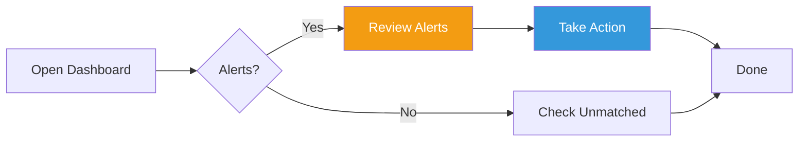
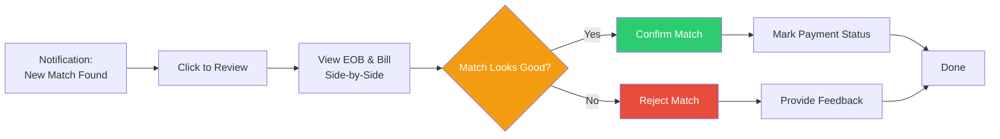
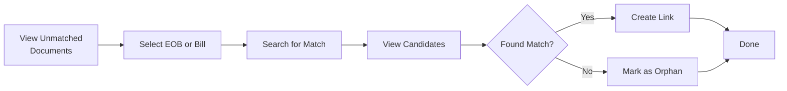

# UI Design: Medical EOB & Bill Matching Dashboard

## Table of Contents

1. [Design Philosophy](#design-philosophy)
2. [User Personas](#user-personas)
3. [User Workflows](#user-workflows)
4. [Dashboard Views](#dashboard-views)
5. [Component Library](#component-library)
6. [Responsive Design](#responsive-design)
7. [Accessibility](#accessibility)
8. [Implementation with AppSmith](#implementation-with-appsmith)

---

## Design Philosophy

### Principles

1. **Information at a Glance** - Critical information visible without scrolling
2. **Action-Oriented** - Clear next steps and call-to-actions
3. **Trust Through Transparency** - Show confidence scores and matching breakdown
4. **Progressive Disclosure** - Details available on-demand, don't overwhelm
5. **Error Prevention** - Confirm destructive actions, provide undo
6. **Privacy Conscious** - Display PHI only when needed, redact when possible

### Visual Language

```yaml
colors:
  primary: "#3498db"     # Blue - trustworthy, medical
  success: "#2ecc71"     # Green - matched, paid
  warning: "#f39c12"     # Orange - needs review
  danger: "#e74c3c"      # Red - mismatch, overdue
  neutral: "#95a5a6"     # Gray - unmatched

typography:
  headings: "Inter, system-ui, sans-serif"
  body: "Inter, system-ui, sans-serif"
  monospace: "'Roboto Mono', monospace"  # For amounts

spacing:
  base: 8px
  scale: [8, 16, 24, 32, 48, 64]
```

---

## User Personas

### Primary Persona: Self-Managing Patient

**Name**: Sarah  
**Age**: 35-55  
**Tech Savvy**: Medium  
**Goals**:
- Track medical expenses for tax deductions
- Ensure bills match insurance EOBs
- Pay bills on time
- Minimize time spent on medical admin

**Pain Points**:
- Receives EOBs and bills at different times
- Provider names don't always match between EOB and bill
- Forgets which bills are paid vs pending
- Worried about overpaying or duplicate billing

**Needs from Dashboard**:
- Quick overview of pending payments
- Alerts for mismatches or overdue bills
- Confidence in auto-matches
- Easy manual override if system is wrong

---

## User Workflows

### Workflow 1: Daily Check-In



**User Story**: "As a user, I want to check if there are any new matches or issues that need my attention, so I can stay on top of my medical bills."

**Steps**:
1. User opens dashboard
2. System highlights any alerts (mismatches, overdue bills)
3. User reviews alerts and takes action
4. User checks unmatched documents list
5. User closes dashboard knowing everything is handled

**Time**: 2-5 minutes

---

### Workflow 2: Reviewing an Auto-Match



**User Story**: "As a user, I want to verify that the system matched the correct EOB to bill, so I can trust the automation."

**Steps**:
1. User receives notification of new match
2. User clicks to open match review interface
3. System shows EOB and Bill side-by-side with confidence breakdown
4. User compares key fields (date, provider, amount)
5. User confirms or rejects match
6. If confirmed, user marks payment status
7. Done

**Time**: 1-2 minutes per match

---

### Workflow 3: Manual Matching



**User Story**: "As a user, I want to manually match an EOB to a bill when the system couldn't find an automatic match, so no documents are left untracked."

**Steps**:
1. User views list of unmatched documents
2. User selects an EOB (or Bill)
3. User searches for matching bills (or EOBs)
4. System shows candidates with similarity scores
5. User selects best match and creates link
6. Done

**Time**: 3-5 minutes per manual match

---

## Dashboard Views

### 1. Overview Dashboard (Home)

**Purpose**: At-a-glance status of all medical bills and matches

**Layout**:
```
┌────────────────────────────────────────────────────┐
│  Medical Bills Dashboard          [Sync] [Settings]│
│  Last updated: 2 minutes ago                        │
├────────────────────────────────────────────────────┤
│                                                     │
│  📊 Summary Cards (4-column grid)                   │
│  ┌──────────┬──────────┬──────────┬──────────┐    │
│  │ Matched  │ Pending  │ Total    │ Alerts   │    │
│  │ Pairs    │ Bills    │ Due      │          │    │
│  │   12     │   3      │ $1,247   │    2     │    │
│  │  ✅       │  ⏳       │  💵       │  ⚠️       │    │
│  └──────────┴──────────┴──────────┴──────────┘    │
│                                                     │
│  ⚠️ Alerts & Action Items                           │
│  ┌─────────────────────────────────────────────┐  │
│  │ ⚠️ Amount mismatch: EOB #123 vs Bill #456   │  │
│  │    Expected: $36.00, Actual: $42.00         │  │
│  │    [Review Match →]                         │  │
│  │                                             │  │
│  │ 🔴 Overdue: Invoice INV-001                 │  │
│  │    Due: 01/15/2024 (29 days ago)           │  │
│  │    Amount: $125.00                          │  │
│  │    [Mark as Paid] [View Details]           │  │
│  └─────────────────────────────────────────────┘  │
│                                                     │
│  📋 Recent Matches (Last 30 days)                   │
│  ┌─────────────────────────────────────────────┐  │
│  │ Date ▼  EOB          Bills      Amount Status││
│  │ 02/14   UHC-2024-01  Bill #789  $125  ✅ Paid││
│  │ 02/13   Aetna-456    Bill #788  $36   ⏳ Pend││
│  │ 02/12   BCBS-789     Bill #787  $89   ⚠️ Rev ││
│  │ 02/10   Kaiser-123   Bill #786  $45   ✅ Paid││
│  │ ...                                         │  │
│  │ [View All →]                 Showing 4 of 12││
│  └─────────────────────────────────────────────┘  │
│                                                     │
│  🔍 Quick Stats                                     │
│  ┌──────────────────────┬──────────────────────┐  │
│  │ Unmatched EOBs: 2    │ Unmatched Bills: 3   │  │
│  │ [View →]             │ [View →]             │  │
│  └──────────────────────┴──────────────────────┘  │
└────────────────────────────────────────────────────┘
```

**Key Features**:
- **Summary Cards**: High-level metrics with icons
- **Alerts Section**: Prominently displayed action items
- **Recent Matches Table**: Sortable, filterable list
- **Quick Stats**: Links to unmatched documents

**Interactions**:
- Click any alert to jump to detail view
- Click table row to open match review
- Sort table by any column
- Filter by date range or status

---

### 2. Match Review Interface

**Purpose**: Review and approve/reject an auto-matched EOB-Bill pair

**Layout**:
```
┌────────────────────────────────────────────────────┐
│  ← Back to Dashboard                    Match #42  │
├────────────────────────────────────────────────────┤
│                                                     │
│  Review Match: EOB → Bill          Confidence: 82% │
│  ┌───────────────────────────────────────────────┐ │
│  │  📊 Match Confidence Breakdown                │ │
│  │  Date Match:      ███████████████████░░  95%  │ │
│  │  Provider Match:  ████████████████░░░░░  80%  │ │
│  │  Patient Match:   ███████████████████░░  100% │ │
│  │  Amount Match:    ███████████████████░░  100% │ │
│  │  Overall:         ████████████████░░░░░  82%  │ │
│  └───────────────────────────────────────────────┘ │
│                                                     │
│  📄 Document Comparison                             │
│  ┌────────────────────────┬────────────────────┐  │
│  │ EOB Details            │ Bill Details       │  │
│  ├────────────────────────┼────────────────────┤  │
│  │ Insurance:             │ Provider:          │  │
│  │ UnitedHealthcare       │ City Medical Ctr   │  │
│  │                        │                    │  │
│  │ Claim #: 2024-123456   │ Invoice: INV-001   │  │
│  │                        │                    │  │
│  │ Date of Service:       │ Date of Service:   │  │
│  │ 01/15/2024 ✅          │ 01/15/2024 ✅      │  │
│  │                        │                    │  │
│  │ Provider:              │ Patient:           │  │
│  │ City Med Ctr ✅        │ John Doe ✅        │  │
│  │                        │                    │  │
│  │ Patient:               │ Account:           │  │
│  │ John Doe ✅            │ MRN987654          │  │
│  │                        │                    │  │
│  │ Patient Resp:          │ Amount Due:        │  │
│  │ $36.00 ✅              │ $36.00 ✅          │  │
│  │                        │                    │  │
│  │ [View Full EOB →]      │ [View Full Bill →] │  │
│  └────────────────────────┴────────────────────┘  │
│                                                     │
│  ✅ Amount Validation: PASS                         │
│  Expected: $36.00  |  Actual: $36.00  |  Diff: $0  │
│                                                     │
│  💬 Notes (Optional)                                │
│  ┌─────────────────────────────────────────────┐  │
│  │ [Text area for user notes]                  │  │
│  └─────────────────────────────────────────────┘  │
│                                                     │
│  Actions:                                           │
│  [✓ Confirm Match]  [✗ Reject]  [🔗 View in Paperless] │
└────────────────────────────────────────────────────┘
```

**Key Features**:
- **Side-by-Side Comparison**: Easy to compare key fields
- **Visual Indicators**: ✅ for matching fields, ⚠️ for mismatches
- **Confidence Breakdown**: Show why match was made
- **Amount Validation**: Clearly show if amounts match
- **Notes Field**: Allow user to add context
- **Action Buttons**: Clear, prominent CTAs

**Interactions**:
- Hover over confidence bars to see details
- Click "View Full EOB/Bill" to open in Paperless
- Confirm creates link in Paperless
- Reject removes match and allows re-matching

---

### 3. Unmatched Documents View

**Purpose**: See EOBs and Bills that haven't been matched yet

**Layout**:
```
┌────────────────────────────────────────────────────┐
│  ← Back to Dashboard                               │
├────────────────────────────────────────────────────┤
│                                                     │
│  Unmatched Documents                                │
│  ┌──────────────────────────────────────────────┐  │
│  │ [EOBs] [Bills] [All]         🔍 [Search...]  │  │
│  └──────────────────────────────────────────────┘  │
│                                                     │
│  📋 EOBs Waiting for Bills (2)                      │
│  ┌─────────────────────────────────────────────┐  │
│  │ Date▼  Insurance    Provider    Amount  Age ││
│  │ 02/01  Aetna        Lab Corp    $48     13d ││
│  │ 01/28  UHC          City Hosp   $150    17d ││
│  │                                             ││
│  │ Actions: [Find Match] [Mark as Orphan]     ││
│  └─────────────────────────────────────────────┘  │
│                                                     │
│  📋 Bills Waiting for EOBs (3)                      │
│  ┌─────────────────────────────────────────────┐  │
│  │ Date▼  Provider   Invoice   Amount  Due    ││
│  │ 02/10  Dr. Smith  INV-2024  $125    03/10  ││
│  │ 02/08  Radiology  RAD-001   $89     03/08  ││
│  │ 02/05  Pharmacy   RX-12345  $15     03/05  ││
│  │                                             ││
│  │ Actions: [Find Match] [Mark as Paid]       ││
│  └─────────────────────────────────────────────┘  │
│                                                     │
│  💡 Tip: Documents older than 30 days are          │
│  highlighted. Consider manual matching or marking  │
│  as orphaned if no match is expected.              │
└────────────────────────────────────────────────────┘
```

**Key Features**:
- **Separate Sections**: EOBs and Bills grouped
- **Age Indicator**: Show how long unmatched
- **Quick Actions**: Find match or mark as orphan
- **Search/Filter**: Find specific documents

**Interactions**:
- Click row to view document details
- "Find Match" opens manual matching interface
- Highlight rows older than 30 days
- Sort by any column

---

### 4. Manual Matching Interface

**Purpose**: Manually match an EOB to a Bill when auto-match failed

**Layout**:
```
┌────────────────────────────────────────────────────┐
│  ← Back to Unmatched                               │
├────────────────────────────────────────────────────┤
│                                                     │
│  Find Match for: EOB - UHC - 01/28/2024            │
│                                                     │
│  📄 Selected EOB                                    │
│  ┌─────────────────────────────────────────────┐  │
│  │ Insurance: UnitedHealthcare                 │  │
│  │ Date: 01/28/2024                            │  │
│  │ Provider: City Hospital                     │  │
│  │ Patient: John Doe                           │  │
│  │ Amount: $150.00                             │  │
│  │ [View Full Document →]                      │  │
│  └─────────────────────────────────────────────┘  │
│                                                     │
│  🔍 Search for Matching Bills                       │
│  ┌─────────────────────────────────────────────┐  │
│  │ Date Range: [01/21/24] to [02/11/24]       │  │
│  │ Provider: [City Hospital_______________]    │  │
│  │ Amount Range: [$135___] to [$165_____]      │  │
│  │ [Search]                                    │  │
│  └─────────────────────────────────────────────┘  │
│                                                     │
│  📋 Candidate Bills (3 found)                       │
│  ┌─────────────────────────────────────────────┐  │
│  │ ⭐ Date      Provider      Amount  Match %  ││
│  │ ✅ 01/28/24 City Hospital  $150.00  92% High││
│  │ ⚠️ 01/29/24 City Hosp ER   $148.50  75% Med ││
│  │ ⚠️ 02/01/24 City Hosp Lab  $155.00  68% Med ││
│  └─────────────────────────────────────────────┘  │
│                                                     │
│  [Select from List] or [Link to Different Document]│
│                                                     │
│  Selected: Bill - City Hospital - 01/28/24          │
│  [Create Match] [Cancel]                            │
└────────────────────────────────────────────────────┘
```

**Key Features**:
- **Selected Document Summary**: Context at top
- **Search Filters**: Date range, provider, amount
- **Candidate List**: Sorted by match score
- **Visual Indicators**: Confidence level shown
- **Preview on Select**: Show details before confirming

---

### 5. Payment Tracking View

**Purpose**: Track which bills have been paid vs pending

**Layout**:
```
┌────────────────────────────────────────────────────┐
│  ← Back to Dashboard                               │
├────────────────────────────────────────────────────┤
│                                                     │
│  Payment Tracking                                   │
│  ┌──────────────────────────────────────────────┐  │
│  │ Status: [All ▼] [Pending] [Paid] [Overdue]  │  │
│  │ Date Range: [Last 90 days ▼]                │  │
│  └──────────────────────────────────────────────┘  │
│                                                     │
│  💰 Payment Summary                                 │
│  ┌────────────┬────────────┬────────────┐         │
│  │ Total Due  │ Total Paid │ Overdue    │         │
│  │ $1,247.50  │ $2,450.00  │ $125.00    │         │
│  └────────────┴────────────┴────────────┘         │
│                                                     │
│  📋 Bills                                           │
│  ┌─────────────────────────────────────────────┐  │
│  │ Provider  Invoice  Amount  Due Date  Status ││
│  │ Dr. Smith INV-001  $125    02/15/24  🔴 Over││
│  │ Lab Corp  LAB-456  $48     03/01/24  ⏳ Pend ││
│  │ Pharmacy  RX-789   $15     03/05/24  ⏳ Pend ││
│  │ City Hosp CH-123   $250    01/30/24  ✅ Paid ││
│  │ ...                                         ││
│  └─────────────────────────────────────────────┘  │
│                                                     │
│  Actions for Selected:                              │
│  [Mark as Paid] [Add Payment Date] [Add Note]      │
└────────────────────────────────────────────────────┘
```

**Key Features**:
- **Summary Cards**: Total due, paid, overdue
- **Status Filters**: Quick filter by payment status
- **Due Date Sorting**: See overdue bills first
- **Bulk Actions**: Mark multiple as paid
- **Payment History**: Track when payments were made

---

## Component Library

### Status Badge

```
┌─────────────┐
│ ✅ Matched  │  Green
│ ⏳ Pending  │  Orange
│ ⚠️ Review   │  Yellow
│ 🔴 Overdue  │  Red
│ ✅ Paid     │  Green
└─────────────┘
```

### Confidence Score Bar

```
██████████████████░░  90%  High
████████████░░░░░░░░  65%  Medium
████░░░░░░░░░░░░░░░░  25%  Low
```

### Alert Card

```
┌─────────────────────────────────────┐
│ ⚠️ Amount Mismatch                  │
│ EOB #123 vs Bill #456               │
│ Expected: $36.00, Actual: $42.00    │
│ [Review Match →]                    │
└─────────────────────────────────────┘
```

### Document Summary Card

```
┌─────────────────────────┐
│ 📄 EOB                  │
│ UnitedHealthcare        │
│ Date: 01/15/2024        │
│ Provider: City Med Ctr  │
│ Amount: $36.00          │
│ [View →]                │
└─────────────────────────┘
```

---

## Responsive Design

### Desktop (1024px+)
- Full 2-column layouts for comparisons
- 4-column summary cards
- All features visible

### Tablet (768px - 1023px)
- 2-column summary cards
- Single-column document comparison (stacked)
- Collapsible sections

### Mobile (< 768px)
- Single-column layout
- Swipe gestures for navigation
- Bottom sheet for actions
- Simplified tables (show key columns only)

---

## Accessibility

### WCAG 2.1 AA Compliance

**Keyboard Navigation**:
- Tab through all interactive elements
- Arrow keys for table navigation
- Enter/Space for buttons
- Escape to close modals

**Screen Reader Support**:
- Semantic HTML (`<table>`, `<button>`, etc.)
- ARIA labels for icons
- Live regions for notifications
- Skip links for navigation

**Visual Accessibility**:
- 4.5:1 contrast ratio for text
- Color + icon for status (not color alone)
- Focus indicators visible
- Text resizable to 200%

---

## Implementation: Standalone Web App

> **Updated**: The dashboard is implemented as a standalone web app (FastAPI backend + vanilla JS or React frontend), served as a single Docker container on the homelab. See [TECHNOLOGY-STACK.md](./technology-stack.md) ADR-005 for rationale.

### Page Structure

```
├── Dashboard (Home)                → /
│   ├── Header
│   ├── Stats Cards (4x summary)
│   ├── Alerts List
│   ├── Recent Matches Table
│   └── Quick Stats (unmatched counts)
│
├── Match Review                    → /matches/:id
│   ├── Confidence Breakdown
│   ├── Side-by-side Comparison
│   ├── Amount Validation
│   ├── Notes Input
│   └── Action Buttons
│
├── Unmatched Documents (Issue #27) → /unmatched
│   ├── Summary Strip (counts + oldest age)
│   ├── Search & Filter Bar
│   ├── Tabs (All / EOBs / Bills / Orphaned)
│   ├── EOBs Waiting for Bills Table
│   ├── Bills Waiting for EOBs Table
│   ├── Suggested Matches (low-confidence)
│   └── Bulk Actions
│
├── Manual Matching                 → /match/new
│   ├── Selected Document Card
│   ├── Search Form
│   └── Candidates Table
│
└── Payment Tracking                → /payments
    ├── Summary Stats
    ├── Filter Bar
    └── Payments Table
```

### HTML Mockups

Interactive mockups are available in `mockups/`:
- **`dashboard.html`** — Overview dashboard with stats, alerts, recent matches
- **`match-review.html`** — Side-by-side EOB vs Bill comparison with confidence breakdown
- **`unmatched.html`** — Unmatched documents view with search, filters, age indicators, and suggested matches (Issue #27)

### API Endpoints (FastAPI)

```yaml
api_endpoints:
  - GET  /api/matches          # Recent matches list
  - GET  /api/matches/{id}     # Match detail
  - POST /api/matches          # Create match (manual or auto)
  - PATCH /api/matches/{id}    # Update match status
  - GET  /api/unmatched        # Unmatched documents (Issue #27)
  - GET  /api/unmatched/eobs   # Unmatched EOBs only
  - GET  /api/unmatched/bills  # Unmatched bills only
  - GET  /api/suggested        # Low-confidence match suggestions
  - POST /api/unmatched/{id}/orphan  # Mark as orphan
  - GET  /api/alerts           # Action items
  - GET  /api/payments         # Payment tracking
  - PATCH /api/payments/{id}   # Update payment status

query_parameters:
  - ?age=over30   # Filter by document age
  - ?type=eob|bill  # Filter by document type
  - ?sort=date|amount|age  # Sort order
  - ?search=...   # Full-text search
```

### Frontend Components

- **Stat Cards**: Summary counts with color-coded values
- **Tables**: Sortable, filterable document lists with inline actions
- **Badges**: Status indicators (New, Waiting, Overdue, Orphan, Matched, Paid)
- **Confidence Bars**: Visual match score breakdown
- **Search/Filter**: Combined text search + dropdown filters
- **Tabs**: View switching (All / EOBs / Bills / Orphaned)
- **Bulk Actions**: Select-all + batch operations
- **Tip Box**: Contextual guidance for users

---

## Implementation Timeline

### Phase 1: Basic UI (Week 1)
- Dashboard with summary stats
- Recent matches table
- Basic filtering

### Phase 2: Review Interface (Week 2)
- Match review page
- Side-by-side comparison
- Approve/reject actions

### Phase 3: Advanced Features (Week 3)
- Unmatched documents view
- Manual matching interface
- Payment tracking

### Phase 4: Polish (Week 4)
- Responsive design
- Accessibility improvements
- User testing and refinements

---

*Document Version: 1.0*  
*Last Updated: 2026-02-14*  
*Status: UI Design Complete*
