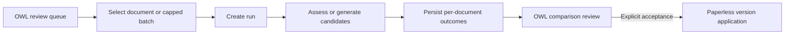

# OCR Quality Orchestration

**Status:** OWL-owned workflow contract
**Revised:** 2026-08-24

## Decision

OWL owns OCR run state, idempotency, candidate lifecycle, comparisons, and
decisions. n8n is optional notification/integration glue and is not the OCR
state machine.

Scheduled, event-driven, and manual entry points call the same OWL services and
produce the same observable run records.

## Initial entry points

| Entry point | Initial behavior |
|---|---|
| Full-corpus inventory | Explicit operator action; non-mutating |
| Document assessment | User-triggered from OWL |
| Candidate generation | User-triggered from OWL |
| Small batch | Explicitly selected documents with hard caps |
| New-document event | Assessment only, if enabled |
| Schedule | Assessment of unscored/stale documents only, if enabled |

No initial entry point automatically generates or accepts OCR candidates.

## Run contract

Every asynchronous operation has:

- run ID and type;
- requested scope and actor;
- scorer/provider/configuration versions;
- queued, running, completed, failed, and cancelled states;
- item and page progress;
- safe aggregate outcomes;
- bounded retries;
- cancellation; and
- timestamps and correlation IDs.

Document operations are idempotent by document/version checksum and operation
configuration. Concurrent requests for the same effective work coalesce or
return a conflict rather than creating duplicate candidates.

## Manual and batch workflow



Batch completion produces candidates and comparisons only. It does not provide
an `accept all` path.

## Event-driven assessment

A Paperless event may request assessment after document processing completes.
Repeated delivery is safe. The event identifies the Paperless document/version;
OWL re-reads authoritative state and does not trust OCR content embedded in the
event.

Events that arrive while Paperless is still processing are retried with bounded
backoff and an explicit terminal failure.

An accepted candidate or rollback also creates a durable, privacy-safe
invalidation for affected downstream analysis. Each module reprocesses
idempotently against the accepted version/checksum and exposes stale, running,
complete, or failed state. This re-analysis is tracked by issue
[#114](https://github.com/rsocko/owl/issues/114).

## Scheduled assessment

Scheduling is optional and uses OWL's existing scheduler unless deployment
requirements justify another orchestrator. It assesses documents that are:

- unscored for the current version;
- scored by an obsolete scorer version; or
- changed since the last assessment.

It does not periodically re-OCR the corpus.

## n8n integration

n8n may:

- invoke an authenticated OWL inventory or assessment endpoint;
- route aggregate completion/failure notifications;
- forward reviewed action-required outcomes; or
- coordinate with other homelab systems.

n8n must not:

- independently decide which documents need remediation;
- write OCR scores or statuses without OWL confirmation;
- accept candidates;
- maintain a second queue/state machine; or
- include raw OCR text or document metadata in notifications.

## Observability

OWL exposes:

- run progress and duration;
- aggregate score/status distributions;
- provider latency, failure, and retry counts;
- candidate and review throughput;
- Azure page usage and configured cost estimates;
- stale comparison and Paperless application failures; and
- rollback availability.

Alerts are emitted for failed runs, reviewed action-required outcomes, version
application failures, and rollback failures. A low score by itself is a review
signal, not an urgent alert.

## API shape

```text
POST /api/ocr/inventory
POST /api/ocr/assessments/{document_id}
POST /api/ocr/candidates
POST /api/ocr/batches
GET  /api/ocr/runs/{run_id}
POST /api/ocr/runs/{run_id}/cancel
POST /api/ocr/comparisons/{comparison_id}/accept
POST /api/ocr/comparisons/{comparison_id}/reject
POST /api/ocr/documents/{document_id}/rollback
```

Authorization distinguishes inventory, candidate generation, acceptance, and
rollback permissions.

## Implementation status (issue #30, first slice)

The run contract above is implemented today for the three run-starting entry
points that exist in the codebase — Stage-1 corpus scan, Stage-2 stratified
sample, and Stage-2 manual single-document (`force_stage2_analysis`) — on the
existing `ocr_quality_runs` table (`InventoryRun` in
`src/doc_intelligence_hub/modules/ocr_quality/database.py`,
`RunStage`/`RunStatus`/`RunTrigger` in `models.py`). This is the same table
the Force-Stage-2 feature (PR #143) introduced
`RunStage.STAGE_2_MANUAL_SINGLE_DOCUMENT` on; the contract fields below
extend that table rather than introducing a second run-tracking mechanism.

Implemented per the acceptance criteria:

- **Identity/observability fields**: `run_id`, `actor`, `trigger`
  (`RunTrigger`: `manual` / `explicit_batch` / `event` / `schedule`),
  `correlation_id`, `status` (now including `cancelled`), `counts`,
  `throughput_docs_per_second`, `started_at`/`finished_at`,
  `retry_count`/`max_retries`, `cancel_requested`/`cancelled_at`.
- **Idempotency**: `idempotency_key` (indexed) is a digest of stage + scope +
  configuration (+ document/version for single-document runs). Repeated
  delivery for `run_manual_stage2` with an unchanged
  `document_version_key`/`max_pages` returns the prior completed run's
  result (`idempotent_replay_of_run_id` in the response) instead of
  re-fetching/re-profiling, unless `force=True`.
- **Conflict, not silent duplication**: a second request for the same
  effective work (same `idempotency_key`) while one is `running` raises
  `RunConflictError` (service layer) → HTTP 409 with the existing run's
  `run_id` in the body, so a caller can poll instead of guessing. This is
  defense-in-depth alongside the router's existing in-process active-run
  guard.
- **Cancellation**: `POST /runs/{run_id}/cancel` (cooperative — the run's own
  page/document loop observes `cancel_requested` between units of work and
  stops cleanly, setting `status=cancelled`; never silently left `running`).
- **Bounded retries**: transient PDF-fetch failures during Stage-2 profiling
  are retried up to `run_max_retries` (config, default 2) before being
  recorded as a terminal per-document failure; each retry increments the
  owning run's `retry_count`.
- **Alerts**: terminal `failed`/`cancelled` runs call
  `service.emit_run_alert()`, a thin wrapper over the existing
  `core.alerts.emit_alert()` (module `ocr_quality`, reused rather than
  building new alert infra). A low quality score alone never triggers this —
  only run-level failure/cancellation, matching the "review signal, not an
  alert" rule above.

### Explicitly deferred to later slices

- **Candidate generation / acceptance / rejection / rollback runs (issue
  [#18](https://github.com/rsocko/owl/issues/18))**: `OcrQualityCandidate`
  (`candidate_models.py`/`candidate_service.py`) currently has its own,
  disconnected `state`/`actor`/timestamp fields and is **not yet** wired to
  `ocr_quality_runs`. The extension point for that work: add a nullable
  `run_id` foreign key to `OcrQualityCandidate` referencing
  `InventoryRun.run_id`, and adopt the reserved `RunStage` values already
  documented in `models.py` (`candidate_generation`, `acceptance`,
  `rejection`, `rollback`) instead of inventing new stage identifiers. An
  acceptance/rollback operation should get a `run_id` the same way Stage-2
  manual runs do today (create an `InventoryRun` row, reuse
  `_compute_idempotency_key`/`RunConflictError`/`request_cancellation`/
  `emit_run_alert` from `service.py` rather than re-implementing them).
- **Event-driven (Paperless webhook) and n8n-scheduled entry points**: not
  built yet. When added, they must call `run_corpus_scan`/a future
  assessment-only entry point with `trigger=RunTrigger.EVENT` /
  `RunTrigger.SCHEDULE` and **must not** set `force=True` or call any
  candidate-generation/acceptance path — new-document/scheduled triggers
  assess only, per the contract above.
- **Downstream invalidation wiring (issue
  [#114](https://github.com/rsocko/owl/issues/114))**: not built yet; an
  accepted candidate/rollback creating a durable invalidation record is
  still owned by that issue. The `run_id`/`correlation_id` fields added here
  are intended to be the join key that invalidation records reference.
- **Real Alembic migrations**: schema changes remain additive nullable
  columns picked up via `Base.metadata.create_all` (existing convention, not
  changed in this slice) — a known limitation for production deployments,
  not solved here.
- **Explicit-batch document/page/provider/Azure-cost caps**: not built in
  this slice (no explicit-batch entry point exists yet); `RunTrigger`
  reserves `explicit_batch` for when it is.

