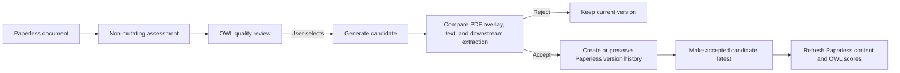

# OCR Quality Assessment and Review

**Status:** Revised design
**Revised:** 2026-08-24

## Decision

OWL owns OCR quality assessment, candidate comparison, and review. Paperless-ngx
remains the document system of record.

The first release will:

1. assess the existing corpus without changing documents;
2. expose an OWL-native OCR Quality review queue;
3. generate alternate OCR only for a user-selected document or small explicit
   batch;
4. require review before making a candidate current; and
5. preserve the originally ingested file and a rollback path.

The first release will not automatically re-OCR or replace documents based only
on a score.

## Paperless artifact model

The design distinguishes three artifacts:

| Artifact | Purpose | Policy |
|---|---|---|
| Original/source file | Exact file originally ingested by Paperless, including any OCR layer it already contained | Immutable |
| Paperless archive/version | Derived searchable PDF used for normal viewing, copying, and download | May become the latest version after approval |
| Extracted content | Text used by Paperless search and API consumers such as OWL, TYRION, and Mission Control | Must correspond to the accepted latest version |

An original ScanSnap PDF with an ABBYY layer is still the original source. It is
not rewritten merely because another engine produces a better candidate.

Paperless document versions are the primary user-visible history. OWL retains
run metadata, decisions, checksums, and candidate artifacts while a comparison
or configured rollback window is active. Applying a candidate must explicitly
preserve a prior usable version; the implementation must not assume that a
generic reprocess call creates that history automatically.

## Quality model

OCR quality is not represented by a single English-word ratio. OWL records:

- **Overlay/readability quality**: whether text can be selected and copied from
  the PDF, whether words align with the page image, page coverage, reading
  order, and obvious text-layer collisions.
- **Machine-extraction quality**: whether extracted text is coherent and useful
  for search and downstream tasks, including dates, amounts, identifiers,
  medical codes, tables, and structured fields.
- **Assessment status**: `GOOD`, `UNCERTAIN`, `REVIEW_RECOMMENDED`, or `FAILED`.
  Candidate readiness and accepted improvements belong to the separate candidate
  lifecycle, not the scorer output.

Scores are quality-risk estimates when no ground truth exists. They are not
claims of character-level accuracy.

Digital-native documents are normally exempt from image re-OCR, but not from
text-quality assessment. Digital extraction can still have missing text, bad
encoding, or incorrect reading order. Classification is page-aware so mixed
image/text PDFs are not treated as wholly digital or wholly scanned.

## Candidate engines

The initial candidate providers are:

| Provider | Role |
|---|---|
| OCRmyPDF + Tesseract 5 | Local, private, free searchable-PDF candidate |
| Azure Document Intelligence `prebuilt-layout` | Cloud candidate with searchable-PDF output, geometry, and word confidence; the searchable PDF is reconstructed from Layout's word-level text/polygon primitives, not its structured/markdown extraction, giving correct reading order on multi-column documents |

Azure Layout's structured/markdown extraction (tables, paragraphs, sections)
must not be spliced into the searchable-PDF candidate — that output does not
preserve a reliable word-by-word reading order. Only its word-level text and
bounding-polygon primitives (the same kind of data `prebuilt-read` exposes)
may be used to build the candidate PDF.

Multiple engines may produce independent candidates for the same document.
OWL must never merge text layers, coordinates, or confidence values from
different engines into one PDF. One engine and one configuration own each
candidate version.

## OWL review experience

OWL is the primary UI. It provides:

- corpus distribution and quality-risk filters;
- search by Paperless document metadata;
- existing and candidate PDF views with synchronized pages;
- existing/candidate text diff and changed-region highlighting;
- overlay and machine-extraction score explanations;
- candidate engine, version, settings, runtime, and estimated cost;
- downstream extraction comparison where applicable;
- explicit accept, reject, retry, and rollback actions; and
- a normal deep link from OWL to the Paperless document.

The design does not add an OWL URL custom field to Paperless. A Paperless-side
trigger may be reconsidered only if a clean native extension point becomes
available.

Paperless custom fields are optional and minimal. If enabled, they may expose
aggregate status such as last review date, current engine, and review status.
OWL remains authoritative for detailed scores and candidate history.

## Candidate lifecycle

Small explicit batches use the same lifecycle. Batch selection does not imply
batch acceptance.

## Acceptance policy

Initial acceptance is always user-confirmed. OWL must block acceptance when:

- pages are missing or reordered unexpectedly;
- the candidate is not a valid searchable PDF;
- selectable text is materially misaligned with the page image;
- machine-extraction quality materially regresses;
- required Paperless version preservation fails; or
- the candidate or comparison run is stale relative to the current document.

Numeric improvement alone is insufficient.

## Integration boundaries

- Paperless owns original files, current versions, metadata, and full-text
  indexing.
- OWL owns assessments, candidates, comparisons, review decisions, and
  downstream-impact evidence.
- TYRION, Mission Control, Action Queue, EOB matching, and OWL Insights consume
  the accepted Paperless content. Accepting or rolling back a version durably
  invalidates affected cached analysis so each module can reprocess against the
  new version/checksum. Their extraction success and failure rates provide
  quality evidence, not automatic replacement authority.
- n8n may route notifications or invoke supported OWL entry points, but it does
  not own OCR state or decision logic.

## Privacy and audit

Raw OCR text and document images stay inside the configured trusted processing
boundary. GitHub work items, logs, notifications, and external dashboards use
aggregate or redacted data only.

Every candidate and decision records:

- Paperless document and version identifiers;
- source and candidate checksums;
- engine, model/version, and settings;
- scorer version and component scores;
- actor and timestamps;
- accept/reject reason; and
- rollback availability and expiration.

## Related work

- [Baseline inventory](./ocr-baseline-inventory.md) — issue
  [#25](https://github.com/rsocko/owl/issues/25)
- [Quality scoring](./ocr-quality-scoring.md) — issue
  [#29](https://github.com/rsocko/owl/issues/29)
- [Secondary review](./ocr-ollama-integration.md) — issue
  [#17](https://github.com/rsocko/owl/issues/17)
- [Candidate generation and application](./ocr-remediation-engine.md) — issue
  [#18](https://github.com/rsocko/owl/issues/18)
- [Orchestration](./ocr-n8n-workflow.md) — issue
  [#30](https://github.com/rsocko/owl/issues/30)
- Integration and release — issue
  [#23](https://github.com/rsocko/owl/issues/23)
- OWL review and comparison UI — issue
  [#115](https://github.com/rsocko/owl/issues/115)
- Downstream analysis invalidation — issue
  [#114](https://github.com/rsocko/owl/issues/114)
