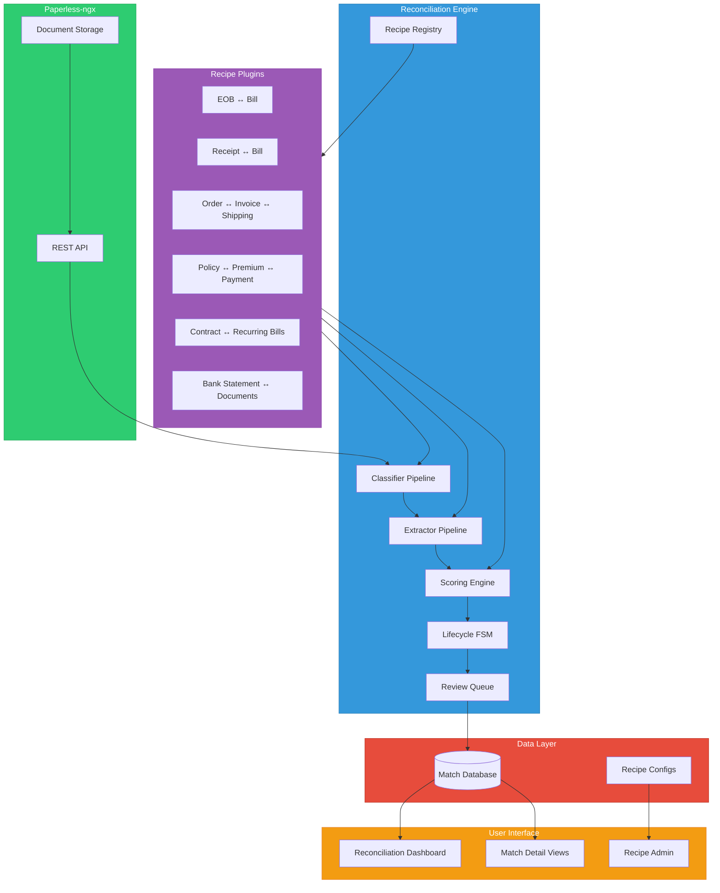
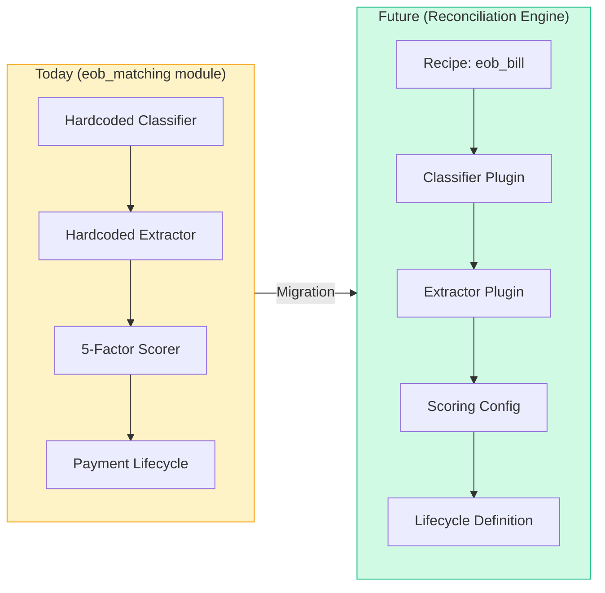
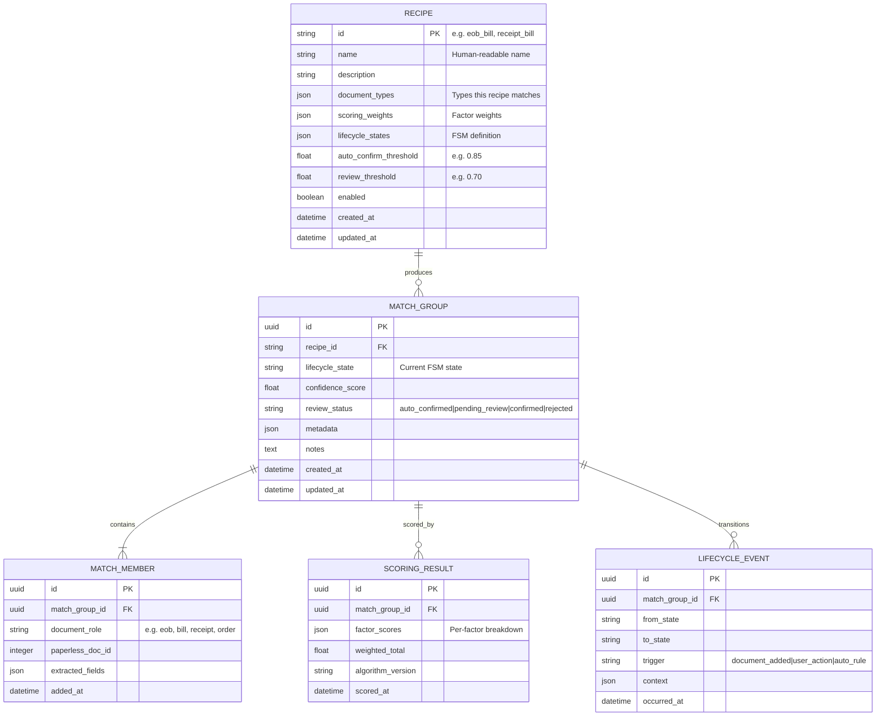
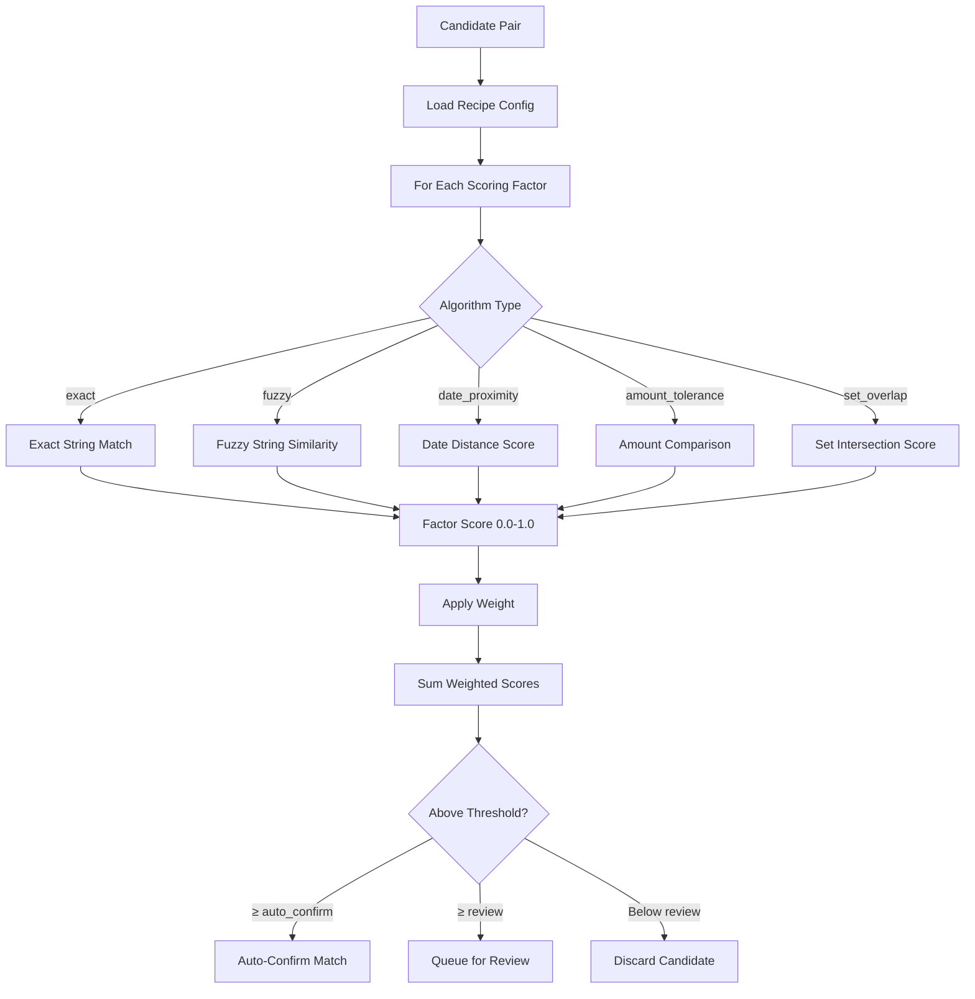
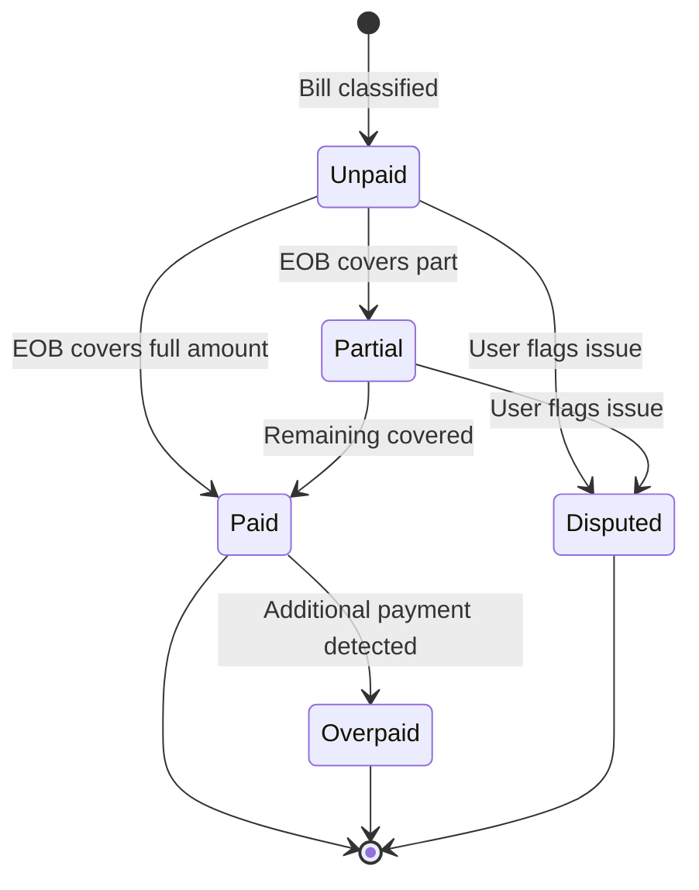
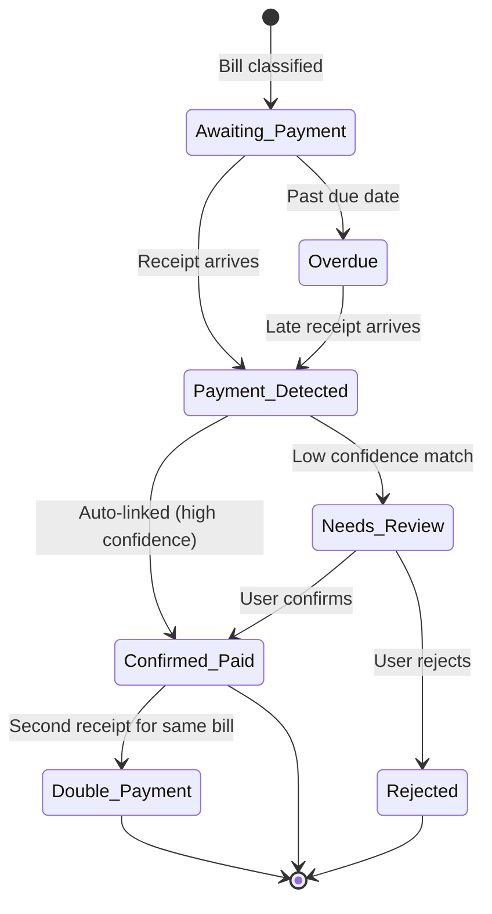
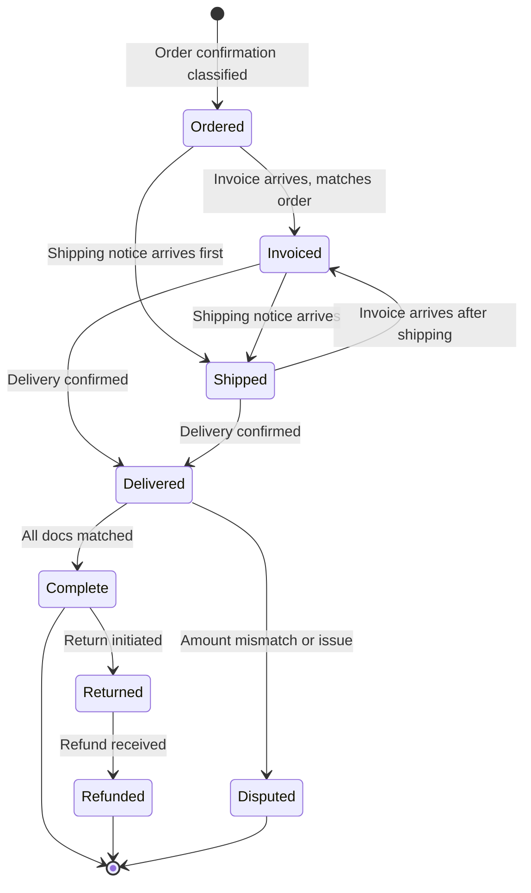
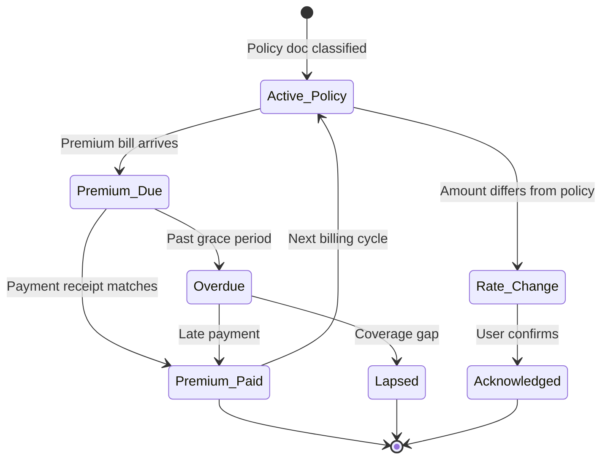

# Design Document: Generalized Reconciliation Engine

## Executive Summary

OWL's EOB↔Bill matching engine demonstrates a powerful pattern: classify documents, extract structured data, score candidate matches on weighted factors, and track lifecycle states. Today this is hardcoded to the medical EOB scenario.

The **Reconciliation Engine** generalizes this into a configurable, recipe-driven system that supports arbitrary document matching scenarios — from payment receipts to purchase orders to bank statement line items. The existing EOB matcher becomes the first "recipe" within the engine, preserving full backward compatibility while unlocking new use cases.

:::info Key Principle
Every matching scenario follows the same pipeline: **Classify → Extract → Score → Match → Review → Confirm**. The Reconciliation Engine provides shared infrastructure for this pipeline and lets each scenario customize behavior via pluggable recipes.
:::

---

## 1. Architecture Overview

### High-Level Architecture



### Component Responsibilities

| Component | Responsibility |
|-----------|---------------|
| **Recipe Registry** | Manages available matching recipes, their configs, and activation state |
| **Classifier Pipeline** | Routes documents to the correct recipe(s) based on document type |
| **Extractor Pipeline** | Runs recipe-specific extraction to produce structured fields |
| **Scoring Engine** | Evaluates candidate pairs using weighted factors from recipe config |
| **Lifecycle FSM** | Manages state transitions for matched document groups |
| **Review Queue** | Surfaces uncertain matches for human review |

### Migration Path: EOB → Recipe

The existing `eob_matching` module becomes a recipe plugin within the engine:



:::warning Backward Compatibility
All existing API endpoints (`/api/eob/*`, `/api/admin/weights`) remain functional. They become thin wrappers that delegate to the Reconciliation Engine with `recipe_id = "eob_bill"`.
:::

---

## 2. Data Model

### Core Entities



### Recipe Configuration Schema

```python
class RecipeConfig(BaseModel):
    """Defines a matching recipe."""
    id: str                           # "receipt_bill"
    name: str                         # "Payment Receipt ↔ Bill Matching"
    description: str
    enabled: bool = True

    # Document classification
    document_types: list[DocumentTypeConfig]  # Types this recipe handles
    match_cardinality: str            # "1:1", "1:N", "N:M"

    # Scoring
    scoring_factors: list[ScoringFactor]
    auto_confirm_threshold: float = 0.85
    review_threshold: float = 0.70
    amount_tolerance_pct: float = 0.02  # 2% tolerance

    # Lifecycle
    lifecycle: LifecycleConfig        # States + transitions

    # Matching behavior
    match_window_days: int = 90       # Only match docs within this window
    allow_partial_match: bool = False  # Allow partial payment matches
    detect_duplicates: bool = True    # Flag potential double-payments


class ScoringFactor(BaseModel):
    """A single scoring factor within a recipe."""
    name: str                 # "amount", "date", "provider"
    weight: float             # 0.0 - 1.0, all weights sum to 1.0
    algorithm: str            # "exact", "fuzzy", "date_proximity", "amount_tolerance"
    config: dict = {}         # Algorithm-specific params
    # e.g. {"tolerance_days": 7} for date_proximity
    # e.g. {"tolerance_pct": 0.05} for amount_tolerance


class LifecycleConfig(BaseModel):
    """Finite state machine for a match group's lifecycle."""
    initial_state: str
    states: list[LifecycleState]
    transitions: list[LifecycleTransition]


class LifecycleState(BaseModel):
    name: str                 # "unpaid", "paid", "overpaid"
    display_label: str
    category: str             # "pending", "active", "terminal"
    color: str                # For UI rendering


class LifecycleTransition(BaseModel):
    from_state: str
    to_state: str
    trigger: str              # "document_added", "user_confirm", "amount_exceeded"
    conditions: dict = {}     # Optional guard conditions
```

---

## 3. Scoring Engine

### Generalized Scoring Pipeline

The scoring engine evaluates candidate document pairs using configurable factor algorithms:



### Built-in Scoring Algorithms

| Algorithm | Description | Config Params |
|-----------|-------------|---------------|
| `exact` | Binary match (1.0 if equal, 0.0 if not) | `case_sensitive`, `strip_whitespace` |
| `fuzzy` | Levenshtein/Jaro-Winkler similarity | `method`, `min_threshold` |
| `date_proximity` | Score based on days apart | `tolerance_days`, `decay_rate` |
| `amount_tolerance` | 1.0 if within tolerance, scaled otherwise | `tolerance_pct`, `tolerance_abs` |
| `set_overlap` | Jaccard similarity of item sets | `min_overlap` |
| `reference_match` | Exact match on reference/confirmation numbers | `normalize_patterns` |

### Per-Recipe Scoring Configurations

#### EOB ↔ Bill (existing, migrated)
| Factor | Weight | Algorithm | Config |
|--------|--------|-----------|--------|
| Date | 30% | `date_proximity` | `tolerance_days: 30` |
| Provider | 25% | `fuzzy` | `method: jaro_winkler` |
| Patient | 20% | `fuzzy` | `method: jaro_winkler` |
| Amount | 15% | `amount_tolerance` | `tolerance_pct: 0.10` |
| Procedures | 10% | `set_overlap` | `min_overlap: 0.5` |

#### Receipt ↔ Bill
| Factor | Weight | Algorithm | Config |
|--------|--------|-----------|--------|
| Amount | 35% | `amount_tolerance` | `tolerance_pct: 0.02` |
| Provider/Merchant | 25% | `fuzzy` | `method: jaro_winkler` |
| Date | 20% | `date_proximity` | `tolerance_days: 14` |
| Reference Number | 15% | `reference_match` | `normalize_patterns: [strip_dashes]` |
| Account Number | 5% | `exact` | `case_sensitive: false` |

#### Order ↔ Invoice ↔ Shipping
| Factor | Weight | Algorithm | Config |
|--------|--------|-----------|--------|
| Order Number | 40% | `reference_match` | `normalize_patterns: [strip_prefix]` |
| Merchant | 25% | `fuzzy` | `method: jaro_winkler` |
| Amount | 20% | `amount_tolerance` | `tolerance_pct: 0.01` |
| Date | 10% | `date_proximity` | `tolerance_days: 30` |
| Items | 5% | `set_overlap` | `min_overlap: 0.3` |

#### Insurance Policy ↔ Premium ↔ Payment
| Factor | Weight | Algorithm | Config |
|--------|--------|-----------|--------|
| Policy Number | 35% | `reference_match` | — |
| Insurer | 25% | `fuzzy` | `method: jaro_winkler` |
| Premium Amount | 25% | `amount_tolerance` | `tolerance_pct: 0.005` |
| Coverage Period | 15% | `date_proximity` | `tolerance_days: 5` |

#### Contract ↔ Recurring Bills
| Factor | Weight | Algorithm | Config |
|--------|--------|-----------|--------|
| Provider | 30% | `fuzzy` | `method: jaro_winkler` |
| Amount | 30% | `amount_tolerance` | `tolerance_pct: 0.05` |
| Service Period | 20% | `date_proximity` | `tolerance_days: 7` |
| Account/Contract ID | 20% | `reference_match` | — |

---

## 4. Lifecycle State Machines

Each recipe defines its own lifecycle FSM. Here are the definitions for each scenario:

### EOB ↔ Bill Lifecycle (existing)



### Receipt ↔ Bill Lifecycle



### Order ↔ Invoice ↔ Shipping Lifecycle



### Insurance Policy ↔ Premium Lifecycle



---

## 5. API Design

### New Endpoints

All endpoints are under `/api/reconciliation/`.

#### Recipe Management

```
GET    /api/reconciliation/recipes                    # List all recipes
GET    /api/reconciliation/recipes/{recipe_id}        # Get recipe details
PUT    /api/reconciliation/recipes/{recipe_id}        # Update recipe config
PATCH  /api/reconciliation/recipes/{recipe_id}/toggle # Enable/disable recipe
```

#### Matching Operations

```
POST   /api/reconciliation/run                        # Trigger matching run (all active recipes)
POST   /api/reconciliation/run/{recipe_id}            # Trigger run for specific recipe
GET    /api/reconciliation/matches                    # List matches (filterable by recipe, state, confidence)
GET    /api/reconciliation/matches/{match_id}         # Get match detail with members + scoring
PATCH  /api/reconciliation/matches/{match_id}         # Update match (confirm, reject, add note)
DELETE /api/reconciliation/matches/{match_id}         # Remove match (unlink documents)
```

#### Review Queue

```
GET    /api/reconciliation/review                     # Pending review items (cross-recipe)
GET    /api/reconciliation/review/{recipe_id}         # Pending reviews for specific recipe
POST   /api/reconciliation/review/{match_id}/confirm  # Confirm match
POST   /api/reconciliation/review/{match_id}/reject   # Reject match
POST   /api/reconciliation/review/{match_id}/relink   # Re-link to different document
```

#### Dashboard & Stats

```
GET    /api/reconciliation/stats                      # Aggregate stats across all recipes
GET    /api/reconciliation/stats/{recipe_id}          # Stats for specific recipe
GET    /api/reconciliation/timeline/{recipe_id}       # Match timeline for a recipe
```

#### Backward-Compatible EOB Endpoints

```
# These remain unchanged — they delegate to the engine with recipe_id="eob_bill"
GET    /api/eob/matches          → /api/reconciliation/matches?recipe_id=eob_bill
GET    /api/eob/unmatched        → /api/reconciliation/matches?recipe_id=eob_bill&state=unmatched
POST   /api/eob/run              → /api/reconciliation/run/eob_bill
GET    /api/admin/weights        → /api/reconciliation/recipes/eob_bill (scoring_factors)
PUT    /api/admin/weights        → PUT /api/reconciliation/recipes/eob_bill (scoring_factors)
```

### Request/Response Examples

#### List Matches

```json
// GET /api/reconciliation/matches?recipe_id=receipt_bill&state=needs_review&limit=20
{
  "matches": [
    {
      "id": "a1b2c3d4-...",
      "recipe_id": "receipt_bill",
      "confidence_score": 0.78,
      "lifecycle_state": "needs_review",
      "review_status": "pending_review",
      "members": [
        {
          "role": "bill",
          "paperless_doc_id": 1042,
          "title": "Comcast Internet - July 2026",
          "extracted": {"amount": 89.99, "provider": "Comcast", "due_date": "2026-07-15"}
        },
        {
          "role": "receipt",
          "paperless_doc_id": 1087,
          "title": "Payment Confirmation - Comcast",
          "extracted": {"amount": 89.99, "merchant": "Comcast", "date": "2026-07-12", "confirmation": "CNF-9923847"}
        }
      ],
      "scoring": {
        "weighted_total": 0.78,
        "factors": {
          "amount": {"score": 1.0, "weight": 0.35},
          "provider": {"score": 0.92, "weight": 0.25},
          "date": {"score": 0.85, "weight": 0.20},
          "reference": {"score": 0.0, "weight": 0.15},
          "account": {"score": 0.0, "weight": 0.05}
        }
      },
      "created_at": "2026-07-13T08:30:00Z"
    }
  ],
  "total": 12,
  "page": 1,
  "limit": 20
}
```

---

## 6. Document Classification

### Classifier Registry

Each recipe registers document types it handles. The classifier pipeline determines which recipe(s) a new document belongs to:

```python
CLASSIFIER_REGISTRY = {
    "eob_bill": {
        "types": ["medical_eob", "medical_bill"],
        "patterns": {
            "medical_eob": [
                r"explanation\s+of\s+benefits",
                r"this\s+is\s+not\s+a\s+bill",
                r"plan\s+paid|member\s+responsibility",
            ],
            "medical_bill": [
                r"patient\s+statement|amount\s+due",
                r"balance\s+forward|payment\s+due",
            ],
        },
        "tags": ["medical-eob", "medical-bill"],
    },
    "receipt_bill": {
        "types": ["payment_receipt", "bill_invoice"],
        "patterns": {
            "payment_receipt": [
                r"payment\s+(received|confirmed|successful)",
                r"thank\s+you\s+for\s+your\s+payment",
                r"transaction\s+(id|number|confirmation)",
                r"receipt\s+(number|#|no)",
            ],
            "bill_invoice": [
                r"amount\s+due|balance\s+due|pay\s+by",
                r"invoice\s+(number|#|no)",
                r"statement\s+date|billing\s+period",
            ],
        },
        "tags": ["payment-receipt", "bill-invoice"],
    },
    "order_lifecycle": {
        "types": ["order_confirmation", "invoice", "shipping_notice"],
        "patterns": {
            "order_confirmation": [
                r"order\s+(confirmed|placed|received)",
                r"order\s+(number|#|id)",
                r"estimated\s+delivery",
            ],
            "invoice": [
                r"invoice\s+(number|#|no)",
                r"amount\s+due|total\s+charged",
            ],
            "shipping_notice": [
                r"(shipped|shipping)\s+(confirmation|notice|update)",
                r"tracking\s+(number|#|id)",
                r"estimated\s+delivery",
            ],
        },
        "tags": ["order-confirmation", "invoice", "shipping-notice"],
    },
}
```

:::tip LLM-Enhanced Classification
When `--use-llm` is enabled, the classifier can use Ollama for ambiguous documents. The pattern-based classifier runs first; LLM is a fallback for documents that don't match any pattern above a confidence threshold.
:::

---

## 7. Extraction Fields by Recipe

### Receipt ↔ Bill Extraction

| Field | Source: Receipt | Source: Bill |
|-------|----------------|--------------|
| `amount` | Payment amount | Amount due |
| `date` | Payment date | Due date / Statement date |
| `provider` | Merchant name | Biller name |
| `reference_number` | Confirmation # | Invoice # / Account # |
| `payment_method` | Card ending, bank | — |
| `account_number` | Account # | Account # |

### Order ↔ Invoice ↔ Shipping Extraction

| Field | Order | Invoice | Shipping |
|-------|-------|---------|----------|
| `order_number` | ✓ | ✓ (if shown) | ✓ |
| `merchant` | ✓ | ✓ | ✓ |
| `amount` | Order total | Invoice total | — |
| `date` | Order date | Invoice date | Ship date |
| `items` | Line items | Line items | Items shipped |
| `tracking_number` | — | — | ✓ |
| `delivery_estimate` | ✓ | — | ✓ |

### Insurance Policy ↔ Premium Extraction

| Field | Policy Doc | Premium Bill | Payment Receipt |
|-------|-----------|-------------|-----------------|
| `policy_number` | ✓ | ✓ | ✓ (if shown) |
| `insurer` | ✓ | ✓ | ✓ |
| `premium_amount` | Monthly/annual | Amount due | Amount paid |
| `coverage_period` | Start–End | Billing period | — |
| `coverage_type` | Auto/Home/Health | — | — |

---

## 8. Scenario Details

### Scenario 1: Payment Receipt ↔ Bill (Priority: HIGH)

**Problem statement:** "I paid a bill — did the payment actually go through? Am I paying the same bill twice?"

**Document flow:**
1. Bill/invoice arrives → classified as `bill_invoice` → extracted → enters "Awaiting Payment" state
2. Payment receipt/confirmation arrives → classified as `payment_receipt` → extracted
3. Engine scores receipt against all unmatched bills for the same provider
4. High-confidence matches auto-confirm; others queue for review
5. Double-payment detection: if a second receipt matches an already-paid bill, flag immediately

**Special behaviors:**
- Partial payment support: receipt amount < bill amount → "Partially Paid" state
- Due date alerting: bills in "Awaiting Payment" past due date → alert
- Amount tolerance: receipts for exactly $0.01-$1.00 more (convenience fees) still match

**Effort estimate:** M (leverages existing extractor patterns + scoring engine)

---

### Scenario 2: Order ↔ Invoice ↔ Shipping (Priority: MEDIUM)

**Problem statement:** "I ordered something — was I charged correctly? Did it ship?"

**Document flow:**
1. Order confirmation → classified → creates match group in "Ordered" state
2. Invoice arrives → scored against open orders → links to group → "Invoiced"
3. Shipping notice arrives → scored (order # is primary key) → "Shipped"
4. Amount validation: invoice total should match order total (flag if not)

**Special behaviors:**
- 3-way matching: unlike 2-way recipes, order lifecycle links 3 document types
- Order number is the dominant matching factor (40% weight) — acts almost as a foreign key
- Integration with Mission Control package tracking (reference `mc_tracking_id` field)
- Item-level reconciliation: compare line items across order/invoice for discrepancies

**Effort estimate:** L (3-way matching + new lifecycle states)

---

### Scenario 3: Insurance Policy ↔ Premium ↔ Payment (Priority: MEDIUM)

**Problem statement:** "Am I paying the right premium? Has my rate gone up without notice?"

**Document flow:**
1. Policy document → classified → establishes expected premium amount + schedule
2. Premium bill arrives → matched to policy by policy number + insurer
3. **Rate change detection:** if premium amount ≠ policy amount → alert
4. Payment receipt → matched to premium bill → confirms payment

**Special behaviors:**
- Recurring: expects bills on a regular schedule (monthly/quarterly/annual)
- Ties into Statement Tracking module (recurring bill detection)
- Rate change detection is the primary value-add beyond basic matching
- Policy renewal: new policy doc supersedes previous

**Effort estimate:** L (recurring element + rate change detection logic)

---

### Scenario 4: Contract ↔ Recurring Bills (Priority: LOW)

**Problem statement:** "My bill is higher than what I agreed to. Is this authorized?"

**Document flow:**
1. Contract/agreement → classified → establishes contracted terms (amount, period, provider)
2. Each recurring bill → matched to contract → compared against terms
3. **Variance detection:** bill amount > contracted amount + tolerance → alert
4. **Expiration tracking:** flag when approaching contract end date (promotional pricing ends)

**Special behaviors:**
- Long-lived: contracts persist for months/years; many bills match to one contract
- Variance tracking over time (trending: are bills creeping up?)
- Contract expiration / renewal date tracking
- Examples: lease→rent, ISP contract→monthly bill, gym membership→charges

**Effort estimate:** M (mostly leverages existing patterns, adds variance trending)

---

### Scenario 5: Bank Statement ↔ Documents (Priority: FUTURE/VISION)

**Problem statement:** "Can I account for every transaction on my bank statement?"

**Document flow:**
1. Bank statement → table extraction → individual line items
2. Each line item → match against all classified documents (receipts, bills, etc.)
3. Unmatched items flagged for investigation

**Challenges:**
- Table extraction from bank statements is complex (varied formats, multi-page)
- Merchant names on statements are abbreviated/cryptic (e.g., "AMZN MKTP US" → "Amazon")
- Posting delays: transaction date vs statement date (±3 days typical)
- High volume: 30-100+ transactions per statement

**Dependencies:**
- Monarch Bridge integration (cross-platform transaction data, #768)
- Robust table extractor (may require Azure DI or specialized model)
- Merchant name normalization dictionary

**Effort estimate:** XL (new extraction challenge + high volume + fuzzy merchant matching)

---

## 9. Implementation Phases

### Phase 1: Foundation + Receipt↔Bill (Effort: L)

1. **Refactor:** Extract generic interfaces from `eob_matching/`
   - `RecipeBase` abstract class
   - `ScoringEngine` with configurable factors
   - `LifecycleFSM` with configurable states
2. **Migrate:** EOB matcher becomes `EobBillRecipe` (no behavior change)
3. **Implement:** `ReceiptBillRecipe` as second recipe
4. **API:** New `/api/reconciliation/*` endpoints (EOB endpoints still work)
5. **UI:** Receipt↔Bill matching view + reconciliation dashboard

### Phase 2: Order Lifecycle (Effort: L)

1. **Implement:** `OrderLifecycleRecipe` with 3-way matching
2. **Extend:** Scoring engine for N-way match groups
3. **Integrate:** Mission Control package tracking reference
4. **UI:** Order lifecycle view (timeline-based)

### Phase 3: Insurance + Contract (Effort: M)

1. **Implement:** `InsurancePremiumRecipe` with rate change detection
2. **Implement:** `ContractBillRecipe` with variance trending
3. **Integrate:** Statement Tracking module (recurring pattern data)
4. **UI:** Policy/contract management views

### Phase 4: Bank Statement Vision (Effort: XL)

1. **R&D:** Bank statement table extraction
2. **Build:** Merchant name normalization service
3. **Integrate:** Monarch Bridge for transaction data
4. **UI:** Full reconciliation dashboard with unmatched item drill-down

---

## 10. Error Handling & Edge Cases

| Edge Case | Handling |
|-----------|----------|
| Document matches multiple recipes | Process in all applicable recipes (a receipt can match both a bill AND appear on a bank statement) |
| Duplicate documents uploaded | Cross-run dedup (existing #845 feature) prevents double-counting |
| Partial payments | Support split: one bill → multiple receipts (summing to total) |
| Refunds | Negative amount matching: refund receipt → original bill → "Refunded" state |
| Currency mismatch | Flag for review; no auto-matching across currencies |
| OCR extraction failures | Gracefully degrade scoring (missing fields score 0 for that factor) |
| Recipe conflict | If two recipes claim the same match, higher confidence wins |

---

## 11. Performance Considerations

- **Matching window:** Only score candidates within `match_window_days` of each other (default 90 days) to avoid O(n²) full comparison
- **Index on extracted fields:** Provider name, amount, date, reference numbers
- **Batch processing:** Run matching in batches (new documents since last run)
- **Caching:** Cache extraction results (unchanged documents don't re-extract)
- **Async matching:** Long-running matches execute via APScheduler, not in request cycle

---

## 12. Testing Strategy

| Level | Coverage |
|-------|----------|
| Unit | Scoring algorithms, lifecycle FSM transitions, classifier patterns |
| Integration | API endpoints, recipe CRUD, match lifecycle end-to-end |
| Regression | EOB matching produces identical results before/after migration |
| E2E | Full pipeline: upload doc → classify → extract → score → match → review |

:::tip Benchmark Suite
Extend the existing EOB benchmark (#849) to cover all recipes. Each recipe should have a golden dataset of known-good matches for regression testing.
:::
