# Reconciliation Engine — UI Flow Diagrams

## 1. Navigation Structure

How the Reconciliation Engine fits into OWL's navigation:

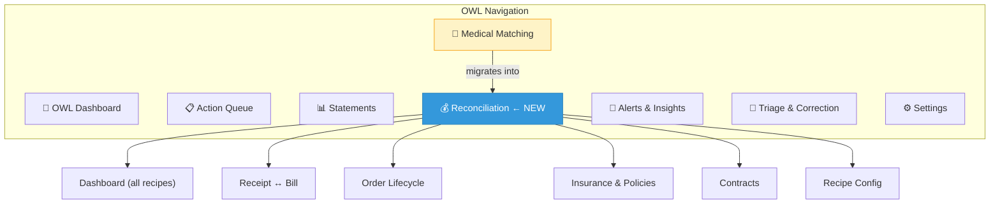

:::info Navigation Evolution
Initially, "Medical Matching" remains as-is. In Phase 2+, it becomes a sub-view under "Reconciliation" (as the `eob_bill` recipe). The transition is gradual — users see the same UI, just nested differently.
:::

---

## 2. Generalized Matching Pipeline

Every reconciliation scenario follows this pipeline:

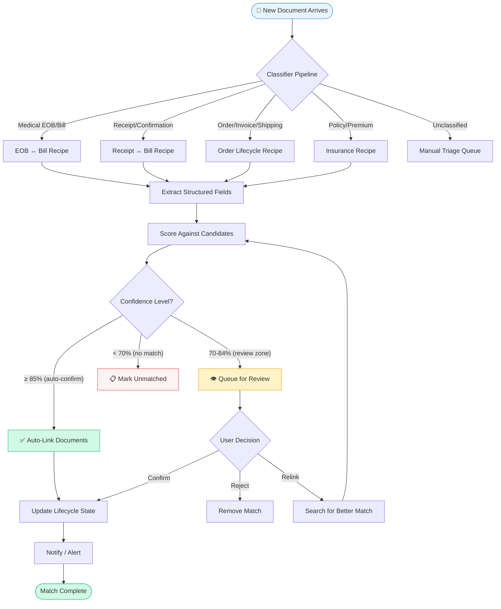

---

## 3. Receipt ↔ Bill Matching Flow

### User Flow: Bill Arrives First

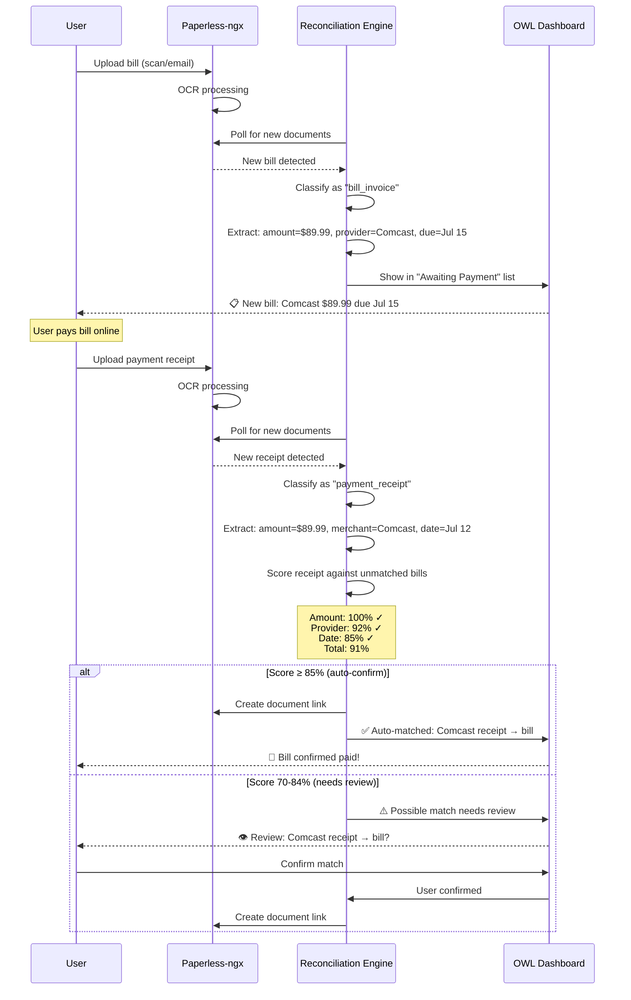

### User Flow: Double Payment Detection

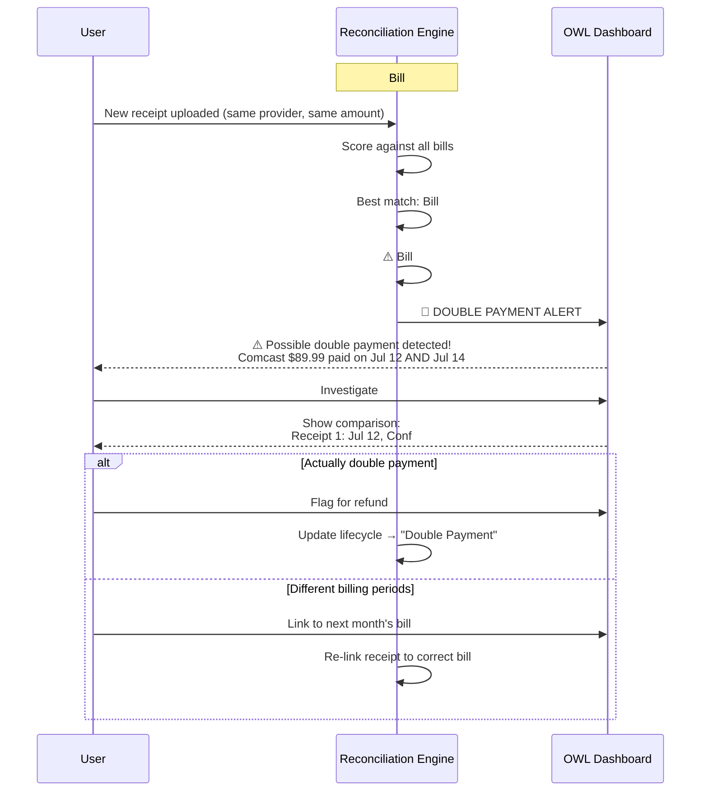

---

## 4. Order Lifecycle Flow (3-Way Matching)

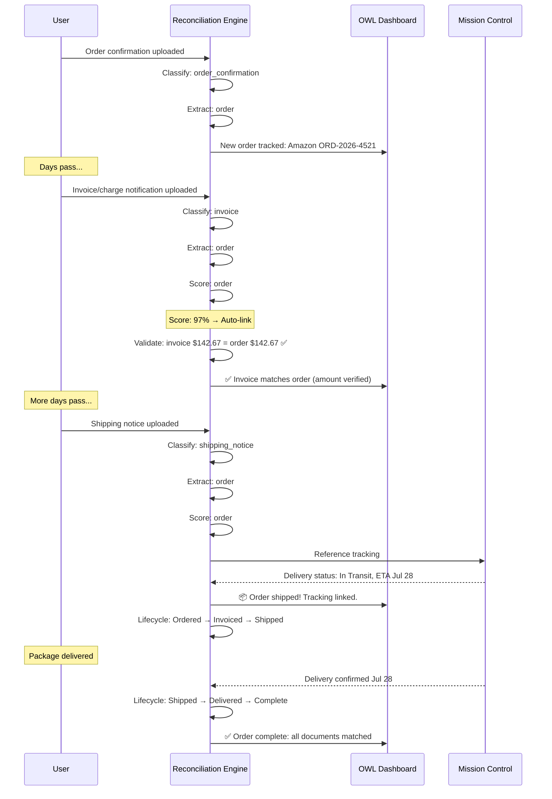

---

## 5. Reconciliation Dashboard Flow

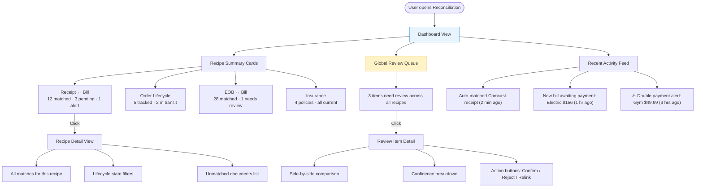

---

## 6. Recipe Configuration Flow

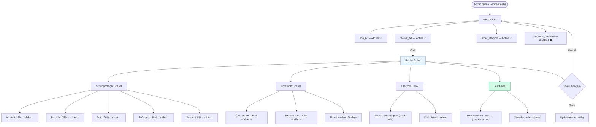

---

## 7. Lifecycle State Diagrams

### Receipt ↔ Bill Lifecycle

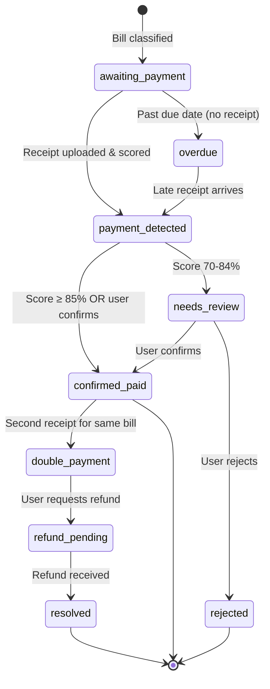

### Order Lifecycle

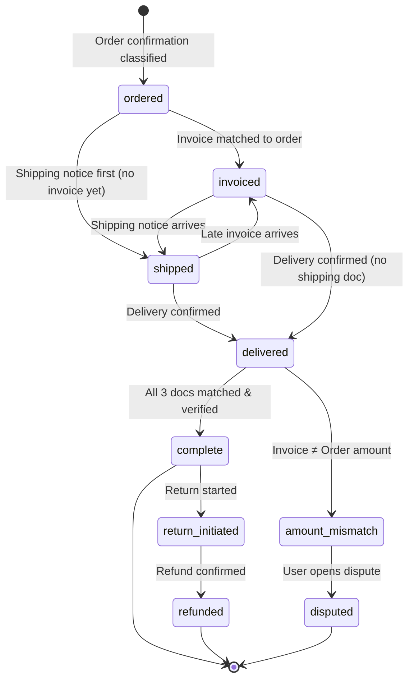

---

## 8. Review Queue Interaction

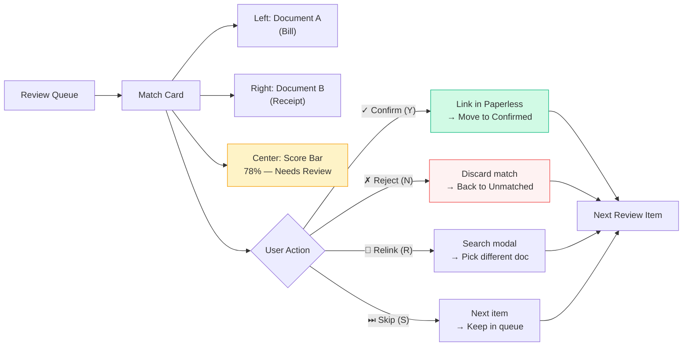

---

## 9. Integration Points

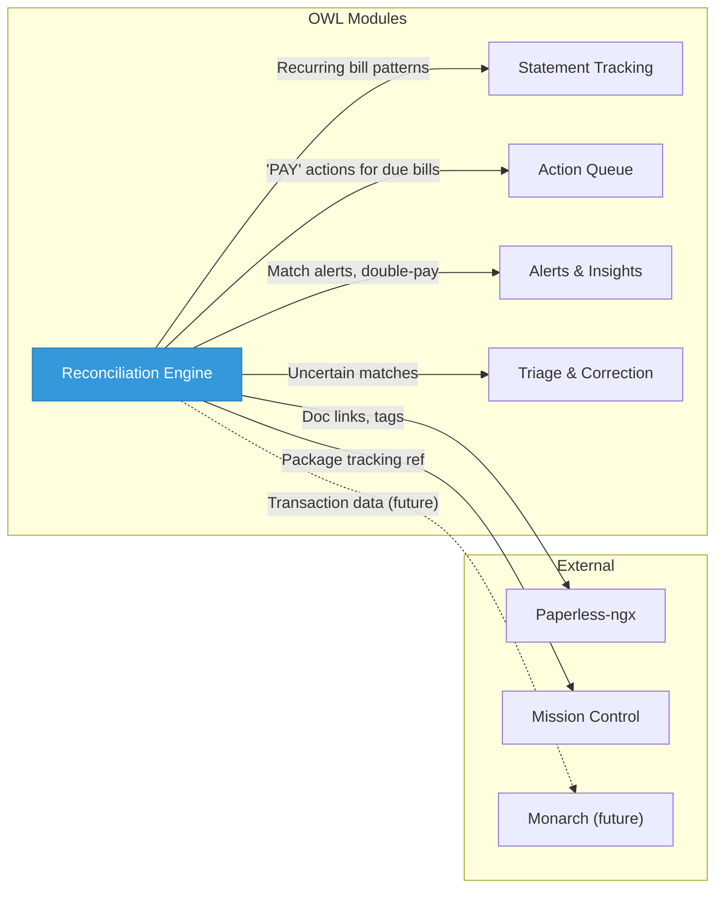

---

## 10. Mobile / Notification Flow

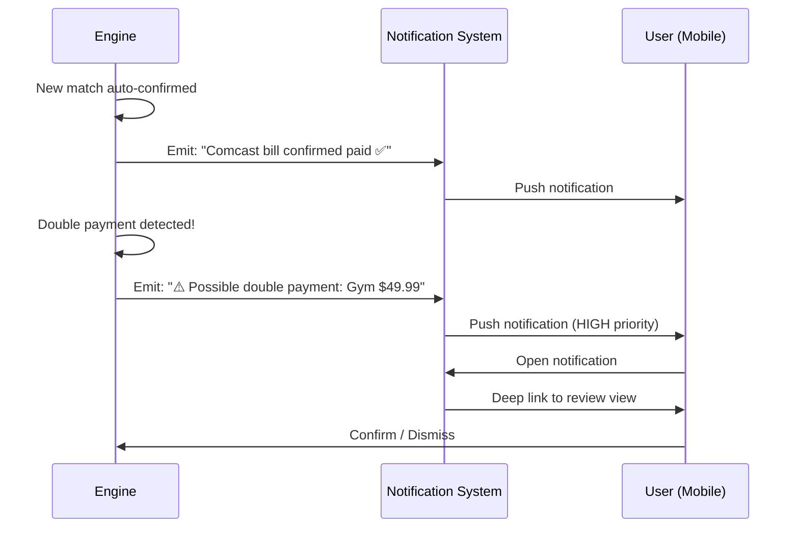
