# Design Document: Statement Tracking and Management System

## Executive Summary

This document presents a comprehensive design for an intelligent statement tracking system that integrates with paperless-ngx. The system analyzes existing documents to identify recurring statements, tracks missing items, and provides smart recommendations for when to retrieve new statements.

**Key Design Principles:**
- Privacy-first: All processing happens locally/self-hosted
- User control: Manual confirmation and override capabilities
- Flexibility: Handle irregular schedules and provider variations
- Extensibility: Design for future automation and enhancement

## Table of Contents

1. [System Architecture](#system-architecture)
2. [Approach Comparison](#approach-comparison)
3. [Core Components](#core-components)
4. [Statement Detection Algorithm](#statement-detection-algorithm)
5. [Recurrence Pattern Analysis](#recurrence-pattern-analysis)
6. [Missing Statement Detection](#missing-statement-detection)
7. [Data Models](#data-models)
8. [User Workflows](#user-workflows)
9. [Technical Considerations](#technical-considerations)

---

## System Architecture

### High-Level Architecture

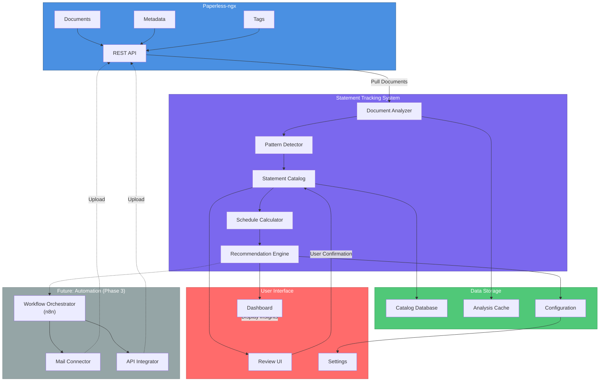

### Component Interaction Flow

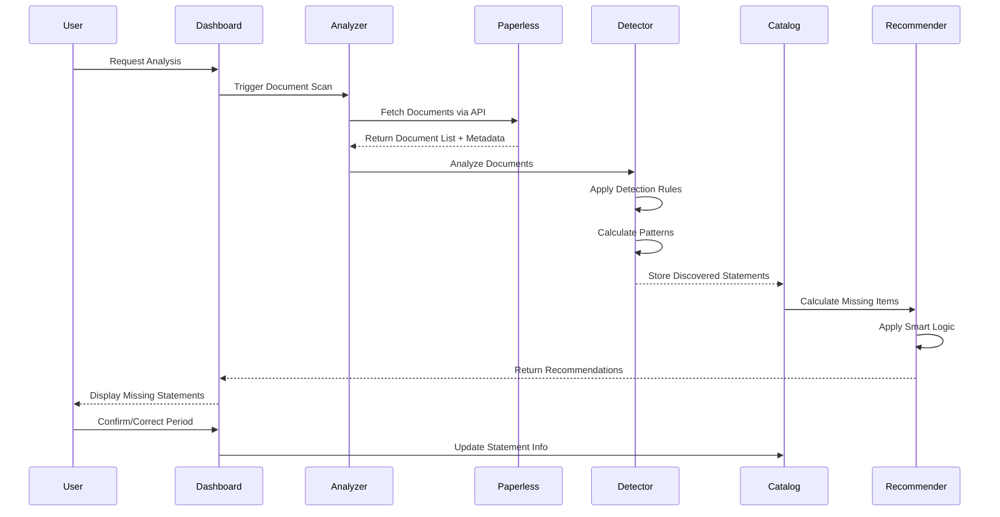

---

## Approach Comparison

### Approach 1: Rule-Based Pattern Detection (Recommended for MVP)

**Overview:** Use explicit rules and heuristics to identify statements based on document metadata, naming patterns, and temporal characteristics.

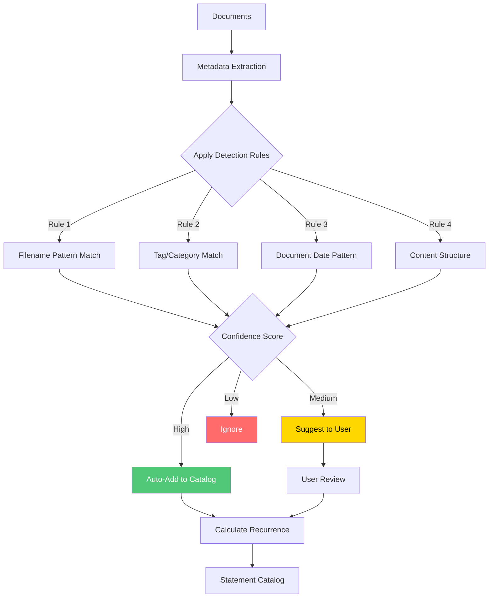

**Detection Rules Examples:**

1. **Filename Pattern Rule**
   ```
   Pattern: {provider}_{type}_{YYYY-MM}.pdf
   Examples:
   - chase_statement_2025-01.pdf
   - comcast_bill_2025-02.pdf
   - insurance_quarterly_2025-Q1.pdf
   ```

2. **Temporal Pattern Rule**
   ```
   If: Same correspondent + similar title + monthly spacing
   Then: Likely recurring statement
   Confidence: 85%
   ```

3. **Tag-Based Rule**
   ```
   If: Tagged with "statement" OR "bill" OR "invoice"
   And: Multiple documents from same correspondent
   Then: Check for recurrence pattern
   ```

**Strengths:**
- ✅ Fast implementation (2-3 weeks)
- ✅ Predictable behavior
- ✅ Easy to debug and adjust
- ✅ No training data required
- ✅ Perfect privacy (no external services)
- ✅ Low resource requirements

**Weaknesses:**
- ❌ Requires manual rule creation
- ❌ May miss non-standard formats
- ❌ Limited ability to learn from corrections
- ❌ Rules need updating for new providers

**Best For:**
- MVP and initial deployment
- Users with consistent statement naming
- Self-hosted environments with privacy concerns
- Quick proof of concept

---

### Approach 2: Machine Learning Document Classification

**Overview:** Train ML models to automatically classify documents and extract statement metadata using NLP and pattern recognition.

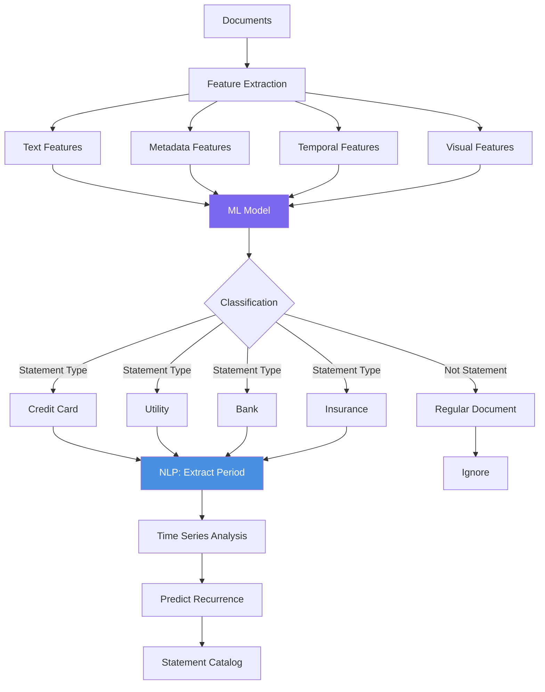

**ML Components:**

1. **Document Classifier**
   - Model: DistilBERT or lightweight transformer
   - Task: Multi-class classification (statement type)
   - Training: Labeled examples from user's documents
   - Self-hosted via Ollama or local inference

2. **Period Extractor**
   - Model: Named Entity Recognition (NER)
   - Task: Extract dates, billing periods
   - Example: "January 2025 Statement" → 2025-01

3. **Pattern Predictor**
   - Model: Time series forecasting (Prophet, ARIMA)
   - Task: Predict next statement date
   - Handles irregularities and seasonality

**Strengths:**
- ✅ Automatic pattern discovery
- ✅ Learns from user corrections
- ✅ Handles non-standard formats
- ✅ Improves over time
- ✅ Minimal manual configuration

**Weaknesses:**
- ❌ Complex implementation (2-3 months)
- ❌ Requires training data
- ❌ Higher resource requirements
- ❌ Less predictable behavior
- ❌ Harder to debug
- ❌ Need ML expertise

**Best For:**
- Large document collections (1000+ documents)
- Varied statement formats
- Long-term deployment
- Users comfortable with ML

---

### Approach 3: Hybrid Rule-Based + ML Enhancement

**Overview:** Start with rule-based detection, enhance with ML for edge cases and continuous improvement.

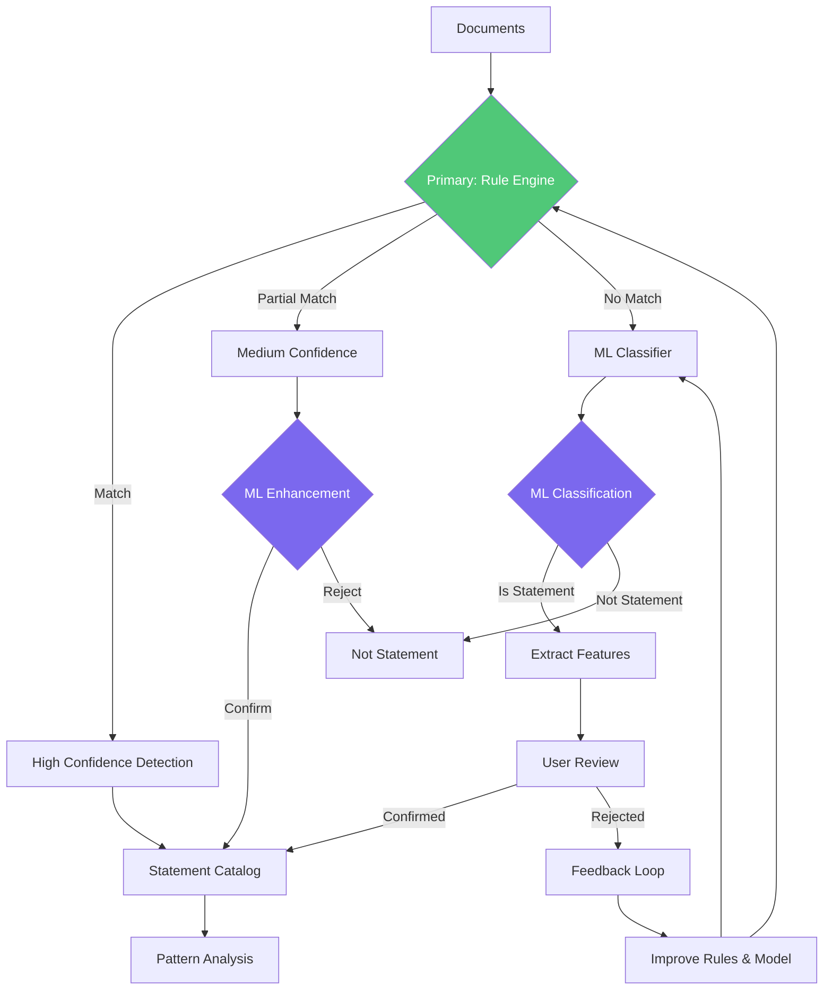

**Implementation Strategy:**

**Phase 1: Rules Only**
- Implement core rule engine
- Deploy and gather data
- Collect user feedback

**Phase 2: Add ML Layer**
- Train model on confirmed statements
- Use ML for edge cases only
- Keep rules as primary method

**Phase 3: Continuous Improvement**
- ML learns from user corrections
- Rules updated based on patterns
- Hybrid system optimizes over time

**Strengths:**
- ✅ Fast initial deployment (like Approach 1)
- ✅ Growth path to ML capabilities
- ✅ Best of both worlds
- ✅ Incremental complexity
- ✅ Can start without ML expertise
- ✅ Privacy maintained with self-hosted ML

**Weaknesses:**
- ❌ More complex architecture
- ❌ Two systems to maintain
- ❌ Need transition strategy

**Best For:**
- Production deployments
- Long-term projects
- Teams with some ML capability
- Balancing speed and sophistication

---

## Core Components

### 1. Document Analyzer

**Purpose:** Interface with paperless-ngx to retrieve and analyze documents.

**Responsibilities:**
- Fetch documents via Paperless API
- Extract metadata (title, correspondent, date, tags)
- Cache analysis results
- Handle API pagination and rate limiting

**Key Functions:**
```python
def fetch_all_documents(since_date=None):
    """Fetch documents from paperless-ngx"""
    
def extract_metadata(document):
    """Extract relevant metadata"""
    return {
        'id': document.id,
        'title': document.title,
        'correspondent': document.correspondent,
        'created_date': document.created,
        'added_date': document.added,
        'tags': document.tags,
        'document_type': document.document_type
    }

def is_likely_statement(metadata):
    """Quick check if document could be a statement"""
```

---

### 2. Pattern Detector

**Purpose:** Identify recurring statements using detection algorithms.

**Key Algorithms:**

#### Algorithm 1: Temporal Grouping

```
Input: List of documents from same correspondent
Output: Groups of potentially recurring documents

Process:
1. Sort documents by date
2. Calculate time intervals between consecutive documents
3. Group documents with similar intervals
4. Identify modal interval (most common spacing)
5. Calculate confidence score based on consistency

Example:
Documents: Jan 5, Feb 6, Mar 7, Apr 5, May 6
Intervals: 32 days, 29 days, 29 days, 31 days
Modal: ~30 days (monthly)
Confidence: 85% (4/4 intervals are 29-32 days)
```

**Implementation:**
```python
def detect_temporal_pattern(documents):
    dates = sorted([doc.date for doc in documents])
    intervals = [dates[i+1] - dates[i] for i in range(len(dates)-1)]
    
    # Classify interval
    if all(25 <= i.days <= 35 for i in intervals):
        return {
            'frequency': 'monthly',
            'confidence': calculate_confidence(intervals),
            'average_day': statistics.mode([d.day for d in dates])
        }
    elif all(85 <= i.days <= 95 for i in intervals):
        return {
            'frequency': 'quarterly',
            'confidence': calculate_confidence(intervals),
            'quarters': [get_quarter(d) for d in dates]
        }
```

#### Algorithm 2: Title Similarity Clustering

```
Input: Documents from same correspondent
Output: Clusters of similar titles (potential statement series)

Process:
1. Extract title patterns (remove dates, numbers)
2. Calculate similarity scores (Levenshtein, Jaro-Winkler)
3. Cluster titles with >80% similarity
4. Identify largest cluster as primary statement series

Example:
"Chase Statement - January 2025" → "chase statement"
"Chase Statement - February 2025" → "chase statement"
"Chase Credit Card Statement March 2025" → "chase credit card statement"
Cluster: ["chase statement" x2, "chase credit card statement" x1]
```

**Implementation:**
```python
def normalize_title(title):
    """Remove dates, numbers, special chars"""
    # Remove common date patterns
    title = re.sub(r'\d{4}[-/]\d{2}[-/]\d{2}', '', title)
    title = re.sub(r'(Jan|Feb|Mar|...|Dec)\w* \d{4}', '', title)
    title = re.sub(r'\d+', '', title)
    return title.lower().strip()

def cluster_by_similarity(titles, threshold=0.8):
    """Group similar titles"""
    clusters = []
    for title in titles:
        normalized = normalize_title(title)
        # Find matching cluster or create new
        matched = False
        for cluster in clusters:
            if similarity(normalized, cluster['pattern']) > threshold:
                cluster['titles'].append(title)
                matched = True
                break
        if not matched:
            clusters.append({'pattern': normalized, 'titles': [title]})
    return clusters
```

#### Algorithm 3: Metadata Pattern Matching

```
Input: Document metadata
Output: Statement type classification

Process:
1. Check tags for statement-related keywords
2. Check correspondent name against known providers
3. Check document_type field
4. Check filename patterns
5. Combine signals with weights

Signals:
- Tag "statement" or "bill": +30 points
- Correspondent in provider database: +25 points  
- Document type "Statement": +20 points
- Monthly date pattern: +15 points
- Filename pattern match: +10 points

Threshold: 50+ points = likely statement
```

---

### 3. Recurrence Pattern Analysis

**Purpose:** Determine the expected schedule for each statement type.

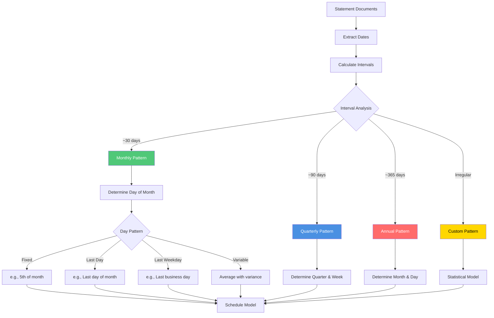

#### Recurrence Algorithms

**Monthly Pattern Detection:**
```python
def analyze_monthly_pattern(dates):
    """Determine monthly statement release pattern"""
    
    # Check for fixed day of month
    days = [d.day for d in dates]
    if statistics.stdev(days) < 2:  # Very consistent
        return {
            'type': 'fixed_day',
            'day': round(statistics.mean(days)),
            'variance': statistics.stdev(days),
            'confidence': 0.95
        }
    
    # Check for last day of month
    last_days = [is_last_day_of_month(d) for d in dates]
    if sum(last_days) / len(last_days) > 0.8:
        return {
            'type': 'last_day',
            'confidence': 0.90
        }
    
    # Check for last business day
    last_business_days = [is_last_business_day(d) for d in dates]
    if sum(last_business_days) / len(last_business_days) > 0.7:
        return {
            'type': 'last_business_day',
            'confidence': 0.85
        }
    
    # Variable pattern
    return {
        'type': 'variable_monthly',
        'average_day': round(statistics.mean(days)),
        'std_dev': statistics.stdev(days),
        'min_day': min(days),
        'max_day': max(days),
        'confidence': 0.70
    }
```

**Expected Date Calculation:**
```python
def calculate_next_expected_date(pattern, last_date):
    """Calculate when next statement is expected"""
    
    if pattern['frequency'] == 'monthly':
        if pattern['type'] == 'fixed_day':
            # Next month, same day
            next_month = last_date + relativedelta(months=1)
            return next_month.replace(day=pattern['day'])
            
        elif pattern['type'] == 'last_day':
            # Last day of next month
            next_month = last_date + relativedelta(months=1)
            return last_day_of_month(next_month)
            
        elif pattern['type'] == 'last_business_day':
            # Last business day of next month
            next_month = last_date + relativedelta(months=1)
            return last_business_day_of_month(next_month)
            
        elif pattern['type'] == 'variable_monthly':
            # Use average with variance
            next_month = last_date + relativedelta(months=1)
            expected_day = pattern['average_day']
            return next_month.replace(day=expected_day)
    
    elif pattern['frequency'] == 'quarterly':
        # Next quarter
        return last_date + relativedelta(months=3)
    
    elif pattern['frequency'] == 'annual':
        # Next year
        return last_date + relativedelta(years=1)
```

**Smart Date Windows:**
```python
def calculate_availability_window(expected_date, pattern):
    """Calculate when statement might be available"""
    
    confidence = pattern.get('confidence', 0.70)
    variance_days = pattern.get('std_dev', 3)
    
    # Earlier statements might be available early
    early_window = expected_date - timedelta(days=2)
    
    # Late window based on confidence and variance
    if confidence > 0.90:
        late_window = expected_date + timedelta(days=variance_days + 5)
    else:
        late_window = expected_date + timedelta(days=variance_days * 2 + 7)
    
    return {
        'earliest': early_window,
        'expected': expected_date,
        'latest': late_window,
        'check_after': expected_date + timedelta(days=1)
    }
```

---

### 4. Missing Statement Detection

**Purpose:** Identify statements that should exist but are missing from paperless-ngx.

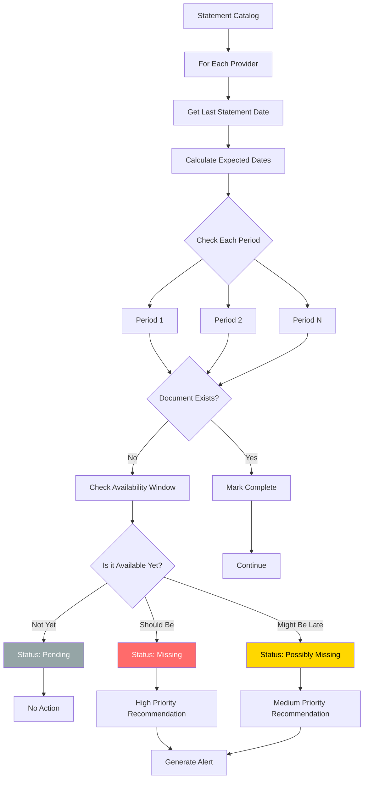

#### Missing Statement Algorithm

```python
def detect_missing_statements():
    """Main algorithm for detecting missing statements"""
    
    recommendations = []
    today = datetime.now().date()
    
    for provider in catalog.get_all_providers():
        pattern = provider.recurrence_pattern
        documents = provider.get_documents()
        
        if not documents:
            continue
            
        # Get last statement date
        last_statement_date = max(doc.period_end for doc in documents)
        
        # Calculate all expected periods since last statement
        expected_periods = generate_expected_periods(
            last_statement_date, 
            today, 
            pattern
        )
        
        for period in expected_periods:
            # Check if we have this period
            existing = find_document_for_period(documents, period)
            
            if existing:
                continue  # We have it
            
            # Calculate availability window
            window = calculate_availability_window(period['date'], pattern)
            
            # Determine status
            if today < window['earliest']:
                # Not available yet
                status = 'pending'
                priority = 0
            elif today >= window['earliest'] and today <= window['latest']:
                # Should be available now
                status = 'missing'
                priority = calculate_priority(today, window, pattern)
            else:
                # Past the window
                status = 'overdue'
                priority = 10  # Highest priority
            
            if status in ['missing', 'overdue']:
                recommendations.append({
                    'provider': provider.name,
                    'period': period,
                    'status': status,
                    'priority': priority,
                    'window': window,
                    'confidence': pattern['confidence']
                })
    
    # Sort by priority
    return sorted(recommendations, key=lambda x: x['priority'], reverse=True)
```

**Priority Calculation:**
```python
def calculate_priority(today, window, pattern):
    """Calculate priority score for missing statement"""
    
    base_priority = 5
    
    # How many days past expected date?
    days_late = (today - window['expected']).days
    if days_late > 10:
        base_priority += 3
    elif days_late > 5:
        base_priority += 2
    elif days_late > 0:
        base_priority += 1
    
    # Confidence in pattern
    if pattern['confidence'] > 0.90:
        base_priority += 1
    
    # Statement type importance (user configurable)
    importance = pattern.get('importance', 'medium')
    if importance == 'critical':
        base_priority += 2
    elif importance == 'high':
        base_priority += 1
    
    return min(base_priority, 10)  # Cap at 10
```

---

## Data Models

### Database Schema

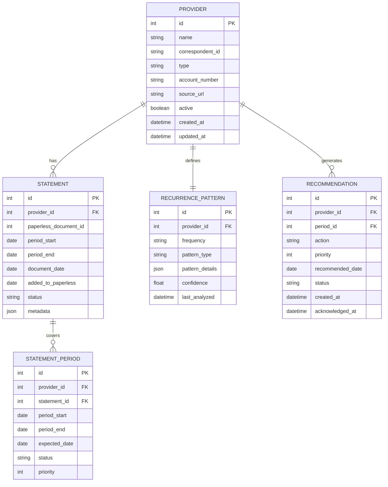

### JSON Data Structures

**Provider Configuration:**
```json
{
  "id": "chase-visa-1234",
  "name": "Chase Visa (...1234)",
  "type": "credit_card",
  "correspondent_id": 42,
  "account_number": "****1234",
  "source_url": "https://www.chase.com/statements",
  "active": true,
  "recurrence_pattern": {
    "frequency": "monthly",
    "type": "last_business_day",
    "confidence": 0.92,
    "details": {
      "average_day": 28,
      "variance": 2.1,
      "analyzed_periods": 24
    }
  },
  "importance": "high",
  "tags": ["statement", "credit-card"],
  "notes": "Statements typically available 2-3 days after month end"
}
```

**Statement Record:**
```json
{
  "id": 1523,
  "provider_id": "chase-visa-1234",
  "paperless_document_id": 8742,
  "period": {
    "start": "2025-01-01",
    "end": "2025-01-31"
  },
  "document_date": "2025-02-03",
  "added_to_paperless": "2025-02-05T14:23:00Z",
  "status": "confirmed",
  "metadata": {
    "title": "Chase Statement - January 2025",
    "filename": "chase_statement_2025-01.pdf",
    "pages": 8,
    "size_kb": 245
  }
}
```

**Recommendation:**
```json
{
  "id": 89,
  "provider": "Chase Visa (...1234)",
  "period": {
    "start": "2025-02-01",
    "end": "2025-02-28"
  },
  "expected_date": "2025-02-28",
  "availability_window": {
    "earliest": "2025-02-26",
    "latest": "2025-03-07"
  },
  "status": "missing",
  "priority": 7,
  "confidence": 0.92,
  "action": "download",
  "recommended_check_date": "2025-03-01",
  "notes": "Statement typically available 2-3 days after month end"
}
```

---

## User Workflows

### Workflow 1: Initial Discovery & Catalog Setup

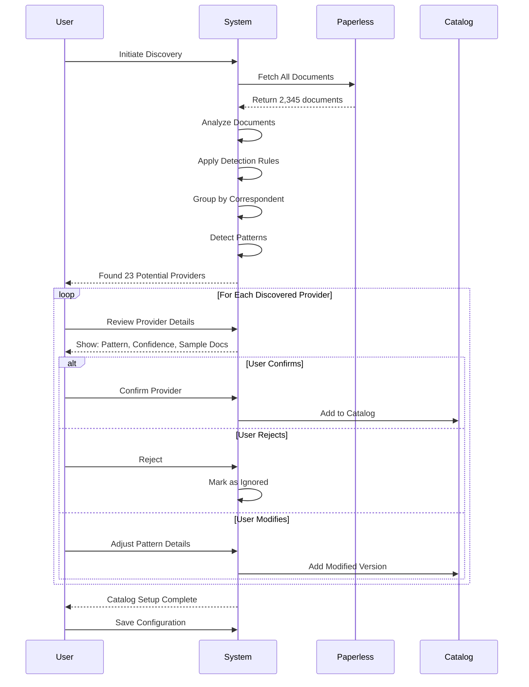

### Workflow 2: Missing Statement Check

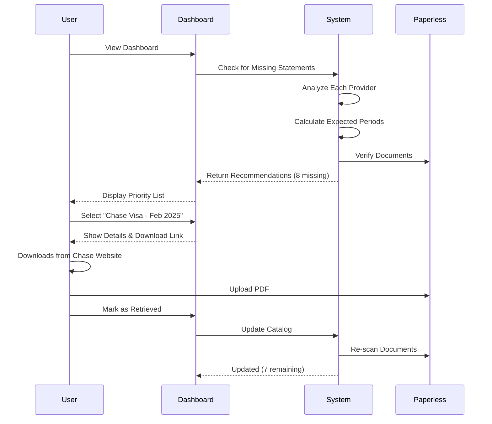

### Workflow 3: Period Correction

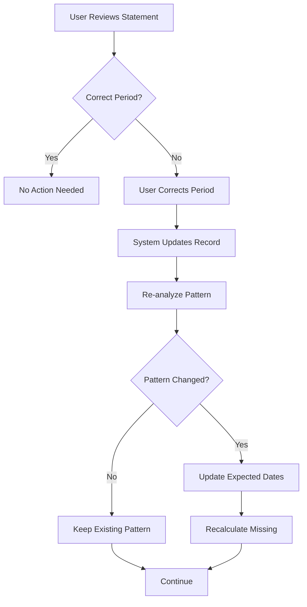

### Workflow 4: New Provider Addition

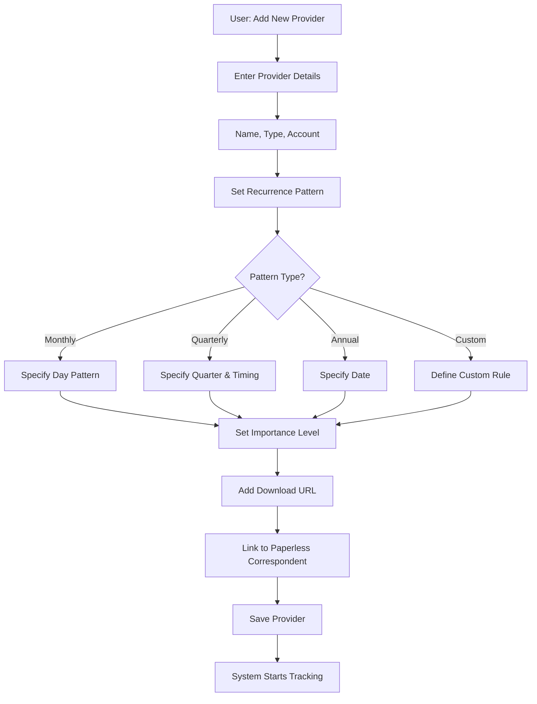

---

## Technical Considerations

### Integration with Paperless-ngx

**API Endpoints Used:**
```
GET  /api/documents/                    - List all documents
GET  /api/documents/{id}/               - Get document details
GET  /api/correspondents/               - List correspondents
GET  /api/tags/                         - List tags
GET  /api/document_types/               - List document types
```

**Authentication:**
- Use API token authentication
- Token stored securely in configuration
- Never commit tokens to version control

**Rate Limiting:**
- Paperless has no built-in rate limits
- Implement client-side throttling for courtesy
- Batch requests when possible

### Data Storage Options

**Option 1: SQLite (Recommended for Single User)**
- ✅ Simple, file-based
- ✅ No server required
- ✅ Good performance for <10,000 statements
- ✅ Built into Python
- ❌ Single-user only

**Option 2: PostgreSQL (For Multi-User)**
- ✅ Full ACID compliance
- ✅ Multi-user support
- ✅ Advanced querying
- ✅ Scales well
- ❌ Requires server setup

**Option 3: JSON Files (For MVP/Testing)**
- ✅ Simplest implementation
- ✅ Human-readable
- ✅ Easy to backup
- ❌ Poor performance at scale
- ❌ No concurrent access

### Privacy & Security

**Principles:**
1. **Self-Hosted First** - All processing local or on private infrastructure
2. **No External APIs** - Don't send document data to third parties
3. **Encrypted Storage** - Sensitive data encrypted at rest
4. **Secure Credentials** - Provider credentials stored securely
5. **Audit Logging** - Track access to sensitive information

**Implementation:**
```python
# Never log sensitive data
logger.info(f"Processing statement for {provider.name}")  # OK
logger.info(f"Account number: {account.number}")  # NEVER

# Encrypt sensitive fields
from cryptography.fernet import Fernet

def store_credentials(provider_id, credentials):
    cipher = Fernet(get_encryption_key())
    encrypted = cipher.encrypt(credentials.encode())
    db.store(provider_id, encrypted)
```

### Performance Optimization

**Caching Strategy:**
```python
# Cache document analysis
@cache.memoize(timeout=3600)  # 1 hour
def analyze_document(document_id):
    # Expensive analysis
    pass

# Incremental updates
def update_catalog(since_last_run):
    # Only process new documents
    new_docs = fetch_documents(since=since_last_run)
    # Process only new_docs
```

**Batch Processing:**
```python
# Process in batches to avoid memory issues
def analyze_all_documents():
    batch_size = 100
    offset = 0
    
    while True:
        batch = fetch_documents(limit=batch_size, offset=offset)
        if not batch:
            break
            
        process_batch(batch)
        offset += batch_size
```

### Error Handling

**Scenarios:**
1. **Paperless API Unavailable**
   - Retry with exponential backoff
   - Cache last known state
   - Graceful degradation

2. **Pattern Detection Uncertainty**
   - Flag for user review
   - Don't auto-add to catalog
   - Provide confidence scores

3. **Missing Data**
   - Handle incomplete metadata
   - Fallback to alternative detection methods
   - Log for investigation

```python
def safe_pattern_detection(documents):
    try:
        pattern = detect_pattern(documents)
        if pattern['confidence'] < 0.60:
            return {
                'status': 'uncertain',
                'suggestion': pattern,
                'requires_review': True
            }
        return {
            'status': 'detected',
            'pattern': pattern,
            'requires_review': False
        }
    except InsufficientDataError:
        return {
            'status': 'insufficient_data',
            'requires_review': True
        }
    except Exception as e:
        logger.error(f"Pattern detection failed: {e}")
        return {
            'status': 'error',
            'requires_review': True
        }
```

### Extensibility for Future Automation

The authoritative acquisition and correspondent-policy design is
[Correspondent Intelligence and Acquisition](../../design/active/correspondent-intelligence-and-acquisition.md).
The staged decision is to:

1. reuse Paperless mail rules and API/consume-folder ingestion;
2. implement narrow direct email/API connectors through n8n;
3. store only non-secret connector references and manual retrieval guidance in OWL; and
4. defer credentialed browser automation.

Do not introduce a generic downloader or Playwright/Puppeteer framework before at least two
real provider integrations demonstrate a shared contract. Missing-document alerts must come
only from confirmed expectations, not directly from financial-account or recurring-payment
signals.

---

## Implementation Roadmap

### Phase 1: MVP (Rule-Based Detection)
**Timeline: 2-3 weeks**

1. ✅ Design complete
2. Implement Document Analyzer
3. Implement Pattern Detector (rules-based)
4. Implement Catalog Database (SQLite)
5. Implement Missing Statement Detection
6. Build CLI interface
7. Testing with real documents

### Phase 2: User Interface
**Timeline: 2 weeks**

1. Web dashboard (Flask/FastAPI + React)
2. Provider review UI
3. Statement confirmation workflow
4. Recommendations display
5. Settings and configuration
6. Correspondent/expectation review with title-template examples

### Phase 3: Enhanced Detection
**Timeline: 2-3 weeks**

1. Add more detection rules
2. Improve pattern analysis
3. Add quarterly and annual support
4. Custom recurrence patterns
5. Exception handling
6. Explicit metadata correction and Tyrion candidate reconciliation

### Phase 4: Acquisition

1. Paperless mail-rule configuration
2. Direct email/API provider integrations through n8n
3. Idempotent Paperless upload and statement-found reconciliation
4. Acquisition health and manual portal guidance
5. Browser-automation feasibility assessment only

### Phase 5: ML Enhancement (Optional)
**Timeline: 4-6 weeks**

1. Data labeling UI
2. Train document classifier
3. NER for period extraction
4. Integrate ML with rule engine
5. Continuous learning pipeline

---

## Comparison Matrix

| Feature | Approach 1 (Rules) | Approach 2 (ML) | Approach 3 (Hybrid) |
|---------|-------------------|----------------|-------------------|
| **Discovery Accuracy** | 80-85% | 70-95% | 85-95% |
| **Setup Time** | 5 minutes | 2-4 hours | 10 minutes |
| **Implementation Time** | 2-3 weeks | 2-3 months | 1-2 months |
| **User Intervention Required** | Medium | Low | Low-Medium |
| **Resource Usage (CPU)** | Low | Medium-High | Medium |
| **Resource Usage (Memory)** | Low (<100MB) | Medium (200-500MB) | Medium (150-300MB) |
| **Privacy** | Perfect | Good* | Good* |
| **Maintenance** | Medium | Low | Medium |
| **Extensibility** | Limited | Excellent | Excellent |
| **Learning Capability** | None | High | High |
| **Production Ready** | Yes | Depends | Yes |

*If using self-hosted ML models

---

## Decision Framework

### Choose Approach 1 (Rule-Based) If:
- ✅ You want to start quickly (MVP in weeks)
- ✅ You have <50 statement types
- ✅ Your statements follow consistent patterns
- ✅ Privacy is paramount
- ✅ You have limited ML expertise
- ✅ You prefer predictable behavior

### Choose Approach 2 (ML-Based) If:
- ✅ You have >100 statement types
- ✅ Statements have varied, inconsistent formats
- ✅ You have ML expertise on team
- ✅ You can invest 2-3 months in development
- ✅ You have enough training data (>100 examples/category)
- ✅ You want minimal ongoing maintenance

### Choose Approach 3 (Hybrid) If:
- ✅ You want best of both worlds
- ✅ You're building for production
- ✅ You can invest 1-2 months initially
- ✅ You want to grow capabilities over time
- ✅ You have moderate ML expertise
- ✅ You want balance of speed and sophistication

---

## References & Inspiration

- **Paperless-ngx API Documentation** - https://docs.paperless-ngx.com/
- **Time Series Pattern Recognition** - Prophet, ARIMA models
- **Document Classification** - BERT, DistilBERT for text classification
- **Self-Hosted ML** - Ollama, llama.cpp for local inference
- **Document Acquisition** - Paperless mail rules and narrow provider email/API connectors
- **Workflow Orchestration** - n8n for automation

---

## Appendix A: Example Detection Rules

```json
{
  "rules": [
    {
      "id": "rule_monthly_statement_filename",
      "name": "Monthly Statement Filename Pattern",
      "pattern": ".*statement.*\\d{4}[-_](0[1-9]|1[0-2]).*",
      "weight": 25,
      "confidence": 0.85
    },
    {
      "id": "rule_bill_tag",
      "name": "Bill or Statement Tag",
      "condition": "has_tag('bill') OR has_tag('statement')",
      "weight": 30,
      "confidence": 0.90
    },
    {
      "id": "rule_temporal_monthly",
      "name": "Monthly Temporal Pattern",
      "condition": "interval_variance < 5 AND average_interval BETWEEN 25 AND 35",
      "weight": 35,
      "confidence": 0.95
    },
    {
      "id": "rule_correspondent_type",
      "name": "Known Financial Correspondent",
      "condition": "correspondent.type IN ['bank', 'credit_card', 'utility']",
      "weight": 20,
      "confidence": 0.80
    }
  ],
  "threshold": 50
}
```

---

## Appendix B: Provider Configuration Templates

**Credit Card:**
```json
{
  "type": "credit_card",
  "recurrence": {
    "frequency": "monthly",
    "type": "last_business_day",
    "variance_days": 3
  },
  "importance": "high",
  "typical_delay_days": 2,
  "required_fields": ["account_number"]
}
```

**Utility Bill:**
```json
{
  "type": "utility",
  "recurrence": {
    "frequency": "monthly",
    "type": "fixed_day",
    "day": 15,
    "variance_days": 2
  },
  "importance": "medium",
  "typical_delay_days": 5,
  "required_fields": ["account_number", "service_address"]
}
```

**Insurance:**
```json
{
  "type": "insurance",
  "recurrence": {
    "frequency": "quarterly",
    "type": "first_day_of_quarter",
    "variance_days": 7
  },
  "importance": "medium",
  "typical_delay_days": 10,
  "required_fields": ["policy_number"]
}
```

---

**Document Version:** 1.0  
**Last Updated:** 2026-02-14  
**Status:** Design Complete - Ready for Review
