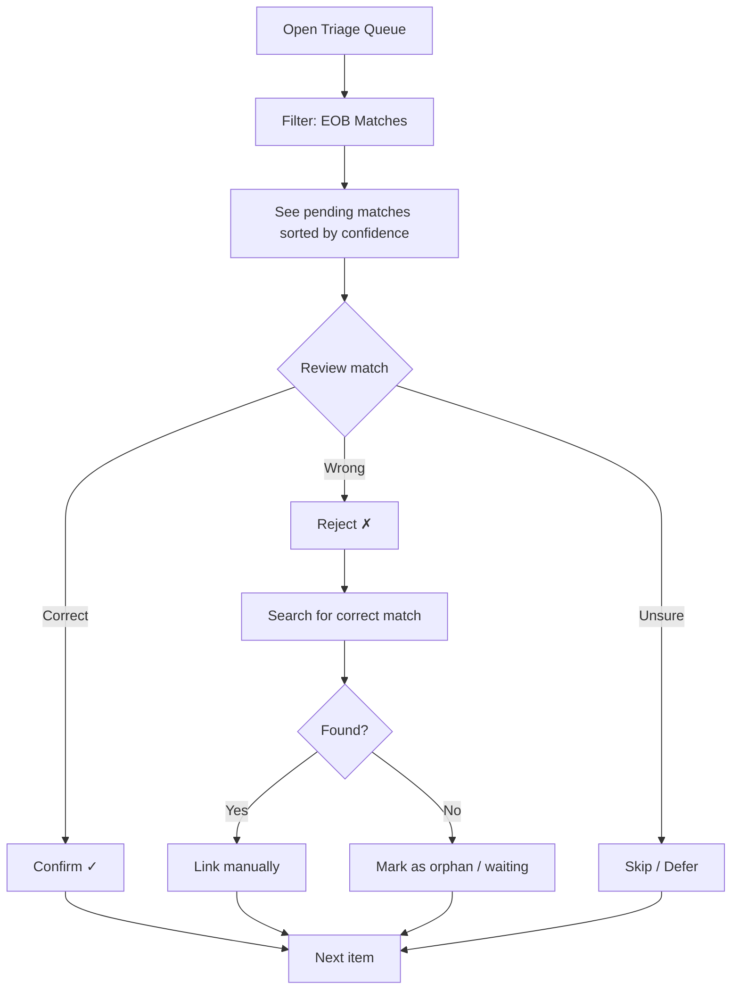
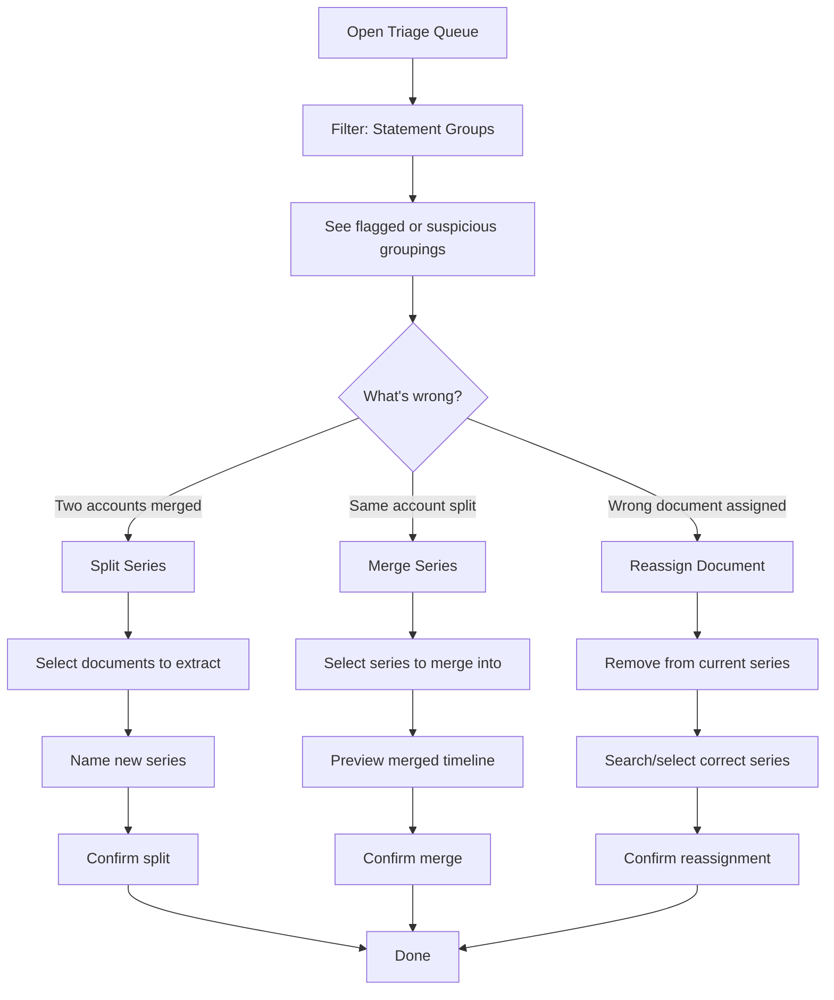
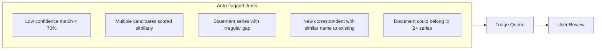
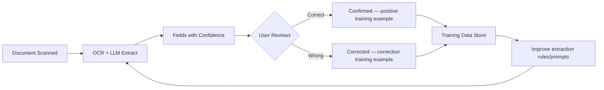
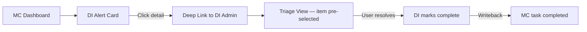
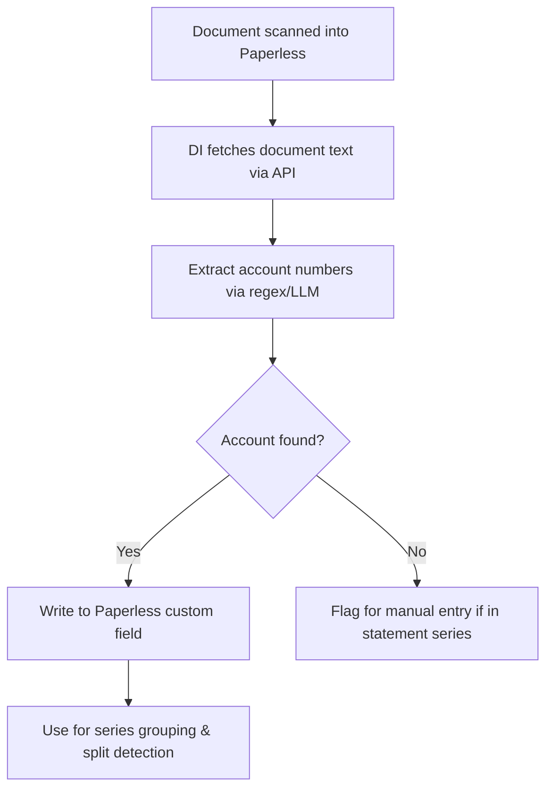

# Design Document: Needs Review & Document Correction UI

## Executive Summary

This document defines the **Needs Review and correction interface** for the Document Intelligence admin UI. It lets users review, correct, and adjust automated document relationships in Paperless-ngx. Internal routes, APIs, and data models retain the `triage` name for compatibility. It addresses five core workflows:

1. **EOB ↔ Bill Match Triage** — Reviewing, confirming, rejecting, and manually re-linking automated matches
2. **Statement Grouping Correction** — Splitting, merging, and reassigning documents that were incorrectly grouped into the same statement "series"
3. **Orphan Document Management** — Handling unmatched EOBs (no bill found) and unmatched bills (no EOB received) on both sides
4. **Duplicate Detection & Merge** — Identifying and merging duplicate documents (e.g., same bill received via mail + portal), with options for superseded documents
5. **Metadata Correction & Writeback** — Fixing incomplete or incorrect extracted data (OCR/LLM errors), writing corrections back to Paperless custom fields, and using corrections as extraction training data

**Key principle:** Needs Review contains places where the system needs human judgment, not real-world tasks the user must perform. The system makes its best guess automatically, but humans must be able to correct it quickly without deep technical knowledge. See [Action Queue vs. Needs Review](../../architecture/index.md#action-queue-vs-needs-review) for the cross-workflow routing model.

---

## Table of Contents

1. [Problem Statement](#problem-statement)
2. [User Workflows](#user-workflows)
3. [Design Principles](#design-principles)
4. [Data Model Changes](#data-model-changes)
5. [API Endpoints](#api-endpoints)
6. [UI Architecture](#ui-architecture)
7. [View Specifications](#view-specifications)
8. [Interaction Patterns](#interaction-patterns)
9. [Integration Points](#integration-points)
10. [Implementation Plan](#implementation-plan)

---

## Problem Statement

### EOB ↔ Bill Matching Issues

The automated matcher uses a 5-factor weighted score (date 30%, provider 25%, patient 20%, amount 15%, procedures 10%) to pair EOBs with bills. This works well for obvious matches but fails in cases like:

- **Provider name variations**: "City Medical Center" on EOB vs "City Med Ctr" on bill
- **Multiple visits same day**: Two services on the same date, same provider, different amounts
- **Split billing**: One EOB covers multiple bills (or vice versa)
- **Timing gaps**: Bill arrives months after EOB, outside normal matching window
- **Incorrect match**: System matched to wrong document with superficially similar attributes

### Statement Grouping Issues

The statement tracker groups documents into "series" by correspondent + title pattern + temporal recurrence. Failure modes include:

- **Same correspondent, different accounts**: e.g., two Chase credit cards both filed under "Chase" correspondent
- **Merged accounts**: Provider merged billing systems, new statement format looks like a different series
- **Shared correspondent name**: "Capital One" for both a credit card and a savings account
- **Incorrectly split**: Minor title variation caused system to create two series for the same account
- **Orphaned documents**: Document matched to wrong series due to ambiguous title

---

## User Workflows

### Workflow 1: EOB Match Queue Review



**Target time**: 10-30 seconds per item for confirm/reject, 1-2 minutes for manual re-link.

### Workflow 2: Statement Grouping Correction



### Workflow 3: Proactive Anomaly Review

The system surfaces items that likely need attention:



---

## Design Principles

1. **Queue-based workflow** — Items flow through a triage queue. Process one, move to next. Minimize context-switching.
2. **Show, don't tell** — Display the actual document thumbnails/previews alongside metadata. Let the user's eyes confirm.
3. **Confidence transparency** — Always show WHY the system made a decision (which factors scored high/low).
4. **Non-destructive** — All corrections are additive events. Original automated decisions are preserved in history for learning.
5. **Bulk actions** — When multiple items have similar issues, allow batch operations (e.g., "move all Correspondent=Chase with account ending 4321 to new series").
6. **Keyboard-first** — Power users should be able to triage with keyboard shortcuts (Y/N/S for confirm/reject/skip).
7. **Learning from corrections** — Corrections feed back into scoring weights and pattern detection.

---

## Data Model Changes

### New Tables

```sql
-- Correction events (audit trail for all user actions)
CREATE TABLE correction_events (
    id TEXT PRIMARY KEY,
    event_type TEXT NOT NULL,  -- 'match_confirmed', 'match_rejected', 'match_manual',
                               -- 'series_split', 'series_merge', 'doc_reassigned'
    target_type TEXT NOT NULL,  -- 'eob_match' or 'statement_series'
    target_id TEXT NOT NULL,
    payload JSON NOT NULL,      -- Event-specific details
    created_at TIMESTAMP DEFAULT CURRENT_TIMESTAMP,
    created_by TEXT DEFAULT 'user'
);

-- Triage queue items
CREATE TABLE triage_queue (
    id TEXT PRIMARY KEY,
    item_type TEXT NOT NULL,   -- 'eob_match_review', 'grouping_anomaly', 'orphan_document'
    priority INTEGER DEFAULT 50,  -- 0-100, higher = more urgent
    status TEXT DEFAULT 'pending',  -- 'pending', 'deferred', 'resolved', 'dismissed'
    source TEXT NOT NULL,      -- 'auto_flag', 'user_request', 'scheduled_scan'
    target_type TEXT NOT NULL,
    target_id TEXT NOT NULL,
    reason TEXT,               -- Human-readable reason this was flagged
    metadata JSON,             -- Additional context for rendering
    deferred_until TIMESTAMP,
    resolved_at TIMESTAMP,
    resolved_action TEXT,      -- What the user did
    created_at TIMESTAMP DEFAULT CURRENT_TIMESTAMP
);

-- Statement series override (user corrections to auto-detected groupings)
CREATE TABLE series_overrides (
    id TEXT PRIMARY KEY,
    series_id TEXT NOT NULL,
    override_type TEXT NOT NULL,  -- 'rename', 'merge_into', 'split_from', 'add_doc', 'remove_doc'
    payload JSON NOT NULL,
    created_at TIMESTAMP DEFAULT CURRENT_TIMESTAMP
);
```

### Extended Existing Tables

```sql
-- Add to eob_matches (existing)
ALTER TABLE eob_matches ADD COLUMN user_status TEXT DEFAULT 'unreviewed';
  -- 'unreviewed', 'confirmed', 'rejected', 'override'
ALTER TABLE eob_matches ADD COLUMN reviewed_at TIMESTAMP;
ALTER TABLE eob_matches ADD COLUMN user_notes TEXT;

-- Add to statement_series (existing)
ALTER TABLE statement_series ADD COLUMN manually_curated BOOLEAN DEFAULT FALSE;
ALTER TABLE statement_series ADD COLUMN account_identifier TEXT;
  -- User-provided disambiguator (e.g., "ending 4321")
```

---

## API Endpoints

### Triage Queue

```
GET    /api/triage/queue
       ?type=eob_match_review|grouping_anomaly|orphan_document
       &status=pending|deferred
       &sort=priority|created_at
       &limit=20&offset=0
       
GET    /api/triage/queue/:id
POST   /api/triage/queue/:id/resolve   { action, payload }
POST   /api/triage/queue/:id/defer     { until }
POST   /api/triage/queue/:id/dismiss
GET    /api/triage/stats               -- counts by type and status
```

### EOB Match Corrections

```
POST   /api/eob/matches/:id/confirm    { notes? }
POST   /api/eob/matches/:id/reject     { reason?, reassign_to? }
POST   /api/eob/matches/manual         { eob_doc_id, bill_doc_id, notes? }
GET    /api/eob/candidates/:doc_id     -- Get match candidates for a document
       ?type=eob|bill&limit=10
```

### Statement Series Corrections

```
GET    /api/statements/series
       ?correspondent=...&flagged=true
GET    /api/statements/series/:id
       -- Returns series info + all member documents + timeline
       
POST   /api/statements/series/:id/split
       { document_ids: [...], new_series_name, account_identifier? }
       
POST   /api/statements/series/merge
       { source_series_id, target_series_id }
       
POST   /api/statements/series/:id/reassign
       { document_id, target_series_id }
       
POST   /api/statements/series/:id/rename
       { name, account_identifier? }
       
GET    /api/statements/series/:id/timeline
       -- Visual timeline data with gaps highlighted
```

---

## UI Architecture

### Location

The triage correction UI lives in the **DI Admin SPA** at `:8001/admin/triage`. This is explicitly a power-user workflow that does NOT belong in Mission Control.

### Navigation

```
/admin
├── /admin/triage                    ← Unified triage queue (default view)
│   ├── /admin/triage/eob/:id        ← EOB match detail/review
│   ├── /admin/triage/series/:id     ← Statement series detail/edit
│   └── /admin/triage/orphan/:id     ← Orphaned document review
├── /admin/config                    ← Existing config page
└── /admin/scanning                  ← Existing scan schedules
```

### Layout

```
┌─────────────────────────────────────────────────────────────────┐
│  DI Admin    [Triage ●12]  [Config]  [Scanning]                 │
├─────────────────────────────────────────────────────────────────┤
│  ┌─────────────────────────────────────────────────────────────┐│
│  │  Triage Queue                          [12 pending] [Stats] ││
│  │  ┌──────────────────────────────────────────────────────┐  ││
│  │  │ [All ●12] [EOB Matches ●7] [Groupings ●4] [Orphans ●1] ││
│  │  └──────────────────────────────────────────────────────┘  ││
│  │                                                             ││
│  │  ┌─ Queue List ─────────────┬─── Detail Panel ───────────┐ ││
│  │  │                          │                             │ ││
│  │  │  ▸ EOB Match: UHC #123   │  [Detail for selected]     │ ││
│  │  │    72% confidence        │                             │ ││
│  │  │    ⚠️ Amount mismatch     │                             │ ││
│  │  │                          │                             │ ││
│  │  │  ▸ Series: Chase (2 accts)│                            │ ││
│  │  │    Similar names detected│                             │ ││
│  │  │                          │                             │ ││
│  │  │  ▸ EOB Match: Aetna #456 │                             │ ││
│  │  │    65% confidence        │                             │ ││
│  │  │    Multiple candidates   │                             │ ││
│  │  │                          │                             │ ││
│  │  └──────────────────────────┴─────────────────────────────┘ ││
│  └─────────────────────────────────────────────────────────────┘│
└─────────────────────────────────────────────────────────────────┘
```

---

## View Specifications

### 1. Triage Queue (List View)

**Purpose**: Unified inbox of all items needing human review.

Each queue item card shows:
- Item type icon/badge (EOB match, grouping issue, orphan)
- Title (human-readable summary of what needs review)
- Reason flagged (why the system thinks this needs attention)
- Priority indicator
- Age (how long it's been in queue)
- Quick-action buttons (for obvious confirm/dismiss)

**Sorting**:
- Default: Priority (desc), then created_at (asc)
- Optional: By type, by age, by confidence

**Filters**:
- Type: All, EOB Matches, Groupings, Orphans
- Status: Pending (default), Deferred, Resolved (history)

---

### 2. EOB Match Review (Detail View)

**Purpose**: Review a single auto-match with full context.

**Sections**:
1. **Confidence breakdown** — Bar chart showing each factor's contribution
2. **Side-by-side comparison** — Key fields from EOB and Bill aligned
3. **Document previews** — Thumbnail/first-page preview of both documents
4. **Match history** — If this pair was previously rejected and re-matched
5. **Alternative candidates** — Other documents that also scored > 50%

**Actions**:
- ✓ Confirm (keyboard: Y) — Accept this match
- ✗ Reject (keyboard: N) — Reject, optionally select alternative
- ⏭ Skip (keyboard: S) — Move to next, come back later
- 🔗 Re-link — Open manual matching interface
- 📄 View in Paperless — Open source document

---

### 3. Statement Series Detail (Detail View)

**Purpose**: View and correct a statement series grouping.

**Sections**:
1. **Series header** — Name, correspondent, frequency, account identifier
2. **Timeline visualization** — Horizontal timeline showing all documents with gaps
3. **Document list** — All documents in this series, sorted by date
4. **Similar series** — Other series from same correspondent (for merge candidates)
5. **Anomaly indicators** — What triggered the flag (irregular gap, similar name collision, etc.)

**Actions**:
- ✂️ Split — Select documents → extract to new series
- 🔗 Merge — Combine with another series
- ↗️ Reassign — Move single document to different series
- ✏️ Rename — Change series name / add account identifier
- ✓ Confirm — Mark as "correctly grouped, no issue"

---

### 4. Split Series Interface

**Purpose**: Extract documents from one series into a new or existing series.

**Flow**:
1. Show all documents in the series as selectable cards
2. User selects which documents belong to a DIFFERENT account
3. User names the new series (or picks existing series to move to)
4. Optional: add account identifier (e.g., "ending 4321")
5. Preview: show both series after the split (timeline preview)
6. Confirm

**Smart Suggestions**:
- If account numbers are detected in document content, pre-suggest split points
- Group by detected account number patterns
- Highlight documents that share a sub-pattern (e.g., "Chase Sapphire" vs "Chase Freedom")

---

### 5. Merge Series Interface

**Purpose**: Combine two series that are actually the same account.

**Flow**:
1. Show both series side-by-side with their timelines
2. Preview merged timeline (documents interleaved by date)
3. Check for date collisions (two documents for same period = probably NOT same account)
4. Confirm

**Guard rails**:
- Warn if merge would create duplicate periods
- Warn if documents have different account numbers in content
- Show confidence score for "these are the same account"

---

## Interaction Patterns

### Keyboard Shortcuts (Triage Queue)

| Key | Action |
|-----|--------|
| `Y` | Confirm / Accept current item |
| `N` | Reject current item |
| `S` | Skip (move to next) |
| `D` | Defer (snooze for 7 days) |
| `X` | Dismiss (not an issue) |
| `↑` / `↓` | Navigate queue |
| `Enter` | Open detail view |
| `Esc` | Back to queue |
| `?` | Show shortcuts overlay |

### Batch Operations

For items with similar issues:
- Multi-select with checkboxes or Shift+Click
- Floating action bar appears when 2+ items selected: "Confirm (N) · Reject (N) · Defer (N)"
- Batch confirm / reject / defer
- **"Bulk confirm" button** in queue header: "Confirm all matches ≥ 90%" (threshold configurable)
- "Apply same action to similar" — e.g., "Confirm all matches > 90% confidence"
- Selection persists across filter changes (items stay selected even when switching tabs)

### Undo

All corrections are undoable for 30 seconds via toast notification. After that, corrections can be reversed via the audit trail but require explicit "undo" action.

---

## Integration Points

### → Mission Control

MC shows DI triage counts in its alert feed. When the triage queue has pending items:
- Alert: "X document relationships need review"
- Link: Opens DI admin in new tab at `/admin/triage`
- MC does NOT render the triage correction UI itself (too document-specific)

### → Paperless-ngx

Corrections write back to Paperless:
- Confirmed matches → create document links (Paperless document linking feature)
- Series corrections → update custom fields (account identifier, series name)
- Rejected matches → remove any auto-created links

### → Statement Tracker (internal)

- Split/merge operations update the Statement Tracker's catalog database
- Recurrence patterns are recalculated after series modifications
- "Missing statement" alerts respect corrected series boundaries

### → EOB Matcher (internal)

- Confirmed/rejected matches feed back into scoring weight tuning
- Pattern of corrections over time can auto-adjust factor weights
- Rejected matches with manual re-links become training examples

---

## Implementation Plan

### Phase 1: Queue Infrastructure (1 week)

- [ ] Create `triage_queue`, `correction_events`, `series_overrides` tables
- [ ] Add `user_status` fields to `eob_matches`
- [ ] Build queue population logic (auto-flag low confidence, anomalies)
- [ ] Implement `/api/triage/*` endpoints
- [ ] Basic queue list UI in admin SPA

### Phase 2: EOB Match Review (1-2 weeks)

- [ ] Implement match confirmation/rejection endpoints
- [ ] Build side-by-side comparison component
- [ ] Add confidence breakdown visualization
- [ ] Implement manual re-link flow with candidate search
- [ ] Add keyboard shortcuts
- [ ] Paperless writeback for confirmed matches

### Phase 3: Statement Grouping Correction (2 weeks)

- [ ] Build series detail view with timeline
- [ ] Implement split series flow
- [ ] Implement merge series flow
- [ ] Implement single-document reassignment
- [ ] Add "similar series" detection for merge suggestions
- [ ] Recalculate patterns after corrections

### Phase 4: Smart Flagging & Learning (1 week)

- [ ] Build anomaly detection rules (irregular gaps, name collisions)
- [ ] Feed corrections back into matching weights
- [ ] Add batch operations
- [ ] Implement "confidence threshold" settings

---

## Orphan Document Management

### What is an Orphan?

| Type | Definition | Implication |
|------|-----------|-------------|
| **Orphan EOB** | EOB exists but no matching bill found | Bill may not have arrived yet, or was paid at visit, or is self-pay |
| **Orphan Bill** | Bill exists but no matching EOB received | Insurance may still be processing, or coverage was denied, or it's out-of-network |

### Auto-flagging Rules

- EOB with no match after **30 days** → flagged as orphan (status: `waiting`)
- EOB with no match after **60 days** → escalated (status: `overdue`, pushed to MC)
- Bill with no EOB after **14 days** → flagged (status: `waiting`)
- Bill with no EOB after **45 days** → escalated (status: `overdue`)

### Orphan Actions

| Action | What Happens |
|--------|-------------|
| **Find Match** | Opens manual match search (same as re-link in EOB review) |
| **Waiting for Bill/EOB** | Defers for 30 days, re-flags if still unmatched |
| **Self-Pay / No Bill Expected** | Marks resolved, tags document in Paperless with `no-bill-expected` |
| **Already Paid** | Marks payment status without requiring a bill document |
| **Not Medical** | Misclassified document — removes from medical tracking |

### Timeline View

Each orphan shows a timeline: service date → EOB/bill received → expected match window → current status. Helps user understand whether to wait or act.

---

## Duplicate Detection & Merge

### Detection Signals

Duplicate detection runs on document ingestion and uses:

| Signal | Weight | Example |
|--------|--------|---------|
| Invoice/claim number match | 40% | Same INV-20240115-042 |
| Amount match | 20% | Same $42.00 |
| Date of service match | 15% | Same 01/15/2024 |
| Provider match | 10% | Same City Medical Center |
| Title similarity | 10% | "City Med Jan Bill" vs "City Medical January Invoice" |
| Content hash similarity | 5% | Similar but not identical (different scan quality) |

### Duplicate vs Superseded

| Scenario | Action |
|----------|--------|
| **True duplicate** (same content, different scan) | Merge: keep better quality, archive other |
| **Superseded** (updated balance, payment applied) | Mark old as superseded, new as primary |
| **Related but different** (itemized vs summary bill) | Not duplicates — keep both, link together |

### Merge Behavior

When merging duplicates:
1. **Primary document** retains all Paperless metadata, tags, links
2. **Archived document** gets tagged `duplicate-of:{primary_id}` in Paperless
3. Any existing EOB match links transfer to the primary
4. Both document IDs are stored in the match record so either can be referenced
5. Paperless document is NOT deleted — only tagged. User can still access it.

### Data Model Addition

```sql
CREATE TABLE document_duplicates (
    id TEXT PRIMARY KEY,
    primary_doc_id INTEGER NOT NULL,    -- Paperless doc ID (kept)
    duplicate_doc_id INTEGER NOT NULL,  -- Paperless doc ID (archived)
    relationship TEXT NOT NULL,         -- 'duplicate', 'superseded', 'related'
    similarity_score REAL,
    merge_action TEXT,                  -- 'archive', 'keep_both'
    created_at TIMESTAMP DEFAULT CURRENT_TIMESTAMP
);
```

---

## Metadata Correction & Writeback

### Problem

Extracted metadata (from OCR + LLM) is sometimes wrong or missing:
- **OCR artifacts**: "Ci+y Medica1 Cen+er" instead of "City Medical Center"
- **Missing fields**: Patient name not found in scan
- **Wrong extraction**: LLM picked wrong date or amount from multi-value document
- **Low confidence**: Extraction ran but confidence was below useful threshold

### Inline Editing Model

Each extracted field displays with:
- **Current value** (editable inline)
- **Confidence score** from extraction
- **Status badge**: ✓ Confident, ⚠ Low Confidence, ✗ Missing, ✎ Corrected
- **Original extraction** shown below corrected fields (for reference)

### Writeback to Paperless

When user saves corrections:
1. Updated values written to **Paperless custom fields** via API
2. Corresponding Paperless document metadata updated (title, correspondent, date, etc. where applicable)
3. Correction event stored in `correction_events` table with before/after values

### Training Data Loop

Corrections serve as training data for future extraction:



### What Gets Stored

```sql
CREATE TABLE extraction_corrections (
    id TEXT PRIMARY KEY,
    document_id INTEGER NOT NULL,       -- Paperless doc ID
    field_name TEXT NOT NULL,            -- 'patient_name', 'provider_name', etc.
    original_value TEXT,                 -- What OCR/LLM extracted
    original_confidence REAL,           -- Extraction confidence (0-1)
    corrected_value TEXT NOT NULL,       -- What user entered
    correction_type TEXT NOT NULL,       -- 'fix', 'add_missing', 'confirm'
    written_to_paperless BOOLEAN DEFAULT FALSE,
    created_at TIMESTAMP DEFAULT CURRENT_TIMESTAMP
);

CREATE INDEX idx_corrections_field ON extraction_corrections(field_name, correction_type);
```

### Paperless Custom Fields Written

> **Superseded naming guidance:** The table below documents the OWL `0.2.0`
> implementation. New work must follow the canonical registry and
> dual-read/single-write migration in
> [Paperless Metadata and Document Summary Design](../../design/active/paperless-metadata-and-document-summary.md).
> The `di_*` names remain read aliases only; new writes use the canonical
> Paperless names.

| DI Field | Paperless Custom Field | Written When |
|----------|----------------------|--------------|
| patient_name | `di_patient_name` | Corrected or newly extracted |
| provider_name | `di_provider_name` | Corrected or newly extracted |
| date_of_service | `di_date_of_service` | Corrected |
| patient_responsibility | `di_patient_resp` | Corrected or newly extracted |
| claim_number | `di_claim_number` | Corrected or newly extracted |
| invoice_number | `di_invoice_number` | Corrected or newly extracted |
| account_identifier | `di_account_id` | Extracted or user-provided |
| document_classification | `di_doc_type` | EOB, Bill, Statement |

---

## Mockups

Interactive HTML mockups are available in:
- `mockups/triage-correction/triage-unified.html` — Unified queue + detail view with collapsible panel, multi-select, bulk actions
- `mockups/triage-correction/statement-series-detail.html` — Series view with timeline, split/merge/reassign
- `mockups/triage-correction/insights-tab.html` — Insights tab with spend comparison, trends, compliance
- `mockups/triage-correction/orphans-dupes-metadata.html` — Orphan management, duplicate merge, metadata correction (3 views with doc preview + source-region highlighting)
- `mockups/triage-correction/rules-config.html` — Rules configuration with 3 engine tiers (basic, LLM, n8n), rule editor, routing config
- `mockups/triage-correction/manual-match-search.html` — Manual match/re-link search modal with smart filters, scored results, doc previews
- `mockups/triage-correction/dashboard-history.html` — Dashboard (stats, queue breakdown, match rate chart, activity feed) + correction history with diffs, Paperless sync status, undo

Legacy mockups (superseded by unified view):
- `mockups/triage-correction/triage-queue.html`
- `mockups/triage-correction/eob-match-review.html`

---

## Rules Engine Architecture

### Three Rule Tiers

| Tier | Engine | When to Use | Cost |
|------|--------|-------------|------|
| **Basic** | Threshold / field comparison | Known patterns: orphan age, similarity %, spend change, extraction confidence | Free, fast, deterministic |
| **LLM** | AI analysis via prompt | Fuzzy/contextual: "Is this bill inflated?", "Classify unknown doc", "Summarize coverage changes" | ~$0.02–0.05 per analysis |
| **n8n Workflow** | External workflow via webhook | Multi-step: cross-reference Monarch, call external APIs, complex pipelines with multiple integrations | Varies by workflow |

### LLM Integration Points

LLM rules can be injected at several stages:

1. **On document ingest** — Classify document type, extract fields that regex can't, detect anomalies
2. **On match evaluation** — "Analyze these 2 documents and tell me if they're related" for low-confidence matches
3. **Periodic analysis** — Weekly coverage change detection, monthly spend reasonableness checks
4. **On-demand** — User triggers "AI review" from triage queue for a specific item

Each LLM rule includes:
- **Prompt template** with `{{variable}}` substitution from extracted metadata
- **Model selection** (cost/quality tradeoff)
- **Expected response format** (JSON schema for structured output)
- **Cost estimation** and monthly budget tracking

### n8n Workflow Integration

n8n workflows are triggered via webhook and return JSON results:

```
DI → POST webhook URL (with document data) → n8n workflow → return JSON result → DI routes result
```

Benefits of n8n for rules:
- Rich visual workflow builder (no code needed for complex logic)
- 400+ integrations (Monarch Money, email, Slack, APIs)
- Can include LLM steps within the workflow
- Self-hosted, full control

### Rule Routing & Escalation

Every rule configures a **default route** and optional **escalation**:

| Route | Description |
|-------|------------|
| **Insight Only** | Stored in DI, visible in Insights tab. No action needed. |
| **Triage Queue** | Added to queue for human review. |
| **Mission Control** | Creates MC alert for immediate action. |

Escalation example: "Monthly spend spike" defaults to Insight Only, but escalates to MC alert when spike exceeds 50%.

---

## Mission Control Deep Linking

### Link Format

MC alerts for DI items include a deep link back to the DI triage detail:

```
https://di-admin.local:8001/admin/triage/{item_type}/{item_id}
```

Examples:
- `/admin/triage/eob-match/m-2024-3847` — Opens unified view with this match selected
- `/admin/triage/orphan/orph-1456` — Opens orphan detail
- `/admin/triage/duplicate/dup-1302-1318` — Opens duplicate comparison
- `/admin/triage/insight/ins-spend-july` — Opens insights tab with this insight focused

### Context Passing

The deep link URL includes query parameters for context:

```
?from=mc&alert_id=abc123&priority=high
```

This allows the DI UI to:
1. Pre-select the item in the queue
2. Show a subtle "🔗 From Mission Control" indicator
3. Auto-expand the detail panel if queue was collapsed

### MC → DI Flow



No back-link needed — MC connector's existing `completeTask()` writeback handles the return flow.

---

## Notification & Scheduling System

### Notification Channels

| Channel | What | When |
|---------|------|------|
| **MC Alerts** | Escalated triage items, actionable insights | Real-time — as rules fire |
| **MC Badge Count** | Total pending triage items | Synced every 15 min via connector |
| **Email Digest** | Weekly summary: triaged count, pending items, match rate trend, top insights | Configurable (default: Sunday 9 AM) |
| **Dashboard** | All stats, activity feed, queue breakdown | Always current when viewed |

### Analysis Schedule

| Schedule | What Runs |
|----------|-----------|
| **On ingest** | Duplicate detection, low-confidence flagging, document classification (basic + LLM) |
| **Daily 2 AM** | Orphan detection, bill aging, basic threshold rules |
| **Weekly** | LLM coverage analysis, n8n cross-reference workflows, spend trend analysis |
| **Monthly** | Monthly spend comparison, account summary, match rate reporting |
| **Manual** | User-triggered "Run now" on any rule from Rules UI |

### Scheduling Implementation

Uses the existing DI Hub scheduler (cron-based). Each rule has a `schedule` field:

```yaml
schedule:
  trigger: daily     # on_ingest | hourly | daily | weekly | monthly | manual
  time: "02:00"      # For daily/weekly/monthly
  day: sunday         # For weekly
```

---

## Paperless Audit Log Integration

### How It Works

Paperless-ngx 2.7+ includes `django-auditlog` (on by default). Every `PATCH` to a document auto-records:
- **Actor**: the API user (our `di-service` account)
- **Timestamp**: when the change occurred
- **Changes dict**: `{ "field_name": ["old_value", "new_value"] }` for each changed field
- **Action type**: CREATE, UPDATE, DELETE

### What This Gives Us For Free

When DI writes corrections back to Paperless via `PATCH /api/documents/{id}/`:
1. ✅ Paperless automatically logs old → new values
2. ✅ Changes appear in the document's **History tab** in Paperless UI
3. ✅ Queryable via `GET /api/documents/{id}/history/`
4. ✅ Actor attribution shows "di-service" (our API account)

### What DI Tracks Additionally

The DI `correction_events` table stores richer context that Paperless doesn't:
- **Extraction confidence** (before/after)
- **Training data flag** (this correction trains future extraction)
- **Source context** (bounding box coordinates, OCR region, rule that triggered)
- **Correction type** classification (fix, add_missing, confirm)
- **Batch context** (which bulk operation this was part of)

### Document Versions (Paperless 3.0)

Paperless 3.0's document versions feature tracks **file-level versions only** (new PDFs uploaded), not metadata changes. Metadata (title, tags, custom fields, correspondent) is shared across all versions on the "root document."

- **Use audit log** for metadata correction history ✅
- **Use file versions** only if we ever need to replace the actual document file (e.g., deskewed/enhanced scan) via `POST /api/documents/{id}/update_version/`


---

## Design Decisions (Resolved)

1. **Account number extraction**: Account numbers are NOT currently stored as a Paperless custom field. The system should **extract account numbers from OCR'd document text** during scanning, then **write them back to Paperless** as a custom field (e.g., `account_identifier`). This enables: (a) auto-detection of multi-account series for flagging, (b) persistent account metadata for future queries, (c) Paperless-native filtering by account.

2. **Bulk operations**: Support both:
   - **"Bulk confirm all > N%"** — One-click to confirm all matches above a configurable threshold (e.g., 90%)
   - **Multi-select** — Checkbox selection across queue items for batch confirm/reject/defer. Selected items show a floating action bar with batch actions.

3. **Auto-populate vs on-demand**: Auto-populate on every scan for items below confidence threshold; on-demand "re-evaluate all" button for full rescan.

4. **MC sync scope**: Only queue COUNTS sync to MC (as alerts). The actual correction workflow stays in DI admin.

5. **Confidence threshold**: Default 75% for EOB matches. Configurable per-module in admin settings.

6. **Multi-user**: No for MVP. Single-user homelab. Add user attribution later if needed.

---

## Account Number Extraction Pipeline

Since Paperless doesn't currently have an account identifier field, the system needs to create and populate one:

### Setup (one-time)
1. Create custom field `account_identifier` in Paperless (type: text)
2. Configure field ID in DI Hub settings

### Extraction Flow


### Extraction Patterns
```python
# Common account number patterns
patterns = [
    r"account\s*(?:#|number|no\.?)\s*[:.]?\s*[*Xx.]*(\d{4})",  # Account #...4321
    r"(?:ending|last\s+4)\s+(?:in\s+)?(\d{4})",                 # ending in 4321
    r"card\s+(?:#|number)\s*[*Xx.]+(\d{4})",                    # card #...4321
    r"[*Xx]{4,}\s*(\d{4})",                                      # ****4321
]
```

### Backfill
On first deployment, run a one-time scan across all documents in statement series to extract and backfill account identifiers. Flag series where multiple distinct account numbers are found.
