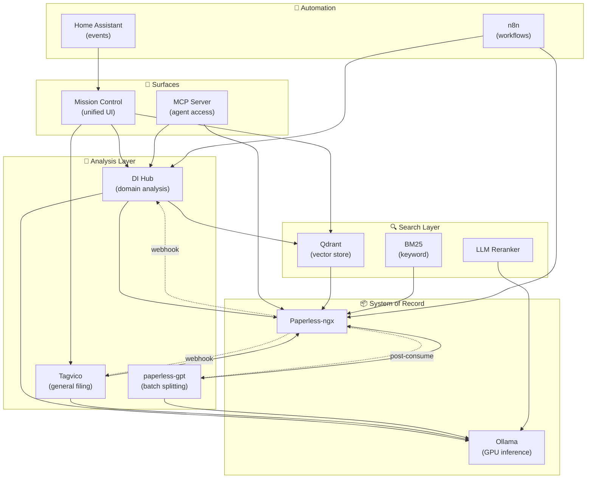

# Paperless-ngx Ecosystem — Capability Assessment & Integration Strategy

## Purpose

This document maps the full open source ecosystem around Paperless-ngx
(35+ projects, 799+ repos on GitHub) and classifies each capability into one of
four action categories for Doc Intelligence Hub and Mission Control:

| Category | Meaning | Action |
|----------|---------|--------|
| 🚀 **Deploy & Use** | Production-ready tool we should run alongside our stack | Deploy on homelab, integrate via API |
| 🔌 **Integrate Into DI/MC** | Capability to wire directly into our services | Build adapter/connector |
| 🧠 **Borrow & Implement** | Architecture/pattern worth adopting in our own code | Study → implement inspired version |
| 📖 **Nice to Know** | Interesting but not actionable now | Track for future reference |

---

## Category 1: 🚀 Deploy & Use in Parallel

These are production-ready projects we should run as standalone services,
integrated via API into our DI Hub / Mission Control surface.

### paperless-gpt (icereed/paperless-gpt) — ⭐ 2,558

| | |
|---|---|
| **What** | Go service using LLM Vision (multimodal OCR) for title/tag generation |
| **Why deploy** | Handles the *general* document classification that Tagvico also does, but adds **LLM-based document boundary detection** for batch-scanned PDFs — a capability neither Tagvico nor DI Hub has |
| **Complements** | Tagvico (general filing) + DI Hub (domain analysis) |
| **Deploy how** | Docker container alongside Paperless-ngx, pointed at Ollama |
| **MC integration** | Surface split-suggestions in Action Queue; show before/after in review UI |

### Paperless-ngx Native AI (built-in, 2025+)

| | |
|---|---|
| **What** | FAISS vector embeddings, "Search by Meaning", "Chat with Documents" |
| **Why deploy** | It's *already there* — we just need to enable and expose it through MC |
| **Complements** | Our hybrid search strategy; gives us baseline semantic search for free |
| **Deploy how** | Enable via Paperless-ngx env vars (`PAPERLESS_AI_ENABLED=true`) |
| **MC integration** | Proxy the semantic search API into MC's unified search bar |

### pypaperless (tb1337/pypaperless) — ⭐ 91

| | |
|---|---|
| **What** | Fully async Python API client (httpx, Pydantic, Python 3.12+) |
| **Why deploy** | Replace our hand-rolled Paperless client in DI Hub with a maintained, typed library |
| **Complements** | DI Hub core layer (`paperless_client.py`) |
| **Deploy how** | `pip install pypaperless` in DI Hub |
| **MC integration** | N/A — internal dependency |

### n8n Community Nodes (chezmoidotsh + waza-ari)

| | |
|---|---|
| **What** | n8n nodes for Paperless-ngx CRUD, metadata sync |
| **Why deploy** | We already run n8n; these nodes replace our custom HTTP Request nodes |
| **Complements** | Existing n8n workflows for statement tracking triggers |
| **Deploy how** | `npm install @makerspacedarmstadt/n8n-nodes-paperless` in n8n |
| **MC integration** | Simplifies workflow authoring; surfaces in MC workflow status panel |

---

## Category 2: 🔌 Integrate Directly Into DI Hub / Mission Control

These capabilities should become first-class features of our services,
connected via APIs or embedded as modules.

### MCP Server — Privacy-Tiered Agent Access

| | |
|---|---|
| **Source projects** | Milli42/paperlessngx-mcp (TS), orellbuehler/paperless-mcp (vector search), nloui/paperless-mcp (⭐208) |
| **Capability** | Expose Paperless-ngx to AI agents (Claude, Copilot) with privacy boundary tiers: Tier 1 metadata only → Tier 2 local extraction → Tier 3 full content |
| **Integrate where** | Mission Control as an MCP server; enables Copilot/Claude to query our docs |
| **Architecture** | MC hosts MCP endpoint → routes to Paperless API + DI Hub enrichments |
| **Priority** | HIGH — this is the agentic interface to our document corpus |

### Hybrid Semantic + Keyword Search

| | |
|---|---|
| **Source projects** | xehonk/paperless-search (Qdrant + BM25 + reranking), paperless-ai RAG system |
| **Capability** | Query expansion via LLM → parallel vector search (Qdrant/FAISS) + keyword (BM25) → LLM reranking → results |
| **Integrate where** | DI Hub as a search module; MC as the search frontend |
| **Architecture** | DI Hub indexes documents into Qdrant on ingest → MC search bar calls DI Hub → DI Hub queries both Qdrant + Paperless FTS → reranks → returns |
| **Priority** | HIGH — upgrades our current TF-IDF-only search |

### Structured Financial Data Extraction

| | |
|---|---|
| **Source projects** | smashah/receipthero-ng, Warracker |
| **Capability** | AI extraction of vendor, date, amount, currency, payment method, line items from receipts/invoices → structured JSON |
| **Integrate where** | DI Hub Statement Tracker (amounts, dates) + new Receipt module |
| **Architecture** | Post-consume hook → DI Hub extraction pipeline → custom fields written back to Paperless → MC surfaces structured data in dashboards |
| **Priority** | MEDIUM — enhances Statement Tracker; enables expense analytics in MC |

### Email → Classify → Archive Pipeline

| | |
|---|---|
| **Source projects** | mcsdodo/personal-assistant, Paperless-ngx native mail |
| **Capability** | IMAP polling → AI classification (Claude) → deduplication → tag assignment → archive |
| **Integrate where** | n8n workflow + DI Hub classification; MC shows ingestion status |
| **Architecture** | n8n monitors mailboxes → calls DI Hub classify endpoint → DI Hub calls Ollama → returns tags/type → n8n uploads to Paperless with metadata |
| **Priority** | MEDIUM — automates the last manual step in our ingest pipeline |

### Home Assistant Event Triggers

| | |
|---|---|
| **Source projects** | Built-in HA integration, BenoitAnastay/paperless-home-assistant-addon |
| **Capability** | Sensors (inbox count, total docs, storage), automations on document events |
| **Integrate where** | MC notification system; HA automations trigger MC alerts |
| **Architecture** | HA sensor monitors Paperless inbox → fires automation → calls MC webhook → MC shows notification |
| **Priority** | LOW — nice for alerting but not core |

---

## Category 3: 🧠 Borrow & Implement (Patterns to Learn From)

These projects contain architecture patterns and approaches we should study
and implement in our own code — not deploy their code directly.

### Webhook → AI Enrichment Pipeline

| | |
|---|---|
| **Source** | fr0der1c/paperless-ngx-companion |
| **Pattern** | Document arrives → Paperless fires webhook → FastAPI receives → multimodal LLM (vision) processes full page image → extracts title + tags + type + date → PATCHes back via REST API |
| **Learn** | Single-pass multimodal processing (send page image, get all metadata at once) vs our current multi-step extraction |
| **Implement in** | DI Hub: add a webhook listener mode that processes documents on arrival instead of polling |

### OCR Rescue Queue & Failure Handling

| | |
|---|---|
| **Source** | admonstrator/zettelrobbe (⭐181) |
| **Pattern** | Failed OCR → enters rescue queue → re-processed with vision model (Mistral) → one-click rescan history → ignored/failed document queues with retry |
| **Learn** | Graceful degradation when OCR fails; human-in-the-loop recovery |
| **Implement in** | DI Hub Action Queue: add a "failed processing" lane; MC surfaces retry button |

### Rule-Based Post-Processing (Regex Engine)

| | |
|---|---|
| **Source** | jgillula/paperless-ngx-postprocessor (⭐161) |
| **Pattern** | Configurable rules: regex patterns applied to OCR text → set title, date, tags, correspondent, type, ASN, custom fields. Docker sidecar. |
| **Learn** | Complements AI — handles templated/structured docs (bank statements, utility bills) where regex is 100% reliable and cheaper than LLM calls |
| **Implement in** | DI Hub: add a "rules engine" module that runs before/alongside AI classification. Statement Tracker already does this partially — generalize it. |

### LLM-Based Document Splitting

| | |
|---|---|
| **Source** | icereed/paperless-gpt (issue #1017) |
| **Pattern** | Multi-page scanned PDF → LLM analyzes page boundaries → splits into separate documents without requiring physical barcode separator pages |
| **Learn** | Eliminates need for PATCH-T sheets or QR stickers in bulk scanning workflows |
| **Implement in** | DI Hub: new "batch processing" module; MC: pre-split review UI |

### Privacy-Tiered Data Access Model

| | |
|---|---|
| **Source** | Milli42/paperlessngx-mcp |
| **Pattern** | Three access tiers: (1) Metadata only — titles, tags, dates, no content (2) Local extraction — structured data extracted locally, only summaries sent to AI (3) Full content — entire document text available to agent |
| **Learn** | Principled approach to AI access control over sensitive documents |
| **Implement in** | MC MCP server: configurable per-document-type or per-tag privacy tiers |

### Cryptographic Timestamping for Provenance

| | |
|---|---|
| **Source** | Butanal/paperless-tsa |
| **Pattern** | Post-consume: hash document → submit to RFC 3161 Timestamp Authority → store proof alongside document |
| **Learn** | Legal document integrity — proves document existed at a point in time |
| **Implement in** | DI Hub: optional post-processing step for legal/financial documents |

### AI Title Generation (Language-Aware)

| | |
|---|---|
| **Source** | chriskoch/ngx-renamer (⭐47) |
| **Pattern** | Post-consume script → sends OCR text + page image to Claude/OpenAI/Ollama → receives structured title with language detection → updates Paperless |
| **Learn** | Focused, single-purpose AI call for high-quality titles; language-aware formatting |
| **Implement in** | DI Hub: dedicated "title suggestion" endpoint; Tagvico may already cover this — compare quality |

---

## Category 4: 📖 Nice to Know

Interesting ecosystem projects to track but not actionable for us now.

| Project | What | Why Not Now |
|---------|------|-------------|
| **Paperless Mobile** (⭐1,422) | Flutter mobile app | MC will be our mobile surface; scan-to-upload is already handled by Paperless-ngx's consume folder + phone scanner apps |
| **Swift Paperless** (⭐977) | Native iOS app | Same as above — MC is our UI layer |
| **Paperparrot** (⭐184) | macOS app | We access via MC web UI |
| **paperless2papra** | Migration CLI | Only relevant if we leave Paperless-ngx |
| **Eppascan / brother-scan** | Scanner hardware bridges | Our scanner already dumps to consume folder |
| **Helm charts** (multiple) | Kubernetes deployment | We're Docker Compose on homelab |
| **mash-playbook** (⭐1,092) | Ansible deployment | Already have homelab-config |
| **Papermerge** (⭐2,935) | Alternative DMS | Committed to Paperless-ngx |
| **Mayan EDMS** | Enterprise DMS | Overkill for our needs |
| **notionless** | Notion → Paperless sync | Don't use Notion for docs |
| **paperless-go CLI** (⭐22) | Go CLI upload tool | n8n handles our automation |
| **Eonvelope** | Envelope budgeting | Different domain |

---

## 🎯 Opportunity Gaps — Where We Can Innovate

These are capabilities **no one in the ecosystem has built** that align with
our DI Hub / Mission Control vision:

### 1. Knowledge Graph Across Documents
- **Gap:** No project extracts entity relationships *across* documents (e.g., "Dr. Smith" appears in EOBs, bills, and correspondence)
- **Our advantage:** DI Hub already does entity extraction; we can build a graph layer
- **Implementation:** Neo4j or SQLite FTS + relationship table; MC visualizes connections

### 2. Calendar/Deadline Awareness
- **Gap:** No project does "this contract expires in 30 days" or "property tax due in 2 weeks"
- **Our advantage:** Statement Tracker already detects recurring patterns; extend to deadlines
- **Implementation:** DI Hub extracts due dates → n8n schedules reminders → MC surfaces timeline

### 3. Cross-Document Financial Reconciliation
- **Gap:** ReceiptHero extracts amounts but no one matches receipts ↔ bank statements ↔ budget
- **Our advantage:** We have Statement Tracker + planned bank integration
- **Implementation:** DI Hub matches extracted amounts/dates/vendors across document types

### 4. Browser Extension for Web Clip Ingest
- **Gap:** No browser extension exists to clip web receipts/confirmations into Paperless
- **Our advantage:** MC already has a web UI; extension could feed directly into our pipeline
- **Implementation:** Chrome/Firefox extension → MC API → Paperless consume

### 5. Multi-Document Summarization
- **Gap:** RAG systems answer questions about single docs; no one summarizes *across* a set
- **Our advantage:** We can ask "summarize all medical bills from Q1 2026"
- **Implementation:** DI Hub aggregation endpoint → LLM summary with citations → MC card

### 6. Document Versioning & Change Detection
- **Gap:** No one tracks "this policy document changed from last year's version"
- **Our advantage:** Statement Tracker already knows about recurring documents
- **Implementation:** DI Hub diffs same-type docs across time periods; MC highlights changes

---

## Integration Architecture (Target State)

---

## Priority Roadmap

### Phase 1 — Quick Wins (This Sprint)
- [ ] Deploy `pypaperless` in DI Hub (replace hand-rolled client)
- [ ] Install n8n Paperless community nodes
- [ ] Enable Paperless-ngx native AI features (FAISS, semantic search)
- [ ] Evaluate paperless-gpt for batch document splitting

### Phase 2 — Core Integration (Next 2 Sprints)
- [ ] Build MCP server in MC with privacy tiers
- [ ] Implement hybrid search (Qdrant + BM25 + reranking) in DI Hub
- [ ] Add webhook listener mode to DI Hub (replace polling)
- [ ] Build email → classify → archive pipeline in n8n

### Phase 3 — Innovation (Future)
- [ ] Knowledge graph across documents
- [ ] Calendar/deadline extraction & alerting
- [ ] Cross-document financial reconciliation
- [ ] LLM-based document splitting (learn from paperless-gpt)
- [ ] Browser extension for web clip ingest

---

## Appendix: Full Project Registry

| # | Repo | ⭐ | Category | Our Classification |
|---|------|-----|----------|--------------------|
| 1 | paperless-ngx/paperless-ngx | 43,455 | Core | Already deployed |
| 2 | clusterzx/paperless-ai | 5,834 | AI | 🧠 Borrow (Tagvico covers general filing) |
| 3 | icereed/paperless-gpt | 2,558 | AI | 🚀 Deploy (batch splitting) |
| 4 | astubenbord/paperless-mobile | 1,422 | Mobile | 📖 Nice to know |
| 5 | paulgessinger/swift-paperless | 977 | Mobile | 📖 Nice to know |
| 6 | xehonk/paperless-search | — | Search | 🧠 Borrow (hybrid search pattern) |
| 7 | nloui/paperless-mcp | 208 | MCP | 🧠 Borrow (reference for our MC MCP) |
| 8 | Milli42/paperlessngx-mcp | — | MCP | 🧠 Borrow (privacy tiers) |
| 9 | admonstrator/zettelrobbe | 181 | AI | 🧠 Borrow (OCR rescue queue) |
| 10 | jgillula/paperless-ngx-postprocessor | 161 | Automation | 🧠 Borrow (regex rule engine) |
| 11 | BenoitAnastay/paperless-home-assistant-addon | 127 | Platform | 🔌 Integrate (HA events) |
| 12 | tb1337/pypaperless | 91 | Library | 🚀 Deploy (pip install) |
| 13 | smashah/receipthero-ng | — | Finance | 🔌 Integrate (structured extraction) |
| 14 | chriskoch/ngx-renamer | 47 | AI | 🧠 Borrow (title generation) |
| 15 | chezmoidotsh/n8n-nodes-paperless | — | Automation | 🚀 Deploy (n8n nodes) |
| 16 | waza-ari/n8n-nodes-paperless | — | Automation | 🚀 Deploy (n8n nodes) |
| 17 | mcsdodo/personal-assistant | — | Automation | 🧠 Borrow (email pipeline) |
| 18 | fr0der1c/paperless-ngx-companion | — | AI | 🧠 Borrow (webhook pattern) |
| 19 | rae2001/paperless-rag | — | RAG | 🧠 Borrow (chat UI pattern) |
| 20 | barryw/PaperlessMCP | — | MCP | 📖 Nice to know (.NET) |
| 21 | sassanix/Warracker | — | Finance | 🧠 Borrow (warranty tracking) |
| 22 | Butanal/paperless-tsa | — | Legal | 🧠 Borrow (timestamping) |
| 23 | b0x42/paperless2papra | — | Migration | 📖 Nice to know |
| 24 | LeoKlaus/Paperparrot | 184 | Mobile | 📖 Nice to know |
| 25 | ccremer/paperless-cli | 22 | CLI | 📖 Nice to know |
| 26 | michael-hessi/Eppascan | 16 | Scanner | 📖 Nice to know |
| 27 | Script-hpp/notionless | — | Sync | 📖 Nice to know |
| 28 | ciur/papermerge | 2,935 | Alt DMS | 📖 Nice to know |
