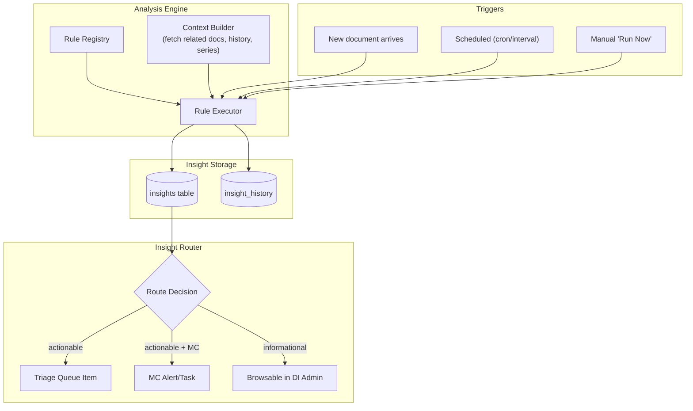
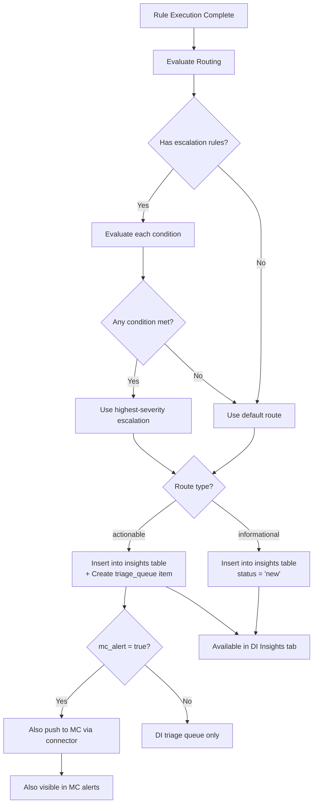

# Design Document: Analysis Engine & Insights System

## Executive Summary

This document extends the Triage & Correction UI design with a **configurable analysis engine** that produces **insights** from document data. Insights are routed based on type: actionable items flow to the triage queue and Mission Control, while informational insights are browsable in a dedicated DI admin Insights tab.

This transforms Document Intelligence from a "fix errors" tool into a **proactive document analysis platform**.

---

## Table of Contents

1. [Architecture Overview](#architecture-overview)
2. [Analysis Rules Model](#analysis-rules-model)
3. [Rule Configuration](#rule-configuration)
4. [Insight Data Model](#insight-data-model)
5. [Routing Logic](#routing-logic)
6. [Built-in Rule Library](#built-in-rule-library)
7. [Insights UI](#insights-ui)
8. [Integration with Existing Systems](#integration-with-existing-systems)
9. [Implementation Plan](#implementation-plan)

---

## Architecture Overview



### Key Concepts

| Concept | Definition |
|---------|-----------|
| **Rule** | A configured analysis that runs against document data to produce insights |
| **Trigger** | What causes a rule to execute (new doc, schedule, manual) |
| **Insight** | The output of a rule execution — a finding with context and data |
| **Route** | Where the insight surfaces: triage queue, MC, or DI insights tab only |
| **Threshold** | Conditions that escalate an informational insight to actionable |

---

## Analysis Rules Model

### Rule Definition

```yaml
# Example rule: Monthly spend comparison
rule:
  id: monthly-spend-comparison
  name: "Monthly Spend vs Average"
  description: "Compare statement amount to rolling 3-month average for the same series"
  
  # What triggers this rule
  trigger:
    type: document_added          # 'document_added', 'schedule', 'manual'
    filter:
      document_type: statement
      # Only run when a new statement arrives
  
  # What data the rule needs
  context:
    - current_document             # The triggering document
    - series_history: 6            # Last 6 documents in same series
    - extracted_fields:
        - total_amount
        - statement_period
  
  # Analysis logic (built-in analyzer ID or custom)
  analyzer: builtin:spend_comparison
  params:
    comparison_window: 3           # Compare to 3-month rolling avg
    
  # How to route the result
  routing:
    default: informational         # Base routing
    escalation:                    # Conditions that upgrade to actionable
      - condition: "pct_change > 50"
        route: actionable
        severity: warning
        mc_alert: true
      - condition: "pct_change > 100"
        route: actionable
        severity: critical
        mc_alert: true
        
  # Display preferences
  display:
    card_type: comparison          # 'comparison', 'trend', 'alert', 'summary'
    highlight_fields:
      - total_amount
      - pct_change
      - largest_new_category
```

### Rule Types

| Type | Description | Example |
|------|-------------|---------|
| **Comparison** | Compare current doc to historical data | Spend vs average, bill vs last month |
| **Anomaly** | Detect unusual patterns | New charge category, unusual amount |
| **Trend** | Track values over time | Spending trend, balance trajectory |
| **Compliance** | Check for expected conditions | Statement received on time, all bills have EOBs |
| **Extraction** | Surface specific data from documents | Account numbers, key dates, balances |

---

## Rule Configuration

Rules are defined in two layers:

### 1. YAML Config File (Power Users)

```yaml
# config/analysis-rules.yaml
rules:
  - id: monthly-spend-comparison
    name: "Monthly Spend vs Average"
    analyzer: builtin:spend_comparison
    trigger: { type: document_added, filter: { document_type: statement } }
    params: { comparison_window: 3 }
    routing:
      default: informational
      escalation:
        - condition: "pct_change > 50"
          route: actionable
          mc_alert: true

  - id: eob-bill-amount-check
    name: "EOB Amount vs Bill"
    analyzer: builtin:eob_amount_match
    trigger: { type: document_added, filter: { document_type: [eob, bill] } }
    routing:
      default: actionable   # Always goes to triage
      
  - id: balance-trend
    name: "Credit Card Balance Trend"
    analyzer: builtin:numeric_trend
    trigger: { type: schedule, cron: "0 9 1 * *" }  # 1st of month, 9am
    params:
      field: closing_balance
      series_filter: { document_type: statement, tags: [credit-card] }
      window: 12
    routing:
      default: informational
      escalation:
        - condition: "trend_direction == 'increasing' and pct_change_6mo > 20"
          route: actionable
          severity: warning
```

### 2. Admin UI (All Users)

The DI Admin gets a **Rules** configuration page where you can:
- Browse and enable/disable built-in rules
- Adjust parameters (thresholds, windows, filters)
- Set routing preferences
- Create simple custom rules via form builder
- See last run time and insight count per rule

```
/admin/rules                         ← Rule configuration
/admin/rules/:id                     ← Edit single rule
/admin/rules/new                     ← Create custom rule
```

---

## Insight Data Model

```sql
CREATE TABLE insights (
    id TEXT PRIMARY KEY,
    rule_id TEXT NOT NULL,              -- Which rule produced this
    rule_name TEXT NOT NULL,            -- Denormalized for display
    
    -- Classification
    insight_type TEXT NOT NULL,         -- 'comparison', 'anomaly', 'trend', 'compliance', 'extraction'
    route TEXT NOT NULL,                -- 'informational', 'actionable'
    severity TEXT DEFAULT 'info',       -- 'info', 'notice', 'warning', 'critical'
    
    -- Content
    title TEXT NOT NULL,                -- "Chase Sapphire: June spend 40% above average"
    summary TEXT,                       -- One-line human summary
    detail JSON NOT NULL,              -- Full analysis data (rule-specific structure)
    highlight_data JSON,               -- Pre-computed highlights for card rendering
    
    -- Context
    series_id TEXT,                     -- Related statement series (if applicable)
    document_ids JSON,                  -- Array of Paperless doc IDs involved
    correspondent TEXT,                 -- For filtering/grouping
    
    -- Lifecycle
    status TEXT DEFAULT 'new',         -- 'new', 'viewed', 'acknowledged', 'archived'
    triage_item_id TEXT,               -- FK to triage_queue if escalated
    mc_alert_id TEXT,                  -- FK/ref if pushed to MC
    
    created_at TIMESTAMP DEFAULT CURRENT_TIMESTAMP,
    viewed_at TIMESTAMP,
    acknowledged_at TIMESTAMP,
    
    -- Recurrence
    period TEXT,                        -- 'Jun 2024', 'Q2 2024', etc. for dedup
    supersedes_id TEXT                  -- Previous insight this replaces (for same rule+series+period)
);

CREATE INDEX idx_insights_route ON insights(route, status);
CREATE INDEX idx_insights_series ON insights(series_id);
CREATE INDEX idx_insights_rule ON insights(rule_id, created_at);

-- Historical trend data for charting
CREATE TABLE insight_history (
    id TEXT PRIMARY KEY,
    rule_id TEXT NOT NULL,
    series_id TEXT,
    period TEXT NOT NULL,               -- 'Jan 2024', 'Feb 2024', etc.
    metric_name TEXT NOT NULL,          -- 'total_amount', 'closing_balance', etc.
    metric_value REAL,
    metadata JSON,
    created_at TIMESTAMP DEFAULT CURRENT_TIMESTAMP
);

CREATE INDEX idx_history_series ON insight_history(series_id, metric_name, period);
```

---

## Routing Logic



### Deduplication

When a rule produces an insight for the same series + period, it **supersedes** the previous one:
- Old insight gets `status = 'superseded'`
- New insight gets `supersedes_id` pointing to old one
- UI shows only the latest, with "history" link to see progression

---

## Built-in Rule Library

### Tier 1: Ship with MVP

| Rule ID | Name | Trigger | Default Route |
|---------|------|---------|---------------|
| `eob-match-review` | EOB Match Confidence | doc_added | actionable (< 75%) |
| `series-anomaly` | Statement Grouping Anomaly | doc_added | actionable |
| `missing-statement` | Missing Expected Statement | schedule (daily) | actionable → MC |
| `monthly-spend-comparison` | Monthly Spend vs Average | doc_added (statement) | informational |
| `statement-received` | Statement Arrival Confirmation | doc_added (statement) | informational |

### Tier 2: Fast Follow

| Rule ID | Name | Trigger | Default Route |
|---------|------|---------|---------------|
| `spend-spike` | Spend Spike Detection | doc_added | escalates if > threshold |
| `new-category` | New Charge Category | doc_added (statement) | informational |
| `balance-trend` | Balance Trend (CC/Loan) | schedule (monthly) | informational |
| `bill-vs-prior` | Bill Amount Change | doc_added (bill) | informational |
| `eob-coverage-summary` | Insurance Coverage Summary | schedule (quarterly) | informational |

### Tier 3: Future

| Rule ID | Name | Trigger | Default Route |
|---------|------|---------|---------------|
| `cross-account-total` | Total Spend Across Accounts | schedule (monthly) | informational |
| `provider-cost-trend` | Medical Provider Cost Trend | schedule (quarterly) | informational |
| `rate-change` | Utility/Service Rate Change | doc_added | escalates if > 10% |
| `autopay-verification` | Verify Autopay Processed | schedule (monthly) | actionable if missed |

---

## Insights UI

### Location

New tab in DI Admin: `/admin/insights`

```
/admin
├── /admin/triage          ← Actionable items (fix things)
├── /admin/insights        ← Informational insights (review things)  ← NEW
├── /admin/rules           ← Configure analysis rules                ← NEW
├── /admin/config          ← Existing
└── /admin/scanning        ← Existing
```

### Insights Tab Layout

```
┌──────────────────────────────────────────────────────────────┐
│  DI Admin    [Triage ●5]  [Insights ●8]  [Rules]  [Config]   │
├──────────────────────────────────────────────────────────────┤
│  Insights                                                     │
│  ┌────────────────────────────────────────────────────────┐  │
│  │ Filter: [All] [Spend] [Trends] [Compliance]  🔍 Search │  │
│  │ Series: [All ▼]   Period: [Last 3 months ▼]            │  │
│  └────────────────────────────────────────────────────────┘  │
│                                                               │
│  ┌── Insight Card ──────────────────────────────────────┐    │
│  │ 📊 Chase Sapphire — June 2024 Spend Summary          │    │
│  │                                                       │    │
│  │  Total: $2,847    Avg (3mo): $2,034    ▲ +40%        │    │
│  │                                                       │    │
│  │  ┌─────────────────────────────────────────────┐     │    │
│  │  │  $3k ┤     ╭─╮                              │     │    │
│  │  │      ┤ ╭─╮ │ │ ╭─╮                          │     │    │
│  │  │  $2k ┤ │ │ │ │ │ │ ╭───╮ ╭─╮ ╭─╮ ╭──╮     │     │    │
│  │  │      ┤ │ │ │ │ │ │ │   │ │ │ │ │ │  │     │     │    │
│  │  │  $1k ┤ │ │ │ │ │ │ │   │ │ │ │ │ │  │     │     │    │
│  │  │      ┼─┴─┴─┴─┴─┴─┴─┴───┴─┴─┴─┴─┴─┴──┘     │     │    │
│  │  │       J  F  M  A  M  J  J  A  S  O  N  D    │     │    │
│  │  └─────────────────────────────────────────────┘     │    │
│  │                                                       │    │
│  │  Highlights:                                          │    │
│  │  • Dining +$340 vs avg (new restaurant charges)       │    │
│  │  • Travel $589 (not in prior 3 months)                │    │
│  │  • Groceries -12% vs avg ($380 → $334)                │    │
│  │                                                       │    │
│  │  [View Statement →]  [Acknowledge]  [Archive]         │    │
│  └───────────────────────────────────────────────────────┘    │
│                                                               │
│  ┌── Insight Card ──────────────────────────────────────┐    │
│  │ 📈 AT&T Wireless — Bill Trend (6 months)              │    │
│  │                                                       │    │
│  │  Current: $89.42    6mo ago: $79.99    ▲ +12%        │    │
│  │  Note: Rate increased in March (+$5/mo base)          │    │
│  │                                                       │    │
│  │  [View Details →]  [Acknowledge]                      │    │
│  └───────────────────────────────────────────────────────┘    │
│                                                               │
│  ┌── Insight Card ──────────────────────────────────────┐    │
│  │ ✅ Comcast — June Statement Received                   │    │
│  │  On time (day 15, expected day 14–16)                 │    │
│  │  Amount: $129.99 (unchanged from May)                 │    │
│  │  [Acknowledge]                                        │    │
│  └───────────────────────────────────────────────────────┘    │
└──────────────────────────────────────────────────────────────┘
```

### Insight Card Types

| Card Type | Visual | Use Case |
|-----------|--------|----------|
| **Comparison** | Current vs average, bar chart, highlights | Monthly spend review |
| **Trend** | Sparkline or mini line chart, direction arrow | Balance tracking, bill trajectory |
| **Alert** | Warning banner with details | Escalated anomalies |
| **Summary** | Simple text with key metrics | Statement received, compliance check |
| **Table** | Side-by-side data rows | Month-over-month line item comparison |

---

## Integration with Existing Systems

### Analysis Engine → Triage Queue

When an insight is routed as `actionable`, the engine automatically creates a `triage_queue` item:

```python
# Pseudo-code
if insight.route == 'actionable':
    triage_item = TriageQueueItem(
        item_type = f'insight:{insight.rule_id}',
        priority = severity_to_priority(insight.severity),
        target_type = 'insight',
        target_id = insight.id,
        reason = insight.summary,
        metadata = { 'insight_type': insight.insight_type }
    )
    # Triage queue now shows insight-generated items alongside
    # EOB match reviews and grouping anomalies
```

### Analysis Engine → Mission Control

When `mc_alert: true`, the DI connector exposes these as alerts:

```python
# In DI API: GET /api/insights/alerts
# Returns insights where mc_alert=true AND status='new'
# MC connector polls this alongside existing /api/statements/missing
```

MC renders these as alert cards — "Chase Sapphire: June spend 40% above average" — with a deep link to the DI Insights tab for full detail.

### Analysis Engine → Statement Tracker

The engine uses the Statement Tracker's catalog as input context:
- Series definitions (which docs belong together)
- Recurrence patterns (expected frequency)
- Extracted amounts and dates

The Statement Tracker's existing "missing statement" detection becomes a **built-in rule** in the analysis engine rather than standalone logic.

---

## Implementation Plan

### Phase 1: Engine Foundation (2 weeks)

- [ ] Create `insights` and `insight_history` tables
- [ ] Build rule registry and YAML loader
- [ ] Implement rule executor with context builder
- [ ] Build routing logic (informational vs actionable)
- [ ] Implement 2 built-in rules: `monthly-spend-comparison` and `missing-statement`
- [ ] Migrate existing missing-statement detection to rule engine
- [ ] Basic Insights tab UI with card rendering

### Phase 2: Rule Library (1-2 weeks)

- [ ] Implement remaining Tier 1 rules
- [ ] Build `spend-spike` escalation rule
- [ ] Add trend tracking and sparkline data
- [ ] Implement insight deduplication (supersedes logic)
- [ ] Add "Acknowledge" / "Archive" lifecycle

### Phase 3: Configuration UI (1 week)

- [ ] Build `/admin/rules` page — list, enable/disable, adjust params
- [ ] Simple rule editor for threshold tuning
- [ ] Schedule configuration for time-based rules
- [ ] Per-series rule overrides (e.g., different spend threshold for different accounts)

### Phase 4: MC Integration (1 week)

- [ ] Expose `/api/insights/alerts` for MC connector
- [ ] Add insight alert cards to MC connector's `fetchAlerts()`
- [ ] Deep link from MC alert → DI Insights tab
- [ ] Dedup notifications (insight-generated alerts vs existing statement/EOB alerts)

---

## Relationship to Triage Design

This document **extends** the Triage & Correction UI design (`DESIGN.md`). The triage queue remains the home for actionable items. This adds:

1. **Analysis Engine** — produces insights, some of which become triage items
2. **Insights Tab** — new surface for informational (non-actionable) insights
3. **Rules Configuration** — admin page for tuning the engine
4. **MC alert expansion** — insight-generated alerts alongside existing ones

The existing triage queue `item_type` field gains new values:
- `insight:monthly-spend-comparison`
- `insight:spend-spike`
- `insight:balance-trend`
- etc.

These appear alongside `eob_match_review` and `grouping_anomaly` items with appropriate card rendering.
